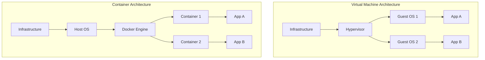
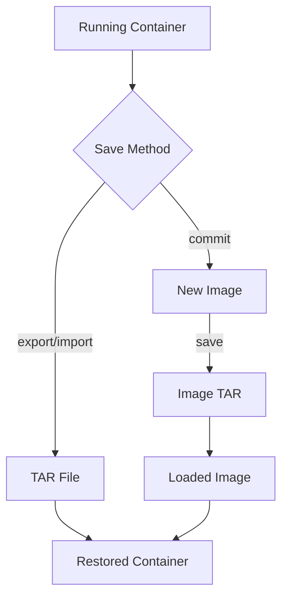
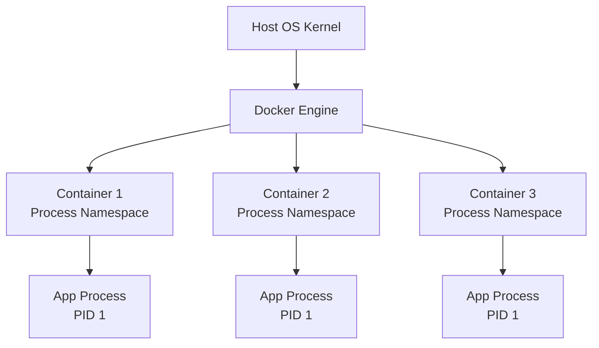
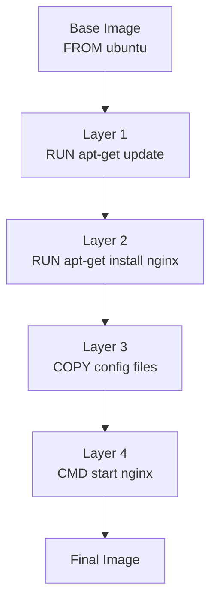
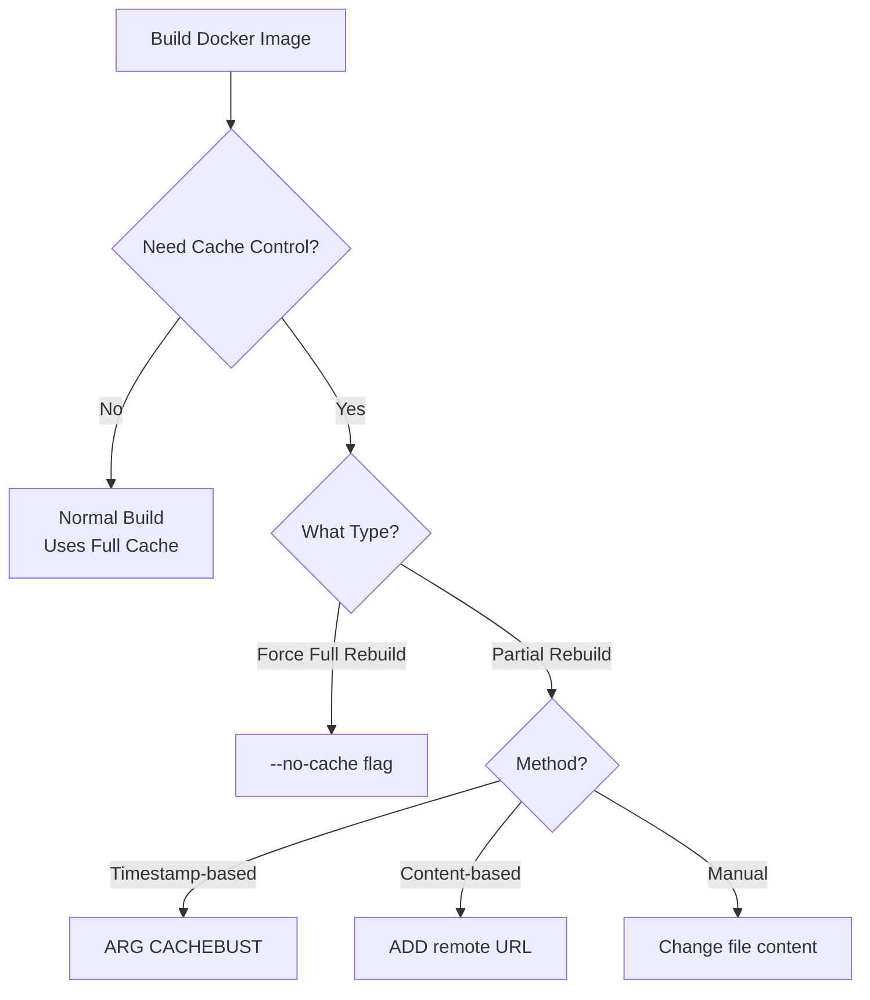
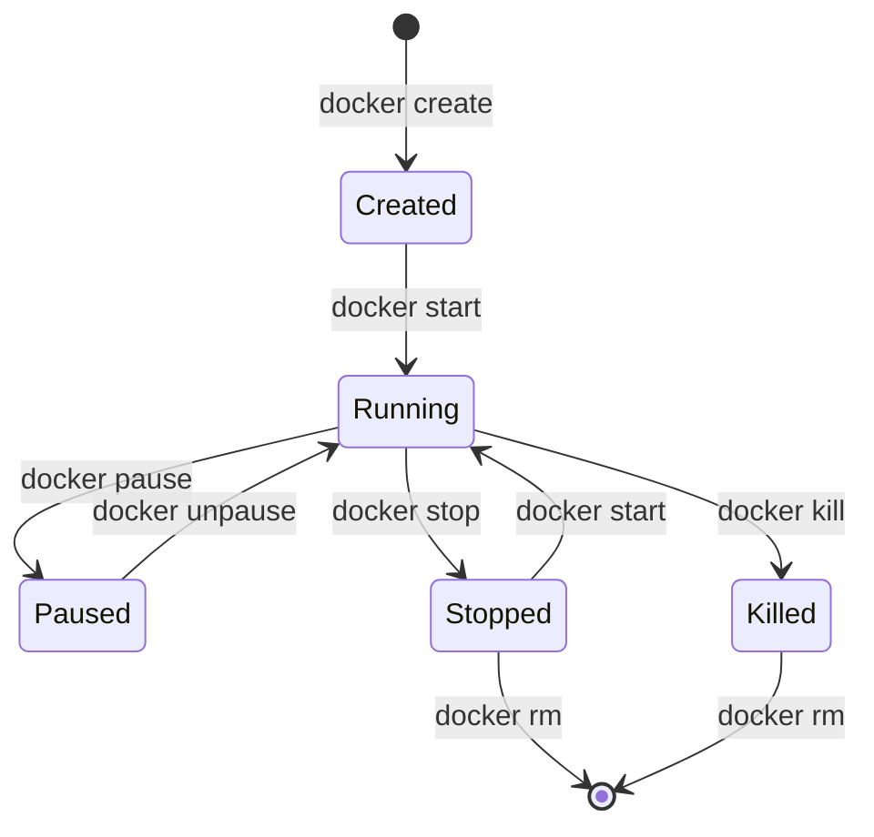
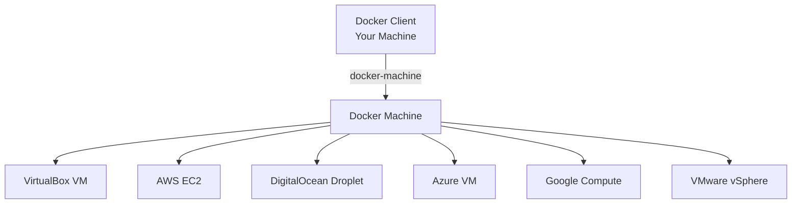
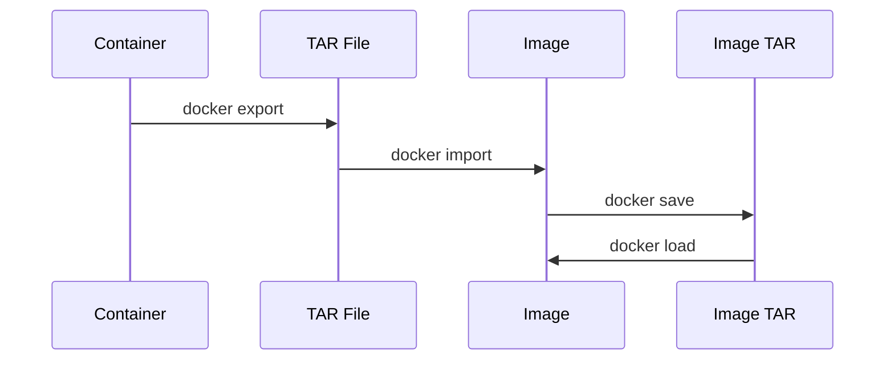
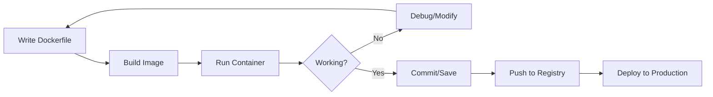

# Docker and Development - Unit 2 Comprehensive Notes

## Table of Contents

1. [Using Docker as a Lightweight Virtual Machine](#1-using-docker-as-a-lightweight-virtual-machine)
2. [From VM to Container](#2-from-vm-to-container)
3. [Saving and Restoring Your Work](#3-saving-and-restoring-your-work)
4. [Environments as Processes](#4-environments-as-processes)
5. [Building Images](#5-building-images)
6. [Running Containers](#6-running-containers)

---

## 1. Using Docker as a Lightweight Virtual Machine

### Overview

Docker provides a lightweight alternative to traditional virtual machines by leveraging containerization technology. Containers share the host OS kernel, making them more efficient than VMs.

### Key Differences: Containers vs Virtual Machines

| Feature            | Virtual Machine                  | Docker Container                    |
| ------------------ | -------------------------------- | ----------------------------------- |
| **Size**           | GBs (includes full OS)           | MBs (shares host kernel)            |
| **Startup Time**   | Minutes                          | Seconds                             |
| **Resource Usage** | Heavy (full OS overhead)         | Lightweight (minimal overhead)      |
| **Isolation**      | Complete (hardware-level)        | Process-level (namespace isolation) |
| **Portability**    | Limited (hypervisor-dependent)   | High (runs anywhere Docker runs)    |
| **Performance**    | Slower (virtualization overhead) | Near-native performance             |

### Architecture Comparison



### Advantages of Docker as Lightweight VM

- **Resource Efficiency**: Containers use fewer resources, allowing more applications per host
- **Rapid Deployment**: Instantaneous startup and shutdown
- **Consistency**: "Build once, run anywhere" philosophy
- **Version Control**: Images can be versioned and rolled back easily
- **Microservices Architecture**: Perfect for distributed systems

### Real-World Use Cases

1. **Development Environments**: Developers can replicate production environments locally
2. **CI/CD Pipelines**: Fast, consistent build and test environments
3. **Microservices Deployment**: Each service runs in its own container
4. **Legacy Application Modernization**: Containerize old apps without code changes

---

## 2. From VM to Container

### The Transition Process

Understanding the shift from VMs to containers is crucial for modern DevOps practices.


### Migration Strategy

| Step                  | VM Approach                        | Container Approach             |
| --------------------- | ---------------------------------- | ------------------------------ |
| **1. Infrastructure** | Provision physical/virtual servers | Install Docker engine          |
| **2. OS Setup**       | Install full OS per application    | Share host OS kernel           |
| **3. Dependencies**   | Install packages system-wide       | Define in Dockerfile           |
| **4. Application**    | Deploy traditionally               | Package as container image     |
| **5. Scaling**        | Clone entire VMs                   | Replicate containers instantly |

### Container Benefits Over VMs

- **Density**: Run 10-100x more containers than VMs on same hardware
- **Speed**: Startup in milliseconds vs minutes
- **Consistency**: Identical behavior across environments
- **Portability**: Move between cloud providers easily

### Practical Example: Web Server Migration

**Traditional VM Approach:**

```bash
# Install full Ubuntu VM (2GB+)
# Install Apache manually
sudo apt-get install apache2
# Configure firewall, networking, etc.
# Takes 10-30 minutes
```

**Container Approach:**

```dockerfile
# Dockerfile - just a few lines
FROM httpd:2.4
COPY ./public-html/ /usr/local/apache2/htdocs/
# Build and run in seconds
```

```bash
# Build image (one-time, 150MB)
docker build -t my-apache2 .

# Run instantly
docker run -d -p 80:80 my-apache2
```

---

## 3. Saving and Restoring Your Work

### The "Save Game" Approach

Docker provides multiple methods to save and restore container states, similar to saving progress in a video game.



### Method 1: Export/Import Workflow

This method exports the **container's filesystem** as a TAR archive.

#### Step-by-Step Process

| Step      | Command                                                           | Purpose                   |
| --------- | ----------------------------------------------------------------- | ------------------------- |
| 1. Export | `docker export Container_ID > filename.tar`                       | Save container filesystem |
| 2. Import | `docker import ~/filename.tar newname:latest`                     | Create image from TAR     |
| 3. Verify | `docker images`                                                   | Confirm image creation    |
| 4. Run    | `docker run -it --name restored-container newname:latest /bin/sh` | Start from saved state    |

#### Practical Example

```bash
# Start a container and make changes
docker run -it --name game-progress ubuntu:latest bash
# Inside container: install packages, create files, etc.
apt-get update && apt-get install -y vim
echo "Level 5 completed" > /progress.txt

# In another terminal: Export the container
docker export game-progress > game-backup.tar

# Import as new image
docker import ~/game-backup.tar game-restored:v1

# Verify the image exists
docker images | grep game-restored

# Run from saved state
docker run -it --name continue-game game-restored:v1 /bin/sh
# Your changes are preserved!
cat /progress.txt  # Shows "Level 5 completed"
```

### Method 2: Commit/Save Workflow

This method preserves the **full image** including metadata and layers.

#### Step-by-Step Process

| Step      | Command                                       | Purpose                     |
| --------- | --------------------------------------------- | --------------------------- |
| 1. Commit | `docker commit <container-id> newname:latest` | Create image from container |
| 2. Save   | `docker save -o filename.tar newname:latest`  | Export image with metadata  |
| 3. Load   | `docker load -i filename.tar`                 | Import image completely     |
| 4. Run    | `docker run -it newname:latest`               | Start from saved image      |

#### Practical Example

```bash
# Make changes to a running container
docker run -it --name workspace ubuntu:latest bash
# Inside: customize environment
apt-get update && apt-get install -y python3 git
mkdir /projects

# Create image from current state
docker commit workspace my-workspace:v1

# Save the entire image (preserves layers and metadata)
docker save -o my-workspace-backup.tar my-workspace:v1

# Later, on another machine or after cleanup:
docker load -i my-workspace-backup.tar

# Run with all customizations intact
docker run -it my-workspace:v1 bash
```

### Comparison: Export vs Commit

| Feature                | Export/Import                  | Commit/Save              |
| ---------------------- | ------------------------------ | ------------------------ |
| **Preserves Layers**   | ❌ No (flattened)              | ✅ Yes                   |
| **Preserves Metadata** | ❌ No (history lost)           | ✅ Yes (tags, labels)    |
| **File Size**          | Smaller (single layer)         | Larger (multiple layers) |
| **Use Case**           | Quick backups, minimal restore | Full image preservation  |
| **Speed**              | Faster                         | Slower                   |

### Real-World Scenario: The 2048 Game Example

Imagine you're developing a game and want to save your progress:

```bash
# 1. Start playing (developing)
docker run -it --name game2048 ubuntu:latest bash

# Inside container: Make progress
apt-get update && apt-get install -y nodejs npm
npm install 2048-game
# ... reach high score ...

# 2. Save your progress (export method)
docker export game2048 > 2048-progress.tar

# 3. Something goes wrong? Restore instantly!
docker import ~/2048-progress.tar 2048-saved:latest
docker run -it 2048-saved:latest /bin/sh
# Continue exactly where you left off!
```

### Best Practices

1. **Use Export/Import** when:

   - You need lightweight backups
   - You don't care about image history
   - Transferring between systems

2. **Use Commit/Save** when:

   - Preserving development stages
   - Need full image metadata
   - Creating distributable images

3. **General Tips**:
   - Tag your images with meaningful names (`myapp:v1.0`)
   - Compress TAR files for storage (`gzip filename.tar`)
   - Document what each saved state represents
   - Test restoration process regularly

---

## 4. Environments as Processes

### Concept Overview

In Docker, each container runs as an **isolated process** with its own environment, rather than a full operating system instance.



### Environment Variables in Containers

Environment variables configure container behavior without changing the image.

#### Setting Environment Variables

| Method              | Syntax                           | Use Case                |
| ------------------- | -------------------------------- | ----------------------- |
| **Dockerfile ENV**  | `ENV KEY=value`                  | Default values in image |
| **Runtime -e flag** | `docker run -e KEY=value`        | Override at runtime     |
| **Env file**        | `docker run --env-file=file.env` | Multiple variables      |

#### Example: Time Zone Configuration

```dockerfile
# Dockerfile with environment variables
FROM ubuntu:latest

# Set timezone to avoid interactive prompts
ENV TZ=Europe/London
ENV DEBIAN_FRONTEND=noninteractive

# Install timezone data
RUN apt-get update && apt-get install -y tzdata

# The container will use London timezone by default
```

```bash
# Build the image
docker build -t timezone-demo:1.0 .

# Run with default timezone (London)
docker run -it timezone-demo:1.0
date  # Shows London time

# Override timezone at runtime
docker run -e TZ=America/New_York -it timezone-demo:1.0
date  # Shows New York time

# Exit container
exit
```

### Process Isolation

Each container sees itself as PID 1, completely isolated from other containers.

```bash
# Container 1
docker run -d --name app1 nginx
docker exec app1 ps aux
# Shows nginx as PID 1

# Container 2
docker run -d --name app2 nginx
docker exec app2 ps aux
# Also shows nginx as PID 1 (isolated namespace)
```

### Resource Constraints

Containers can be limited to specific resources:

```bash
# Limit memory to 512MB
docker run -m 512m nginx

# Limit CPU usage to 1.5 cores
docker run --cpus="1.5" nginx

# Limit both
docker run -m 512m --cpus="1.5" nginx
```

### Advantages of Process-Based Approach

1. **Fast Startup**: Start process, not entire OS
2. **Efficient Resource Usage**: Share kernel, minimal overhead
3. **Easy Scaling**: Launch multiple processes quickly
4. **Isolation**: Namespaces prevent process interference
5. **Portability**: Same process runs anywhere

---

## 5. Building Images

### Image Building Fundamentals

Docker images are built in **layers**, with each instruction in the Dockerfile creating a new layer.



### Docker Build Cache

Docker caches each layer to speed up subsequent builds. Only changed layers and those after are rebuilt.

#### Cache Behavior

| Scenario               | Cache Used? | Reason                         |
| ---------------------- | ----------- | ------------------------------ |
| No changes             | ✅ Yes      | All layers cached              |
| Change in middle layer | ⚠️ Partial  | Cache used until changed layer |
| Change in base image   | ❌ No       | Entire rebuild required        |
| Add new file           | ⚠️ Partial  | Only affected layers rebuild   |

### Technique: Injecting Files with ADD

The `ADD` instruction copies files from host to image and can extract archives automatically.

#### TAR File Injection Example

```bash
# Step 1: Create a compressed TAR file
tar -czvf firstfile.tar.gz firstfile
# -z: gzip compression
# -c: create archive
# -v: verbose output
# -f: filename
```

```dockerfile
# Step 2: Dockerfile with ADD instruction
FROM ubuntu:latest

# Update package list
RUN apt-get -y update

# ADD automatically extracts .tar.gz files
ADD dummy.tar.gz .
# Contents extracted to current directory (/)
```

```bash
# Step 3: Build the image
docker build -t sample-image .

# Step 4: Verify images
docker images

# Step 5: Run and verify extraction
docker run -it sample-image bash
ls  # Files from TAR are extracted here
```

#### ADD vs COPY

| Feature              | ADD                    | COPY                  |
| -------------------- | ---------------------- | --------------------- |
| **Basic file copy**  | ✅ Yes                 | ✅ Yes                |
| **Auto-extract TAR** | ✅ Yes                 | ❌ No                 |
| **Remote URLs**      | ✅ Yes                 | ❌ No                 |
| **Transparency**     | Less (magic behavior)  | More (explicit)       |
| **Best Practice**    | Use for TAR extraction | Use for simple copies |

### Technique: Rebuilding Without Cache

Force Docker to rebuild all layers, ignoring cached layers.

```bash
# Normal build (uses cache)
docker build -t myapp:1.0 .

# Force rebuild without cache
docker build --no-cache -t myapp:1.0 .
```

**When to use:**

- Testing if build process has issues
- Ensuring latest package versions
- Debugging cache-related problems
- Forcing fresh dependency downloads

### Technique: Cache Busting

Sometimes you need to invalidate cache for specific layers while keeping others cached.

#### Method 1: Using Build Arguments (ARG)

```dockerfile
FROM debian
LABEL author="Deepika K deepikak@rvce.edu.in"
LABEL description="This is a demo file to show build-args"

# These layers will be cached
RUN apt-get update && apt-get -y upgrade

# Cache invalidation point
ARG CACHEBUST=1

# Everything after this rebuilds when CACHEBUST changes
RUN echo "Welcome"
RUN apt-get install -y python3
```

```bash
# Build with changing CACHEBUST value (uses timestamp)
docker build -t test:2.0 --build-arg CACHEBUST=$(date +%s) .
# New timestamp = cache invalidated from ARG onwards
```

**How it works:**

- `$(date +%s)` generates Unix timestamp (changes every second)
- Different ARG value = cache miss for subsequent layers
- Layers before ARG still use cache

#### Method 2: Using ADD with Remote URLs

```dockerfile
FROM debian
LABEL author="Deepika K deepikak@rvce.edu.in"
LABEL description="This is a demo file to show ADD-directive"

# Cached layers
RUN apt-get update
RUN echo "Welcome"

# ADD remote file - checks URL for changes
ADD https://raw.githubusercontent.com/user/repo/main/file.txt /app/

# Subsequent layers rebuild if URL content changes
RUN cat /app/file.txt
```

```bash
# Build image
docker build -t repo-image:2.3 .

# View images
docker images
```

**Advantages:**

- Automatically detects remote file changes
- Useful for downloading dependencies
- No manual cache busting needed

### Cache Busting Strategies Comparison



### Best Practices for Building Images

1. **Order Matters**: Place least-changing instructions first

```dockerfile
# ✅ GOOD: Dependencies change rarely
FROM node:14
COPY package.json .
RUN npm install
COPY . .  # Source code changes often

# ❌ BAD: Entire rebuild on any code change
FROM node:14
COPY . .
RUN npm install
```

2. **Minimize Layers**: Combine related commands

```dockerfile
# ✅ GOOD: Single layer
RUN apt-get update && \
    apt-get install -y nginx vim && \
    apt-get clean

# ❌ BAD: Multiple layers
RUN apt-get update
RUN apt-get install -y nginx
RUN apt-get install -y vim
RUN apt-get clean
```

3. **Use .dockerignore**: Exclude unnecessary files

```
# .dockerignore file
node_modules
.git
*.log
.env
```

4. **Multi-stage Builds**: Reduce final image size

```dockerfile
# Build stage
FROM node:14 AS builder
COPY . .
RUN npm install && npm run build

# Production stage
FROM node:14-alpine
COPY --from=builder /app/dist /app
CMD ["node", "/app/server.js"]
```

---

## 6. Running Containers

### Container Lifecycle



### Running GUIs in Docker

Docker containers can run graphical applications by sharing the X11 display socket.

#### Prerequisites

```bash
# Grant Docker access to X server
xhost +local:docker
```

#### Example: Running Nautilus File Manager

```dockerfile
# Dockerfile for GUI application
FROM ubuntu:23.10

# Prevent interactive prompts during installation
ENV DEBIAN_FRONTEND=noninteractive

# Update package list
RUN apt-get update

# Install Nautilus file manager
RUN apt-get install nautilus -y

# Set default command
CMD ["nautilus"]
```

```bash
# Build the image
docker build -t nautilus-ubuntu .

# Run with display sharing
docker run -it --rm \
  -e DISPLAY=$DISPLAY \
  -v /tmp/.X11-unix:/tmp/.X11-unix \
  nautilus-ubuntu:latest
```

**Explanation of flags:**

- `-e DISPLAY=$DISPLAY`: Pass display environment variable
- `-v /tmp/.X11-unix:/tmp/.X11-unix`: Mount X11 socket
- `--rm`: Auto-remove container on exit
- `-it`: Interactive terminal

### Inspecting Containers

Get detailed information about running containers.

```bash
# Step 1: Run a container
docker run -it ubuntu:latest

# Step 2: In another terminal, list containers
docker container ls -a

# Step 3: Inspect container (shows all details)
docker inspect --size <Container-ID>
```

#### Key Information from Inspect

| Section             | Information                         |
| ------------------- | ----------------------------------- |
| **State**           | Running, exit code, start time      |
| **Config**          | Environment variables, entry point  |
| **NetworkSettings** | IP address, ports, networks         |
| **Mounts**          | Volumes and bind mounts             |
| **Size**            | Container size (with `--size` flag) |

```bash
# Get specific information using format flag
docker inspect --format='{{.NetworkSettings.IPAddress}}' <Container-ID>
docker inspect --format='{{.State.Status}}' <Container-ID>
```

### Cleanly Killing Containers

Properly stopping containers ensures graceful shutdown.

#### Stop vs Kill

| Command       | Behavior                           | Use Case                        |
| ------------- | ---------------------------------- | ------------------------------- |
| `docker stop` | Sends SIGTERM, waits, then SIGKILL | Graceful shutdown (default 10s) |
| `docker kill` | Sends SIGKILL immediately          | Force immediate termination     |

```bash
# Step 1: Run container
docker run -it --name myapp ubuntu:latest

# Step 2: List running containers
docker container ls

# Step 3: Kill container (immediate termination)
docker kill myapp

# Alternative: Stop gracefully
docker stop myapp  # Allows cleanup (10s timeout)
docker stop -t 30 myapp  # Custom 30s timeout
```

### Docker Machine

Provision and manage Docker hosts on remote systems or cloud providers.



#### Setting Up Docker Machine

```bash
# Step 1: Install Docker Machine
# Download from https://github.com/docker/machine/releases

# Step 2: Verify installation
docker-machine --version

# Step 3: List existing machines
docker-machine ls

# Step 4: Create a new Docker host VM
docker-machine create my-docker-vm

# Step 5: Verify in VirtualBox (if using VirtualBox driver)
# Check VirtualBox GUI for new VM

# Step 6: List machines again
docker-machine ls
# Shows NAME, ACTIVE, DRIVER, STATE, URL
```

#### Using Docker Machine

```bash
# Connect to remote Docker host
eval $(docker-machine env my-docker-vm)

# Now docker commands run on remote host
docker ps

# Switch back to local Docker
eval $(docker-machine env -u)

# Get IP of remote host
docker-machine ip my-docker-vm

# SSH into Docker host
docker-machine ssh my-docker-vm

# Stop/start remote host
docker-machine stop my-docker-vm
docker-machine start my-docker-vm
```

### Wildcard DNS

Test DNS resolution for wildcard domains.

```bash
# Query wildcard DNS
dig a *.rvce.edu.in
```

**Output explanation:**

- **QUERY**: The DNS query sent
- **ANSWER**: Resolved IP addresses (if any)
- **AUTHORITY**: Authoritative nameserver info
- **Query time**: Response time (milliseconds)

### Delivering Images Over Constrained Connections

Optimize image transfer over slow or limited networks.

#### Multi-stage Build for Smaller Images

```dockerfile
# Build separate lightweight images
FROM alpine as img1
COPY file1.txt .

FROM alpine as img2
COPY file2.txt .
```

```bash
# Build images targeting specific stages
docker build -t image1 --target img1 .
docker build -t image2 --target img2 .

# Transfer notification: Images ready for network transfer

# Run containers in detached mode
docker run -it --name image1 -d image1:latest
docker run -it --name image2 -d image2:latest

# Verify network connectivity
docker network inspect bridge

# Test communication between containers
docker container exec -it image1 /bin/sh
ping <image2-ip>
```

### Sharing Docker Objects as TAR Files

Transfer containers and images between systems without a registry.



#### Export/Import Workflow

```bash
# Step 1: Export running container
docker export nginx-container > nginx.tar

# Step 2: Import as new image
docker import - mynginx < nginx.tar

# Step 3: List images to verify
docker images
```

#### Save/Load Workflow

```bash
# Step 4: Save image to TAR (preserves layers)
docker save -o mynginx1.tar nginx

# Step 5: Load TAR file as image
docker load --input mynginx1.tar

# Or with pipe
docker load < mynginx1.tar
```

#### Use Cases for TAR Transfer

| Scenario               | Method        | Why                   |
| ---------------------- | ------------- | --------------------- |
| **Air-gapped systems** | save/load     | No internet access    |
| **Slow networks**      | export/import | Smaller file size     |
| **Backup/archive**     | save          | Preserve full history |
| **One-time migration** | export        | Quick and simple      |

### Container Configuration with etcd

etcd is a distributed key-value store for configuration management.

```bash
# Step 1: Run etcd container (using quay.io for reliability)
docker run -d -p 2379:2379 -p 2380:2380 --name etcd \
  -e ALLOW_NONE_AUTHENTICATION=yes \
  quay.io/coreos/etcd:v3.5.13

# Note: bitnami/etcd has known issues, use quay.io instead

# Step 2: Verify container is running
docker ps | grep etcd

# Step 3: Store configuration (key-value pair)
docker exec etcd etcdctl put /my_name deepika

# Step 4: Retrieve configuration
docker exec etcd etcdctl get /my_name
# Output: /my_name
#         deepika
```

#### etcd Use Cases

1. **Service Discovery**: Store service locations and ports
2. **Configuration Management**: Centralized app configs
3. **Distributed Locks**: Coordinate distributed systems
4. **Leader Election**: Determine primary node in cluster

```bash
# Store service configuration
docker exec etcd etcdctl put /services/api/url "http://api.example.com"
docker exec etcd etcdctl put /services/api/port "8080"

# Retrieve configuration in application
docker exec etcd etcdctl get /services/api/url
docker exec etcd etcdctl get /services/api/port
```

---

## Summary: Docker Development Best Practices

### Image Building Checklist

- ✅ Use specific base image tags (not `latest`)
- ✅ Minimize layers by combining commands
- ✅ Place changing content at the end of Dockerfile
- ✅ Use `.dockerignore` to exclude unnecessary files
- ✅ Use multi-stage builds for production images
- ✅ Set appropriate environment variables
- ✅ Don't run containers as root (use USER instruction)

### Container Runtime Checklist

- ✅ Name containers with `--name` for easy management
- ✅ Use `--rm` for temporary containers
- ✅ Limit resources with `-m` and `--cpus`
- ✅ Use volumes for persistent data
- ✅ Map ports explicitly with `-p`
- ✅ Use environment variables for configuration
- ✅ Inspect containers regularly to debug issues

### Development Workflow



### Key Takeaways

1. **Containers are NOT VMs**: They're isolated processes, not full OS instances
2. **Layers Matter**: Understand caching for faster builds
3. **Save Your Work**: Use export/import or commit/save appropriately
4. **Environment Variables**: Configure containers without rebuilding
5. **Inspect Everything**: Use `docker inspect` and `docker logs` to debug
6. **Clean Up**: Remove unused containers and images regularly

---

## Quick Reference Commands

### Container Management

```bash
docker ps                    # List running containers
docker ps -a                 # List all containers
docker start <container>     # Start stopped container
docker stop <container>      # Stop running container
docker kill <container>      # Force stop container
docker rm <container>        # Remove container
docker exec -it <container> bash  # Execute command in container
```

### Image Management

```bash
docker images               # List images
docker rmi <image>          # Remove image
docker build -t name:tag .  # Build image
docker tag <image> <new>    # Tag image
docker save -o file.tar <image>   # Save image
docker load -i file.tar     # Load image
```

### System Cleanup

```bash
docker system df            # Show disk usage
docker system prune         # Remove unused data
docker container prune      # Remove stopped containers
docker image prune          # Remove dangling images
```

---

## Reference Books

1. **Docker in Practice** - Comprehensive Docker techniques and patterns
2. **Kubernetes in Action** - Container orchestration at scale
3. **Learning DevOps** - Docker in CI/CD pipelines and modern workflows

---
