# Unit 3: Docker and DevOps - Comprehensive Study Notes

## Table of Contents

1. [Continuous Integration (CI)](#continuous-integration-ci)
2. [Docker Hub Automated Builds](#docker-hub-automated-builds)
3. [Containerizing CI Process](#containerizing-ci-process)
4. [Continuous Delivery (CD)](#continuous-delivery-cd)
5. [Interacting with Teams in CD Pipeline](#interacting-with-teams-in-cd-pipeline)
6. [Facilitating Deployment of Docker Images](#facilitating-deployment-of-docker-images)
7. [Configuring Images for Environments](#configuring-images-for-environments)
8. [Upgrading Running Containers](#upgrading-running-containers)

---

## Continuous Integration (CI)

### Definition

**Continuous Integration (CI)** is a DevOps practice where developers frequently integrate code changes into a shared repository. Each integration is automatically verified by building the application and running automated tests to detect integration errors quickly.

### Key Concepts

| Concept                | Description                                                       |
| ---------------------- | ----------------------------------------------------------------- |
| **Automated Builds**   | Automatically compile and package code when changes are committed |
| **Version Control**    | Use Git repositories (GitHub/BitBucket) to track code changes     |
| **Docker Integration** | Build Docker images automatically from source code                |
| **Testing Automation** | Run tests automatically on each build                             |

### Benefits of CI with Docker

- **Consistency**: Same environment across development, testing, and production
- **Reproducibility**: Docker images ensure builds are reproducible
- **Isolation**: Each build runs in its own container
- **Speed**: Parallel builds and caching speed up the process
- **Portability**: Build once, run anywhere

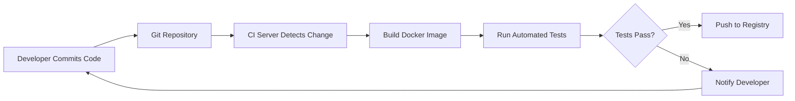

---

## Docker Hub Automated Builds

### Overview

Docker Hub automated builds automatically create Docker images from source code repositories (GitHub/BitBucket) whenever changes are pushed.

### Workflow Architecture

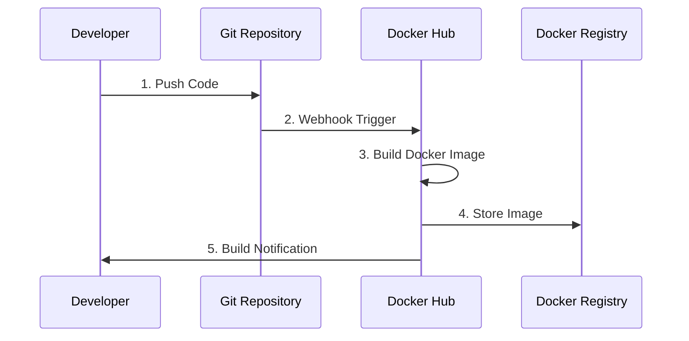

### **Technique 61: Using the Docker Hub Workflow**

#### Complete Step-by-Step Process

| Step        | Action                                | Purpose                    |
| ----------- | ------------------------------------- | -------------------------- |
| **Step 1**  | Create repository on GitHub/BitBucket | Initialize version control |
| **Step 2**  | Clone the Git repository locally      | Get local working copy     |
| **Step 3**  | Add code and Dockerfile to repository | Prepare build instructions |
| **Step 4**  | Commit the source code                | Save changes locally       |
| **Step 5**  | Push to Git repository                | Sync with remote           |
| **Step 6**  | Create new repository on Docker Hub   | Prepare image storage      |
| **Step 7**  | Link Docker Hub repo to Git repo      | Enable automated builds    |
| **Step 8**  | Wait for initial build completion     | Verify first build         |
| **Step 9**  | Commit and push a change              | Test automation            |
| **Step 10** | Wait for second build completion      | Confirm automation works   |

#### Detailed Implementation

**Step 1-2: Repository Setup**

```bash
# Create repository on GitHub first, then clone
git clone https://github.com/username/myapp.git
cd myapp
```

**Step 3-5: Add Code and Dockerfile**

```bash
# Create a simple Dockerfile
cat > Dockerfile << 'EOF'
FROM node:14-alpine
WORKDIR /app
COPY package*.json ./
RUN npm install
COPY . .
EXPOSE 3000
CMD ["npm", "start"]
EOF

# Create application files
echo '{"name": "myapp", "version": "1.0.0"}' > package.json

# Commit and push
git add .
git commit -m "Initial commit with Dockerfile"
git push origin main
```

**Step 6-7: Docker Hub Configuration**

1. Log into Docker Hub (hub.docker.com)
2. Click "Create Repository"
3. Link to GitHub/BitBucket account
4. Select repository and branch
5. Configure build settings

**Step 8-10: Verification**

```bash
# After builds complete, pull and test the image
docker pull username/myapp:latest
docker run -p 3000:3000 username/myapp:latest
```

### Advantages of Automated Builds

| Advantage        | Explanation                           |
| ---------------- | ------------------------------------- |
| **Automation**   | No manual image building required     |
| **Traceability** | Each image linked to specific commit  |
| **Security**     | Source code validated before building |
| **Transparency** | Build logs publicly available         |
| **Integration**  | Works with CI/CD pipelines            |

### Real-World Use Cases

1. **Microservices Deployment**: Automatically build each service when code changes
2. **Multi-environment Support**: Different branches trigger different image tags (dev, staging, prod)
3. **Open Source Projects**: Community can view build process and Dockerfile
4. **Compliance**: Audit trail of all builds and source code

---

## Containerizing CI Process

### Why Containerize CI?

| Traditional CI               | Containerized CI           |
| ---------------------------- | -------------------------- |
| Install CI tools on host     | CI tools in containers     |
| Manual dependency management | Dependencies in image      |
| Environment drift over time  | Consistent environment     |
| Difficult to scale           | Easy horizontal scaling    |
| Hard to reproduce locally    | Run same container locally |

### **Technique 66: Running Jenkins Master within Docker Container**

#### Prerequisites

| Requirement | Specification         | Notes                         |
| ----------- | --------------------- | ----------------------------- |
| **Docker**  | Latest stable version | Must be installed and running |
| **RAM**     | Minimum 256 MB        | 1+ GB recommended             |
| **Storage** | 1 GB minimum          | 10 GB recommended             |
| **Ports**   | 8080, 50000           | Must be available             |

#### Implementation Steps

**Step 1: Verify Docker Installation**

```bash
# Check Docker is installed and running
docker --version
docker info
```

**Step 2: Run Jenkins Docker Container**

```bash
# Run Jenkins with persistent volume
sudo docker run -p 8080:8080 -p 50000:50000 \
  -v jenkins_home:/var/jenkins_home \
  jenkins/jenkins:lts-jdk11

# Breakdown of command:
# -p 8080:8080     -> Map web UI port
# -p 50000:50000   -> Map agent communication port
# -v jenkins_home  -> Named volume for data persistence
# jenkins/jenkins:lts-jdk11 -> Official LTS image with JDK 11
```

**Command Explanation Table**

| Flag                                | Purpose      | Details                                       |
| ----------------------------------- | ------------ | --------------------------------------------- |
| `-p 8080:8080`                      | Web UI Port  | Jenkins web interface access                  |
| `-p 50000:50000`                    | Agent Port   | For Jenkins agents to connect                 |
| `-v jenkins_home:/var/jenkins_home` | Volume Mount | Persist Jenkins data (jobs, configs, plugins) |
| `jenkins/jenkins:lts-jdk11`         | Image        | Long-term support version with Java 11        |

**Step 3: View Running Containers**

```bash
# List all containers (running and stopped)
sudo docker ps -a

# View only running containers
sudo docker ps

# Expected output:
# CONTAINER ID   IMAGE                       STATUS    PORTS
# abc123def456   jenkins/jenkins:lts-jdk11   Up        0.0.0.0:8080->8080/tcp
```

**Step 4: Access Jenkins**

```bash
# Navigate to Jenkins web interface
# URL: http://localhost:8080

# Get initial admin password
sudo docker exec <container-id> cat /var/jenkins_home/secrets/initialAdminPassword
```

### Jenkins Container Architecture

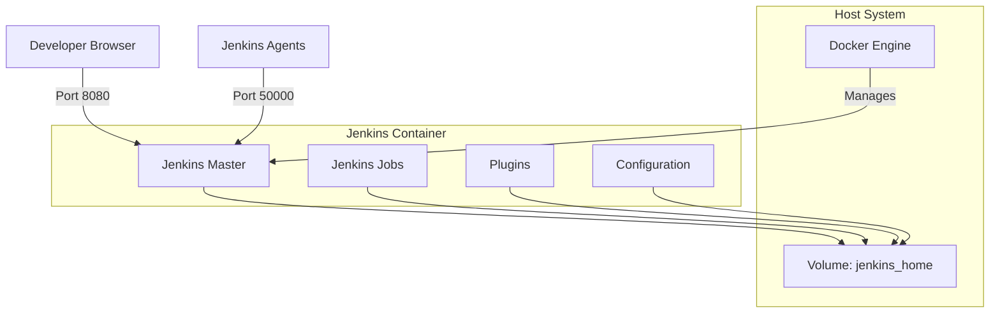

### Additional Configuration

**Dockerfile for Custom Jenkins**

```dockerfile
# Custom Jenkins image with pre-installed plugins
FROM jenkins/jenkins:lts-jdk11

# Switch to root to install tools
USER root

# Install Docker CLI inside Jenkins
RUN apt-get update && \
    apt-get install -y docker.io && \
    apt-get clean

# Install plugins
COPY plugins.txt /usr/share/jenkins/ref/plugins.txt
RUN jenkins-plugin-cli --plugin-file /usr/share/jenkins/ref/plugins.txt

# Switch back to jenkins user
USER jenkins
```

**Docker Compose for Jenkins**

```yaml
version: "3.8"
services:
  jenkins:
    image: jenkins/jenkins:lts-jdk11
    container_name: jenkins-master
    ports:
      - "8080:8080" # Web UI
      - "50000:50000" # Agent communication
    volumes:
      - jenkins_home:/var/jenkins_home
      - /var/run/docker.sock:/var/run/docker.sock # Docker-in-Docker
    restart: unless-stopped
    environment:
      - JENKINS_OPTS=--prefix=/jenkins

volumes:
  jenkins_home:
    driver: local
```

### Benefits of Containerized Jenkins

1. **Portability**: Move Jenkins setup across environments
2. **Version Control**: Infrastructure as Code approach
3. **Easy Updates**: Pull new image and restart
4. **Resource Isolation**: Jenkins doesn't affect host system
5. **Quick Setup**: Minutes instead of hours

---

## Continuous Delivery (CD)

### Definition

**Continuous Delivery** is a software development practice where code changes are automatically built, tested, and prepared for release to production. It extends CI by ensuring software can be reliably released at any time.

### CD vs CI Comparison

| Aspect         | Continuous Integration (CI)  | Continuous Delivery (CD) |
| -------------- | ---------------------------- | ------------------------ |
| **Focus**      | Code integration and testing | Release preparation      |
| **Goal**       | Detect bugs early            | Always be release-ready  |
| **Scope**      | Build and test               | Build, test, and deploy  |
| **Automation** | Build and unit tests         | Full deployment pipeline |
| **Output**     | Tested code                  | Deployable artifacts     |

### CD Pipeline with Docker

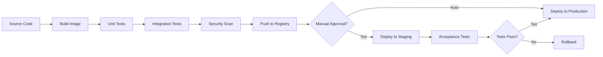

### Key CD Principles with Docker

1. **Immutable Infrastructure**: Docker images don't change after creation
2. **Environment Parity**: Same image runs in dev, test, and prod
3. **Fast Rollback**: Quickly revert to previous image version
4. **Blue-Green Deployments**: Run old and new versions simultaneously
5. **Canary Releases**: Gradual rollout to subset of users

---

## Interacting with Teams in CD Pipeline

### **Technique 70: The Docker Contract - Reducing Friction**

#### Traditional Workflow Problems

**Before Docker: Fragmented Workflow**

| Team            | Problem                   | Impact                      |
| --------------- | ------------------------- | --------------------------- |
| **Development** | "Works on my machine"     | Inconsistent environments   |
| **Testing**     | Non-reproducible test VMs | False positives/negatives   |
| **Operations**  | Manual deployment process | Human errors, slow releases |

**Traditional Workflow Diagram**

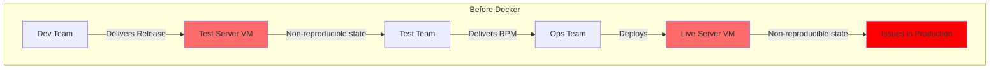

#### Docker Contract Solution

**After Docker: Unified Workflow**

| Benefit                            | Explanation                                   |
| ---------------------------------- | --------------------------------------------- |
| **Single Reference Point**         | All teams use the same versioned Docker image |
| **Reproducibility**                | Image works identically everywhere            |
| **Clear Contract**                 | Image defines inputs/outputs and dependencies |
| **Reduced Communication Overhead** | Less "works on my machine" debates            |

**Docker Contract Workflow**

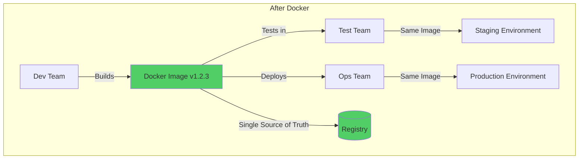

### The Docker Contract Components

**1. Image Specification**

```dockerfile
# Contract: This image provides a Node.js web service
FROM node:14-alpine

# Contract: Application runs on port 3000
EXPOSE 3000

# Contract: Environment variables configure behavior
ENV NODE_ENV=production
ENV DB_HOST=localhost

# Contract: Health check endpoint at /health
HEALTHCHECK --interval=30s --timeout=3s \
  CMD wget --quiet --tries=1 --spider http://localhost:3000/health || exit 1

# Contract: Service starts with npm start
CMD ["npm", "start"]
```

**2. Team Responsibilities with Docker**

| Team            | Responsibility              | Deliverable                          |
| --------------- | --------------------------- | ------------------------------------ |
| **Development** | Build and version images    | Tagged Docker images in registry     |
| **Testing**     | Validate images in test env | Test reports for specific image tags |
| **Operations**  | Deploy approved images      | Running containers in production     |

**3. Communication Flow**

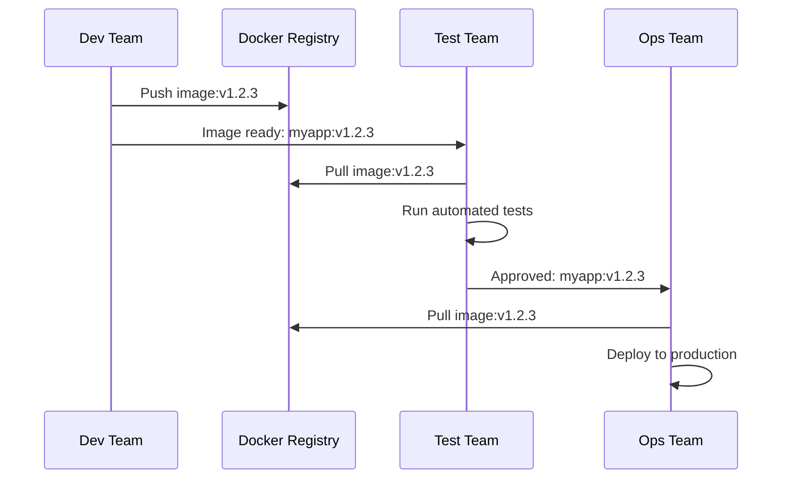

### Real-World Benefits

1. **Faster Releases**: No environment setup delays
2. **Fewer Bugs**: What's tested is what's deployed
3. **Better Collaboration**: Common language across teams
4. **Easier Onboarding**: New team members use same images
5. **Audit Trail**: Every deployment tracked by image tag

---

## Facilitating Deployment of Docker Images

### Overview of Deployment Methods

| Method                   | Use Case                       | Complexity |
| ------------------------ | ------------------------------ | ---------- |
| **Registry Mirroring**   | Multi-region deployments       | Low        |
| **Constrained Networks** | Limited bandwidth environments | Medium     |
| **TAR File Sharing**     | Air-gapped systems             | Low        |

---

### **Technique 71: Manually Mirroring Registry Images**

#### Purpose

Create copies of Docker images with different names/tags for organization, backup, or distribution to private registries.

#### Step-by-Step Process

**Step 1: Pull Image from Docker Hub**

```bash
# Pull the original image
sudo docker pull deepikakripanithi/ubuntu:latest

# Explanation:
# - Fetches image from Docker Hub
# - 'latest' tag gets most recent version
# - Image stored in local Docker cache
```

**Step 2: View Downloaded Images**

```bash
# List all local images
sudo docker images

# Sample output:
# REPOSITORY                    TAG       IMAGE ID       SIZE
# deepikakripanithi/ubuntu     latest    abc123def456   72.8MB
```

**Step 3: Retag the Image**

```bash
# Create new tag for same image
sudo docker tag deepikakripanithi/ubuntu:latest deepikakripanithi/ubuntu2:1.0

# Syntax: docker tag SOURCE_IMAGE[:TAG] TARGET_IMAGE[:TAG]
# This creates an alias, not a copy (same IMAGE ID)
```

**Step 4: Login to Docker Hub**

```bash
# Authenticate with Docker Hub
sudo docker login

# Enter username and password when prompted
# Creates authentication token in ~/.docker/config.json
```

**Step 5: Push Retagged Image**

```bash
# Upload the retagged image
sudo docker push deepikakripanithi/ubuntu2:1.0

# Verification:
sudo docker images
# Both tags point to same IMAGE ID
```

#### Image Tagging Strategy

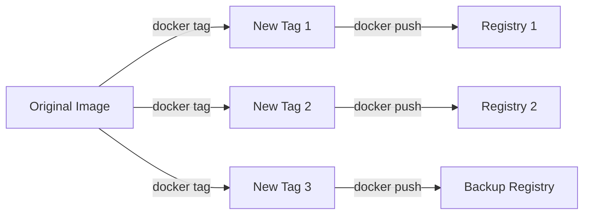

#### Common Tagging Conventions

| Tag Format    | Purpose              | Example            |
| ------------- | -------------------- | ------------------ |
| `latest`      | Most recent stable   | `myapp:latest`     |
| `version`     | Semantic versioning  | `myapp:1.2.3`      |
| `git-sha`     | Specific commit      | `myapp:a3f42e1`    |
| `env-version` | Environment specific | `myapp:prod-1.2.3` |
| `date`        | Timestamp            | `myapp:2024-12-19` |

---

### **Technique 72: Delivering Images Over Constrained Connections**

#### Purpose

Optimize image transfer over slow or expensive network connections by using multi-stage builds and selective transfers.

#### Scenario

Transfer multiple related images efficiently over limited bandwidth.

**Step 1: Create Multi-Stage Dockerfile**

```dockerfile
# Dockerfile with multiple build stages
# Each stage is a separate image that can be built independently

# First image stage
FROM alpine as img1
COPY file1.txt .
RUN echo "Image 1 specific processing"

# Second image stage
FROM alpine as img2
COPY file2.txt .
RUN echo "Image 2 specific processing"

# Benefits:
# - Share base layers (alpine)
# - Only changed layers transferred
# - Efficient use of network bandwidth
```

**Step 2: Build Images with Target Stages**

```bash
# Build only the first image
sudo docker build -t image1 --target img1 .

# Build only the second image
sudo docker build -t image2 --target img2 .

# Explanation:
# --target flag stops build at specified stage
# Creates smaller, focused images
# Shared layers (FROM alpine) only stored once

# Note: Images are now ready to transfer to remote system
# over network using docker save/load or registry push/pull
```

**Step 3: Run Images in Detached Mode**

```bash
# Run first container in background
sudo docker run -it --name image1 -d image1:latest

# Run second container in background
sudo docker run -it --name image2 -d image2:latest

# Flags explained:
# -it         -> Interactive terminal (though running detached)
# --name      -> Give container a friendly name
# -d          -> Detached mode (runs in background)
# image1:latest -> Image name and tag to run
```

**Step 4: Inspect Network to Get IP Addresses**

```bash
# View bridge network details
sudo docker network inspect bridge

# Output shows IP addresses of all containers
# Example output section:
# "Containers": {
#     "abc123": {
#         "Name": "image1",
#         "IPv4Address": "172.17.0.2/16"
#     },
#     "def456": {
#         "Name": "image2",
#         "IPv4Address": "172.17.0.3/16"
#     }
# }
```

**Step 5: Test Container Communication**

```bash
# Execute command inside image1 container
sudo docker container exec -it image1 /bin/sh

# Inside container, ping image2
ping 172.17.0.3

# Or use container name (requires proper DNS setup)
ping image2

# Exit container shell
exit
```

#### Network Architecture

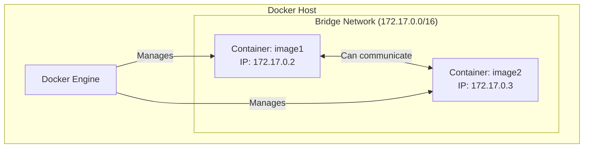

#### Bandwidth Optimization Techniques

| Technique               | Savings | Implementation               |
| ----------------------- | ------- | ---------------------------- |
| **Layer Caching**       | 50-90%  | Use same base images         |
| **Multi-stage Builds**  | 60-80%  | Remove build dependencies    |
| **Minimal Base Images** | 30-50%  | Use alpine instead of ubuntu |
| **Image Compression**   | 20-40%  | Use docker save with gzip    |

**Example: Transfer Images Over Slow Network**

```bash
# On source machine: Save images efficiently
sudo docker save image1:latest image2:latest | gzip > images.tar.gz

# Transfer using rsync (resume-capable)
rsync -avz --progress images.tar.gz user@remote:/tmp/

# On destination machine: Load images
gunzip -c /tmp/images.tar.gz | sudo docker load
```

---

### **Technique 73: Sharing Docker Objects as TAR Files**

#### Purpose

Share Docker containers and images in environments without registry access (air-gapped systems, offline transfers).

#### Complete Workflow

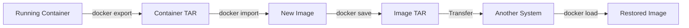

#### Implementation Steps

**Step 1: Export Running Container**

```bash
# Export container filesystem to TAR file
sudo docker export nginx-container > nginx.tar

# Alternative with container ID
sudo docker export abc123def > nginx.tar

# What gets exported:
# - Container's filesystem
# - All file changes made to container
# - NOT: Container config, history, or layers
```

**Step 2: Import TAR as New Image**

```bash
# Import TAR file as new Docker image
sudo docker import - mynginx < nginx.tar

# Syntax breakdown:
# docker import    -> Command to create image from TAR
# -                -> Read from stdin
# mynginx          -> Name for new image
# < nginx.tar      -> Input file

# Alternative: Import from file directly
sudo docker import nginx.tar mynginx:v1.0
```

**Step 3: Verify Imported Image**

```bash
# List all images
sudo docker images

# Expected output:
# REPOSITORY   TAG       IMAGE ID       CREATED         SIZE
# mynginx      latest    ghi789jkl012   5 seconds ago   142MB
```

**Step 4: Save Image with Full History**

```bash
# Save image with all layers and metadata
sudo docker save -o mynginx1.tar mynginx

# Explanation:
# -o mynginx1.tar  -> Output file
# mynginx          -> Image name to save

# This preserves:
# - All image layers
# - Image history
# - Image metadata
# - Multiple tags (if present)
```

**Step 5: Load Image TAR File**

```bash
# Load image from TAR file
sudo docker load --input mynginx1.tar

# Alternative shorter syntax
sudo docker load < mynginx1.tar

# Verification
sudo docker images
```

#### Export vs Save Comparison

| Feature                | docker export            | docker save          |
| ---------------------- | ------------------------ | -------------------- |
| **Input**              | Container                | Image                |
| **Output**             | Flattened filesystem TAR | Layered image TAR    |
| **Preserves History**  | ❌ No                    | ✅ Yes               |
| **Preserves Layers**   | ❌ No                    | ✅ Yes               |
| **Preserves Metadata** | ❌ No                    | ✅ Yes               |
| **File Size**          | Smaller                  | Larger               |
| **Use Case**           | Quick snapshots          | Full backup/transfer |
| **Restore Command**    | docker import            | docker load          |

#### Practical Examples

**Example 1: Backup Entire Image**

```bash
# Save multiple images to single TAR
sudo docker save -o backup.tar nginx:latest mysql:8.0 redis:alpine

# Compress for storage
gzip backup.tar

# Restore on another machine
gunzip backup.tar.gz
sudo docker load -i backup.tar
```

**Example 2: Share Modified Container**

```bash
# Run container and make changes
sudo docker run -it --name myubuntu ubuntu:latest bash
# (Inside container: install packages, modify files)
exit

# Export modified container
sudo docker export myubuntu > custom-ubuntu.tar

# Share TAR file with colleague
# They import it:
sudo docker import custom-ubuntu.tar colleague/custom-ubuntu:v1
```

**Example 3: Air-Gapped Deployment**

```bash
# On connected machine: Save all needed images
sudo docker save -o webapp-stack.tar \
  webapp:latest \
  postgres:13 \
  nginx:alpine \
  redis:6

# Copy to USB drive or secure transfer
# On air-gapped machine:
sudo docker load -i webapp-stack.tar

# Verify all images loaded
sudo docker images
```

---

## Configuring Images for Environments

### Why Configuration Management?

| Challenge                  | Solution with Configuration Management |
| -------------------------- | -------------------------------------- |
| **Hard-coded values**      | External configuration                 |
| **Different environments** | Same image, different config           |
| **Security**               | Secrets outside images                 |
| **Dynamic scaling**        | Runtime configuration                  |

---

### **Technique 74: Informing Your Containers with etcd**

#### What is etcd?

**etcd** is a distributed, reliable key-value store used for storing configuration data, service discovery, and coordinating distributed systems.

**Key Features:**

| Feature             | Description                                      |
| ------------------- | ------------------------------------------------ |
| **Distributed**     | Runs across multiple nodes for high availability |
| **Consistent**      | Ensures data consistency using Raft consensus    |
| **Key-Value Store** | Simple API for storing configuration             |
| **Watch Mechanism** | Get notified of configuration changes            |
| **Fast**            | Optimized for read-heavy workloads               |

#### etcd Architecture

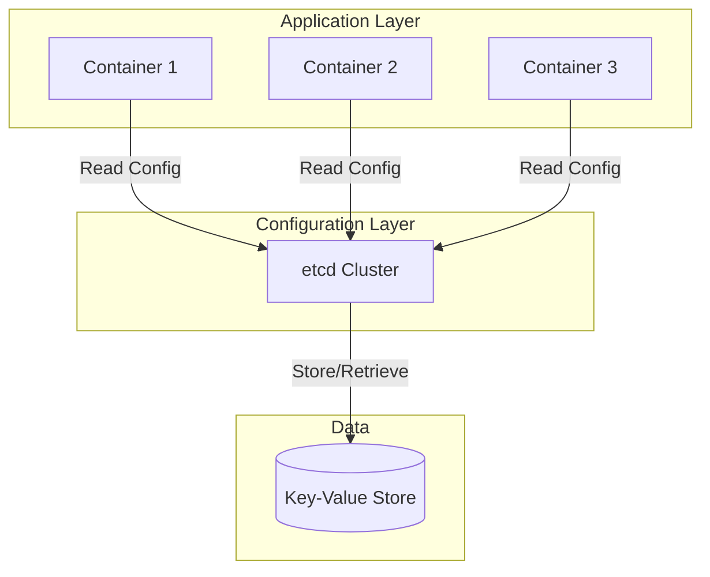

#### Implementation Steps

**Step 1: Run etcd Container**

```bash
# Run etcd with authentication disabled (for development)
sudo docker run -d \
  -p 2379:2379 \
  -p 2380:2380 \
  --name etcd \
  -e ALLOW_NONE_AUTHENTICATION=yes \
  bitnami/etcd:latest

# Port explanation:
# 2379 -> Client communication (API)
# 2380 -> Peer communication (clustering)

# Environment variable:
# ALLOW_NONE_AUTHENTICATION=yes -> Disable auth (DEV ONLY!)
```

**Port Details:**

| Port | Purpose          | Protocol  |
| ---- | ---------------- | --------- |
| 2379 | Client API       | HTTP/gRPC |
| 2380 | Server-to-server | HTTP      |

**Step 2: Verify etcd is Running**

```bash
# Check running containers
sudo docker ps

# Expected output:
# CONTAINER ID   IMAGE                 STATUS         PORTS
# xyz789abc123   bitnami/etcd:latest   Up 2 minutes   0.0.0.0:2379-2380->2379-2380/tcp

# Check logs
sudo docker logs etcd
```

**Step 3: Set Key-Value Pairs**

```bash
# Store configuration using 'put' command
sudo docker exec etcd etcdctl put /my_name deepika

# Syntax: etcdctl put <key> <value>
# Key: /my_name (hierarchical path recommended)
# Value: deepika

# Store more configuration
sudo docker exec etcd etcdctl put /app/database/host localhost
sudo docker exec etcd etcdctl put /app/database/port 5432
sudo docker exec etcd etcdctl put /app/feature/new_ui true
```

**Step 4: Retrieve Key-Value Pairs**

```bash
# Get single key-value
sudo docker exec etcd etcdctl get /my_name

# Output:
# /my_name
# deepika

# Get with additional details
sudo docker exec etcd etcdctl get /my_name --print-value-only
# Output: deepika

# Get all keys with prefix
sudo docker exec etcd etcdctl get /app/ --prefix

# Delete a key
sudo docker exec etcd etcdctl del /my_name
```

#### etcd Operations Reference

| Operation  | Command                         | Purpose                   |
| ---------- | ------------------------------- | ------------------------- |
| **Put**    | `etcdctl put <key> <value>`     | Store or update key-value |
| **Get**    | `etcdctl get <key>`             | Retrieve value for key    |
| **Delete** | `etcdctl del <key>`             | Remove key-value pair     |
| **List**   | `etcdctl get <prefix> --prefix` | Get all keys with prefix  |
| **Watch**  | `etcdctl watch <key>`           | Monitor key for changes   |

#### Using etcd in Applications

**Example: Python Application Reading from etcd**

```python
import etcd3

# Connect to etcd
etcd = etcd3.client(host='localhost', port=2379)

# Read configuration
db_host = etcd.get('/app/database/host')[0].decode('utf-8')
db_port = etcd.get('/app/database/port')[0].decode('utf-8')

print(f"Connecting to database at {db_host}:{db_port}")

# Watch for configuration changes
watch_id = etcd.add_watch_callback('/app/feature/new_ui', callback_function)
```

**Example: Node.js Application**

```javascript
const { Etcd3 } = require("etcd3")
const client = new Etcd3({ hosts: "localhost:2379" })

async function getConfig() {
  // Read configuration
  const dbHost = await client.get("/app/database/host").string()
  const featureFlag = await client.get("/app/feature/new_ui").string()

  console.log(`Database: ${dbHost}`)
  console.log(`New UI enabled: ${featureFlag}`)
}

// Watch for changes
const watcher = await client.watch().key("/app/feature/new_ui").create()

watcher.on("put", (event) => {
  console.log("Feature flag changed:", event.value.toString())
})
```

#### Configuration Hierarchy Best Practices

```mermaid
flowchart TB
    A[Root /] --> B[/app]
    A --> C[/global]

    B --> D[/app/database]
    B --> E[/app/cache]
    B --> F[/app/features]

    D --> G[/app/database/host]
    D --> H[/app/database/port]
    D --> I[/app/database/name]

    E --> J[/app/cache/redis_url]
    E --> K[/app/cache/ttl]

    F --> L[/app/features/new_ui]
    F --> M[/app/features/beta_access]
```

**Recommended Key Structure:**

| Key Pattern                  | Example                      | Use Case             |
| ---------------------------- | ---------------------------- | -------------------- |
| `/app/<service>/<param>`     | `/app/database/host`         | Application config   |
| `/env/<environment>/<param>` | `/env/production/api_url`    | Environment-specific |
| `/secrets/<service>/<key>`   | `/secrets/database/password` | Sensitive data       |
| `/feature/<flag_name>`       | `/feature/new_checkout`      | Feature flags        |

#### Advantages of etcd for Configuration

1. **Centralized Management**: Single source of truth for all configuration
2. **Dynamic Updates**: Change config without restarting containers
3. **High Availability**: Distributed architecture prevents single point of failure
4. **Version Control**: Track configuration changes over time
5. **Multi-Environment**: Different configs for dev/staging/prod

#### Real-World Use Cases

**1. Microservices Configuration**

```bash
# Store service discovery information
sudo docker exec etcd etcdctl put /services/user-api/endpoint "http://user-api:8080"
sudo docker exec etcd etcdctl put /services/order-api/endpoint "http://order-api:8081"
sudo docker exec etcd etcdctl put /services/payment-api/endpoint "http://payment-api:8082"

# Each microservice reads its dependencies from etcd
```

**2. Feature Flags**

```bash
# Enable/disable features without deployment
sudo docker exec etcd etcdctl put /features/new_dashboard "true"
sudo docker exec etcd etcdctl put /features/beta_checkout "false"
sudo docker exec etcd etcdctl put /features/ai_recommendations "true"

# Applications check flags at runtime
```

**3. Database Connection Pooling**

```bash
# Configure database connections dynamically
sudo docker exec etcd etcdctl put /database/max_connections "100"
sudo docker exec etcd etcdctl put /database/timeout "30s"
sudo docker exec etcd etcdctl put /database/retry_attempts "3"
```

#### Production Deployment Considerations

| Aspect             | Development                                | Production               |
| ------------------ | ------------------------------------------ | ------------------------ |
| **Authentication** | Disabled (`ALLOW_NONE_AUTHENTICATION=yes`) | Enable with certificates |
| **Nodes**          | Single node                                | 3+ node cluster          |
| **Persistence**    | Optional                                   | Required (volume mounts) |
| **Network**        | Bridge                                     | Overlay/custom network   |
| **Backup**         | Not critical                               | Regular snapshots        |

**Production etcd Setup**

```bash
# Run etcd with persistent volume and authentication
sudo docker run -d \
  -p 2379:2379 \
  -p 2380:2380 \
  --name etcd-prod \
  -v etcd-data:/bitnami/etcd \
  -e ETCD_ROOT_PASSWORD=strongpassword \
  -e ETCD_AUTH_TOKEN=jwt \
  bitnami/etcd:latest

# Create user with specific permissions
sudo docker exec etcd-prod etcdctl user add myapp --password=apppass
sudo docker exec etcd-prod etcdctl role add myapp-role
sudo docker exec etcd-prod etcdctl role grant-permission myapp-role readwrite /app/
```

---

## Upgrading Running Containers

### Container Lifecycle and Upgrades

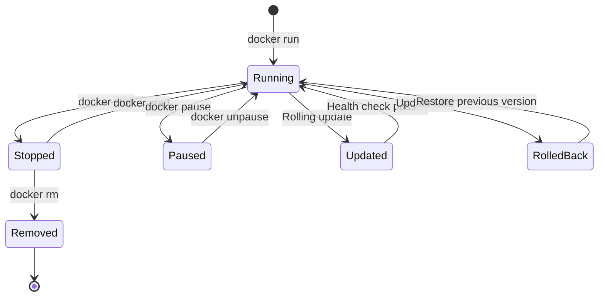

### Upgrade Strategies

| Strategy           | Downtime | Complexity | Risk   | Use Case        |
| ------------------ | -------- | ---------- | ------ | --------------- |
| **Recreate**       | ✅ Yes   | Low        | Low    | Development     |
| **Rolling Update** | ❌ No    | Medium     | Medium | Production      |
| **Blue-Green**     | ❌ No    | High       | Low    | Critical apps   |
| **Canary**         | ❌ No    | High       | Low    | Gradual rollout |

---

### Strategy 1: Recreate (Simple Upgrade)

#### Process

Stop old container, remove it, start new version.

```bash
# Step 1: Stop running container
sudo docker stop myapp-v1

# Step 2: Remove old container
sudo docker rm myapp-v1

# Step 3: Pull new image version
sudo docker pull myapp:v2.0

# Step 4: Run new container
sudo docker run -d --name myapp-v2 \
  -p 8080:8080 \
  myapp:v2.0

# Verification
sudo docker ps
```

**Downtime Visualization:**

```mermaid
gantt
    title Recreate Upgrade Strategy
    dateFormat HH:mm
    section Service
    Running v1    :done, 09:00, 09:05
    Downtime      :crit, 09:05, 09:07
    Running v2    :active, 09:07, 09:15
```

---

### Strategy 2: Rolling Update (Zero Downtime)

#### Process

Gradually replace old containers with new ones.

```bash
# Initial state: 3 containers running v1
sudo docker run -d --name app-1 -p 8081:8080 myapp:v1
sudo docker run -d --name app-2 -p 8082:8080 myapp:v1
sudo docker run -d --name app-3 -p 8083:8080 myapp:v1

# Rolling update process
# Step 1: Start first new container
sudo docker run -d --name app-4 -p 8084:8080 myapp:v2
sleep 10  # Wait for health check

# Step 2: Remove first old container
sudo docker stop app-1 && sudo docker rm app-1

# Step 3: Start second new container
sudo docker run -d --name app-5 -p 8085:8080 myapp:v2
sleep 10

# Step 4: Remove second old container
sudo docker stop app-2 && sudo docker rm app-2

# Step 5: Start third new container
sudo docker run -d --name app-6 -p 8086:8080 myapp:v2
sleep 10

# Step 6: Remove last old container
sudo docker stop app-3 && sudo docker rm app-3
```

**Rolling Update Timeline:**

```mermaid
gantt
    title Rolling Update (Zero Downtime)
    dateFormat HH:mm
    section Instance 1
    v1 Running    :done, 09:00, 09:05
    v2 Starting   :active, 09:05, 09:06
    v2 Running    :09:06, 09:20
    section Instance 2
    v1 Running    :done, 09:00, 09:08
    v2 Starting   :active, 09:08, 09:09
    v2 Running    :09:09, 09:20
    section Instance 3
    v1 Running    :done, 09:00, 09:11
    v2 Starting   :active, 09:11, 09:12
    v2 Running    :09:12, 09:20
```

---

### Strategy 3: Blue-Green Deployment

#### Process

Run both versions simultaneously, switch traffic instantly.

```bash
# BLUE environment (current production - v1)
sudo docker run -d --name blue-app-1 -p 8081:8080 myapp:v1
sudo docker run -d --name blue-app-2 -p 8082:8080 myapp:v1

# GREEN environment (new version - v2)
sudo docker run -d --name green-app-1 -p 9081:8080 myapp:v2
sudo docker run -d --name green-app-2 -p 9082:8080 myapp:v2

# Test green environment
curl http://localhost:9081/health
curl http://localhost:9082/health

# Switch traffic (update load balancer or reverse proxy)
# Nginx config change:
# upstream backend {
#     server localhost:9081;  # Changed from 8081
#     server localhost:9082;  # Changed from 8082
# }

# Reload nginx
sudo nginx -s reload

# If successful, remove blue environment
# If issues, switch back to blue immediately
```

**Blue-Green Architecture:**

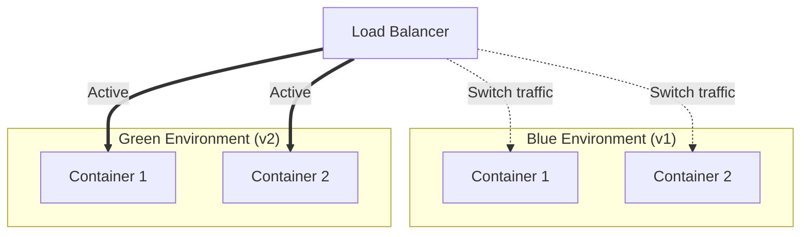

---

### Strategy 4: Canary Deployment

#### Process

Route small percentage of traffic to new version, gradually increase.

```bash
# Production v1 (90% traffic)
sudo docker run -d --name prod-1 -p 8081:8080 myapp:v1
sudo docker run -d --name prod-2 -p 8082:8080 myapp:v1
sudo docker run -d --name prod-3 -p 8083:8080 myapp:v1

# Canary v2 (10% traffic)
sudo docker run -d --name canary-1 -p 8084:8080 myapp:v2

# Nginx weighted load balancing
# upstream backend {
#     server localhost:8081 weight=3;
#     server localhost:8082 weight=3;
#     server localhost:8083 weight=3;
#     server localhost:8084 weight=1;  # Canary gets 10%
# }

# Monitor canary metrics
# If successful, gradually increase canary weight
# Eventually replace all v1 containers
```

**Canary Rollout Phases:**

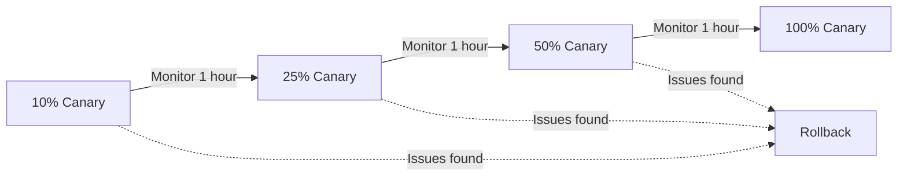

---

### Health Checks and Rollback

#### Implementing Health Checks

```dockerfile
# In Dockerfile
FROM node:14-alpine
WORKDIR /app
COPY . .

# Define health check
HEALTHCHECK --interval=30s --timeout=3s --start-period=40s --retries=3 \
  CMD wget --no-verbose --tries=1 --spider http://localhost:8080/health || exit 1

CMD ["npm", "start"]
```

```bash
# Run container with health check
sudo docker run -d --name myapp \
  --health-cmd="curl -f http://localhost:8080/health || exit 1" \
  --health-interval=30s \
  --health-timeout=3s \
  --health-retries=3 \
  -p 8080:8080 \
  myapp:latest

# Check health status
sudo docker inspect --format='{{.State.Health.Status}}' myapp
# Output: healthy, unhealthy, or starting
```

#### Automated Rollback Script

```bash
#!/bin/bash
# rollback.sh - Automated rollback script

NEW_VERSION="myapp:v2.0"
OLD_VERSION="myapp:v1.5"
CONTAINER_NAME="myapp"

echo "Starting deployment of $NEW_VERSION..."

# Stop and remove old container
docker stop $CONTAINER_NAME
docker rm $CONTAINER_NAME

# Start new version
docker run -d --name $CONTAINER_NAME -p 8080:8080 $NEW_VERSION

# Wait for container to be healthy
echo "Waiting for health check..."
sleep 10

HEALTH_STATUS=$(docker inspect --format='{{.State.Health.Status}}' $CONTAINER_NAME)

if [ "$HEALTH_STATUS" != "healthy" ]; then
    echo "Health check failed! Rolling back to $OLD_VERSION"

    # Rollback
    docker stop $CONTAINER_NAME
    docker rm $CONTAINER_NAME
    docker run -d --name $CONTAINER_NAME -p 8080:8080 $OLD_VERSION

    echo "Rollback complete"
    exit 1
else
    echo "Deployment successful!"
    exit 0
fi
```

---

### Container Update Best Practices

| Practice              | Description                            | Benefit                     |
| --------------------- | -------------------------------------- | --------------------------- |
| **Immutable Images**  | Never modify running containers        | Reproducible deployments    |
| **Version Tags**      | Use specific versions, not `latest`    | Prevent unexpected changes  |
| **Health Checks**     | Implement application health endpoints | Automated failure detection |
| **Graceful Shutdown** | Handle SIGTERM signals properly        | Clean state transitions     |
| **Backup Strategy**   | Keep previous images available         | Quick rollback              |
| **Monitoring**        | Track metrics during upgrade           | Early issue detection       |
| **Testing**           | Test in staging first                  | Reduce production risks     |

---

### Docker Compose for Updates

```yaml
version: "3.8"

services:
  web:
    image: myapp:${VERSION:-latest}
    deploy:
      replicas: 3
      update_config:
        parallelism: 1 # Update 1 container at a time
        delay: 10s # Wait 10s between updates
        failure_action: rollback # Auto rollback on failure
        monitor: 60s # Monitor for 60s after update
      rollback_config:
        parallelism: 1
        delay: 5s
    healthcheck:
      test: ["CMD", "curl", "-f", "http://localhost:8080/health"]
      interval: 30s
      timeout: 3s
      retries: 3
      start_period: 40s
    ports:
      - "8080:8080"
```

```bash
# Deploy new version
VERSION=v2.0 docker-compose up -d

# Docker Compose automatically performs rolling update
# Monitors health checks
# Rolls back if issues detected
```

---

## Summary and Key Takeaways

### Unit 3 Overview Table

| Topic                    | Key Technique               | Primary Benefit                    |
| ------------------------ | --------------------------- | ---------------------------------- |
| **CI with Docker**       | Docker Hub Automated Builds | Automated image creation from code |
| **Containerized CI**     | Jenkins in Docker           | Consistent CI environment          |
| **CD Pipeline**          | Docker Contract             | Reduced team friction              |
| **Image Deployment**     | Registry Mirroring          | Multi-region distribution          |
| **Constrained Networks** | Multi-stage Builds          | Bandwidth optimization             |
| **Offline Sharing**      | TAR Export/Import           | Air-gapped deployments             |
| **Configuration**        | etcd Integration            | Dynamic config management          |
| **Container Updates**    | Rolling Updates             | Zero-downtime deployments          |

---

### Docker DevOps Workflow (Complete Picture)

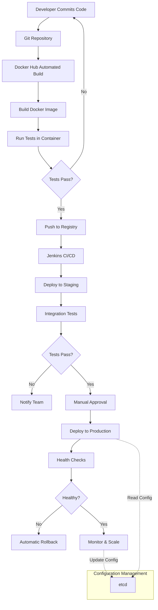

---

### Exam Preparation Checklist

#### Must Know Concepts ✓

- [ ] **Docker Hub Workflow** - All 10 steps in order
- [ ] **Jenkins in Docker** - Command flags and ports (8080, 50000)
- [ ] **Docker Contract** - Before/After diagrams
- [ ] **Image Mirroring** - Pull, tag, push sequence
- [ ] **Multi-stage Builds** - --target flag usage
- [ ] **TAR Operations** - export vs save differences
- [ ] **etcd Commands** - put, get, delete operations
- [ ] **Update Strategies** - Recreate, Rolling, Blue-Green, Canary
- [ ] **Health Checks** - HEALTHCHECK directive syntax

#### Key Commands to Memorize

```bash
# Docker Hub & Registry
docker pull <image>
docker tag <source> <target>
docker push <image>

# Jenkins Container
docker run -p 8080:8080 -p 50000:50000 -v jenkins_home:/var/jenkins_home jenkins/jenkins:lts-jdk11

# Multi-stage Build
docker build -t <name> --target <stage> .

# TAR Operations
docker export <container> > file.tar
docker import - <name> < file.tar
docker save -o file.tar <image>
docker load --input file.tar

# etcd Operations
docker exec etcd etcdctl put <key> <value>
docker exec etcd etcdctl get <key>

# Container Management
docker ps -a
docker network inspect bridge
docker exec -it <container> /bin/sh
```

---

### Practice Questions

1. **What are the advantages of Docker Hub automated builds over manual builds?**
2. **Explain the difference between `docker export` and `docker save`**
3. **Why use etcd for configuration instead of environment variables?**
4. **Compare rolling update vs blue-green deployment strategies**
5. **How does the Docker contract reduce friction between teams?**

---

### Additional Resources

| Resource             | Type          | Focus Area           |
| -------------------- | ------------- | -------------------- |
| Docker in Practice   | Book          | Practical techniques |
| Kubernetes in Action | Book          | Orchestration        |
| Learning DevOps      | Book          | CI/CD pipelines      |
| Docker Documentation | Official Docs | Complete reference   |
| docker.com/labs      | Hands-on Labs | Practice exercises   |

---

## Quick Reference Cards

### Port Reference

| Service        | Port  | Purpose             |
| -------------- | ----- | ------------------- |
| Jenkins Web    | 8080  | Web interface       |
| Jenkins Agents | 50000 | Agent communication |
| etcd Client    | 2379  | Client API          |
| etcd Peer      | 2380  | Server clustering   |

### Docker Command Quick Reference

| Task             | Command                            |
| ---------------- | ---------------------------------- |
| List containers  | `docker ps -a`                     |
| List images      | `docker images`                    |
| Remove container | `docker rm <name>`                 |
| Remove image     | `docker rmi <image>`               |
| View logs        | `docker logs <name>`               |
| Execute command  | `docker exec -it <name> <cmd>`     |
| Inspect network  | `docker network inspect <network>` |

---

**End of Unit 3 Notes**

_Study Tips:_

- Practice each technique hands-on
- Draw diagrams to visualize workflows
- Create flashcards for commands
- Explain concepts to others
- Build a sample CI/CD pipeline
- Use Docker Compose for complex setups

Good luck with your exam preparation! 🚀
