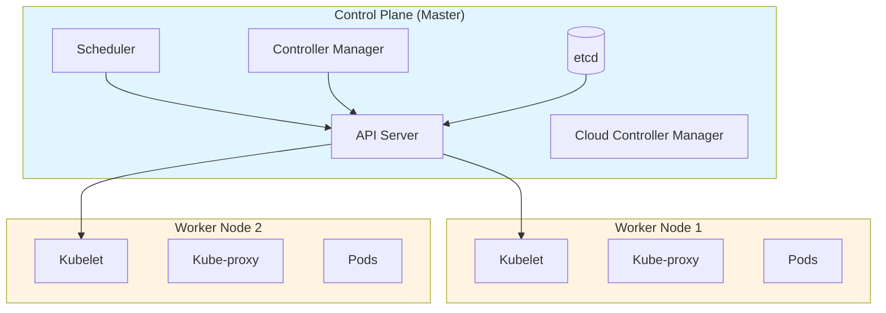
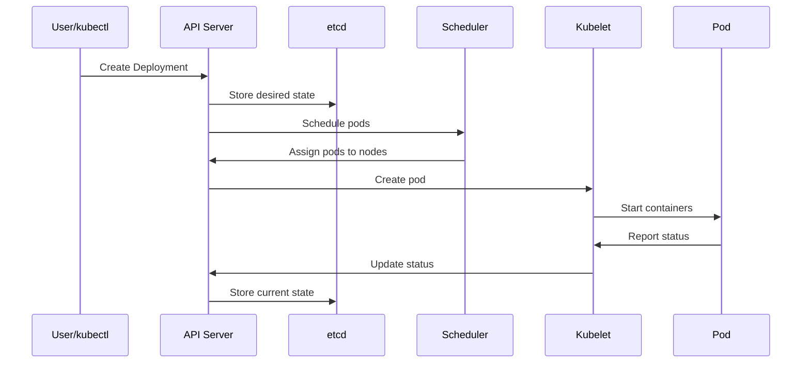
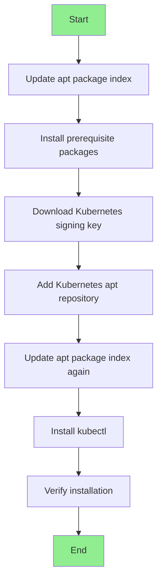
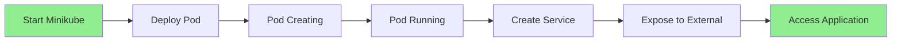
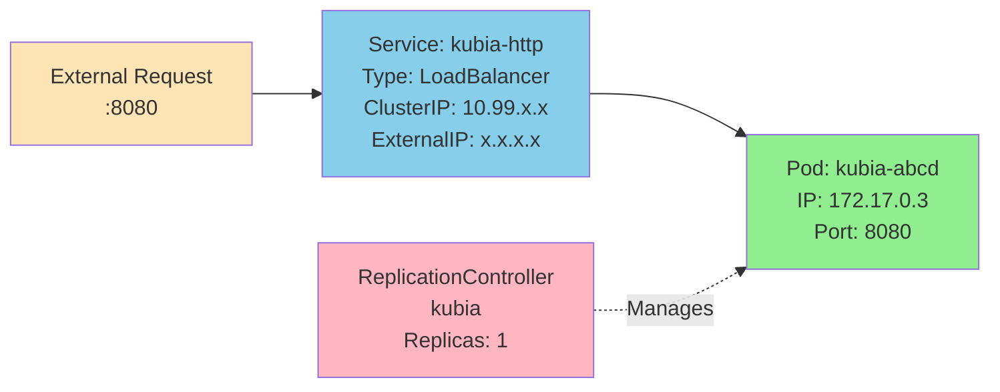
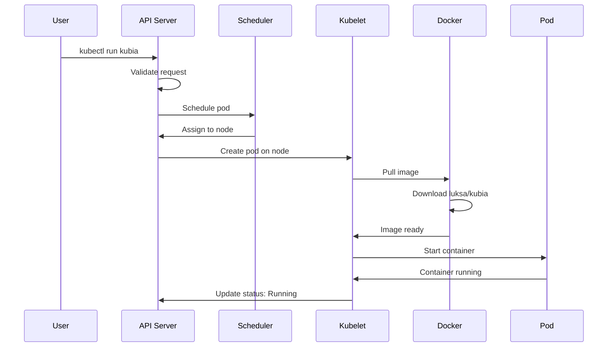

# Unit 4: Docker & Kubernetes - Complete Study Notes

## Table of Contents

1. [Introduction to Docker and Kubernetes](#introduction)
2. [Kubernetes Architecture](#kubernetes-architecture)
3. [Setting up Kubernetes Cluster](#setting-up-kubernetes-cluster)
4. [kubectl Configuration and Usage](#kubectl-configuration)
5. [Running Your First App on Kubernetes](#first-app-on-kubernetes)
6. [Kubernetes Dashboard](#kubernetes-dashboard)
7. [Essential Commands Cheat Sheet](#commands-cheat-sheet)

---

## 1. Introduction to Docker and Kubernetes {#introduction}

### What is Docker?

**Docker** is a containerization platform that packages applications and their dependencies into isolated containers, ensuring consistency across different environments.

### What is Kubernetes?

**Kubernetes (K8s)** is an open-source container orchestration platform that automates deployment, scaling, and management of containerized applications.

### Key Benefits

| Feature             | Docker                          | Kubernetes                     |
| ------------------- | ------------------------------- | ------------------------------ |
| **Primary Purpose** | Container creation & management | Container orchestration        |
| **Scalability**     | Manual scaling                  | Automatic scaling              |
| **Load Balancing**  | Limited                         | Built-in                       |
| **Self-healing**    | No                              | Yes (auto-restart)             |
| **Best For**        | Single-host applications        | Multi-host, production systems |

---

## 2. Kubernetes Architecture {#kubernetes-architecture}

### 2.1 Architecture Overview

Kubernetes follows a **Master-Worker** architecture with two main components:

- **Control Plane (Master Node)**: Manages the cluster
- **Worker Nodes**: Run the actual applications



### 2.2 Control Plane Components

| Component                    | Description                                | Key Functions                                                                                                                                                                                     |
| ---------------------------- | ------------------------------------------ | ------------------------------------------------------------------------------------------------------------------------------------------------------------------------------------------------- |
| **API Server**               | Front-end for the Kubernetes control plane | • Exposes Kubernetes API<br>• Central hub for all communications<br>• Validates and processes REST requests                                                                                       |
| **etcd**                     | Distributed key-value store                | • Stores all cluster data<br>• Maintains cluster state<br>• Source of truth for the cluster                                                                                                       |
| **Scheduler**                | Assigns pods to nodes                      | • Watches for newly created pods<br>• Selects optimal node based on resources<br>• Considers constraints and affinity rules                                                                       |
| **Controller Manager**       | Runs controller processes                  | • Node Controller: monitors node health<br>• Replication Controller: maintains pod count<br>• Endpoints Controller: populates endpoints<br>• Service Account Controller: creates default accounts |
| **Cloud Controller Manager** | Interacts with cloud providers             | • Node management<br>• Route management<br>• Service (load balancer) management                                                                                                                   |

### 2.3 Worker Node Components

| Component             | Description                | Key Functions                                                                                               |
| --------------------- | -------------------------- | ----------------------------------------------------------------------------------------------------------- |
| **Kubelet**           | Agent running on each node | • Ensures containers are running in pods<br>• Communicates with API server<br>• Reports node and pod status |
| **Kube-proxy**        | Network proxy on each node | • Maintains network rules<br>• Enables pod-to-pod communication<br>• Implements Services abstraction        |
| **Container Runtime** | Software to run containers | • Docker, containerd, CRI-O<br>• Pulls images and runs containers                                           |

### 2.4 Component Interaction Flow



---

## 3. Setting up Kubernetes Cluster {#setting-up-kubernetes-cluster}

### 3.1 Minimum Requirements

Before installing Kubernetes, ensure your system meets these requirements:

| Requirement           | Specification              |
| --------------------- | -------------------------- |
| **CPU**               | 2 CPUs or more             |
| **Memory**            | 2GB of free memory minimum |
| **Disk Space**        | 20GB of free disk space    |
| **Internet**          | Active internet connection |
| **Container Runtime** | Docker installed           |

### 3.2 Installing Minikube

**Minikube** is a tool that runs a single-node Kubernetes cluster locally for development and testing.

#### Step 1: Download Minikube

```bash
# Download the latest Minikube Debian package
curl -LO https://storage.googleapis.com/minikube/releases/latest/minikube_latest_amd64.deb
```

#### Step 2: Install Minikube

```bash
# Install the downloaded package
sudo dpkg -i minikube_latest_amd64.deb
```

#### Step 3: Start Cluster with Docker Driver

```bash
# Start Minikube with Docker as the driver
minikube start --driver=docker
```

#### Step 4: Set Docker as Default Driver

```bash
# Make Docker the default driver for future starts
minikube config set driver docker
```

#### Step 5: Start Kubernetes Cluster

```bash
# Start the Minikube cluster
minikube start
```

**Expected Output:**

```
😄  minikube v1.x.x on Ubuntu
✨  Using the docker driver based on user configuration
🎉  minikube 1.x.x is available!
⌛  Starting control plane node in cluster minikube
✅  Done! kubectl is now configured to use "minikube" cluster
```

### 3.3 Installing kubectl

**kubectl** is the command-line tool for interacting with Kubernetes clusters.

#### Installation Process Flow



#### Step 1: Update Package Index

```bash
# Update apt and install prerequisites
sudo apt-get update
sudo apt-get install -y apt-transport-https ca-certificates curl
```

#### Step 2: Download Signing Key

```bash
# Download the public signing key for Kubernetes repositories
curl -fsSL https://pkgs.k8s.io/core:/stable:/v1.28/deb/Release.key | sudo gpg --dearmor \
-o /etc/apt/keyrings/kubernetes-apt-keyring.gpg
```

#### Step 3: Add Kubernetes Repository

```bash
# Add the Kubernetes apt repository to sources list
echo 'deb [signed-by=/etc/apt/keyrings/kubernetes-apt-keyring.gpg] \
https://pkgs.k8s.io/core:/stable:/v1.28/deb/ /' | sudo tee /etc/apt/sources.list.d/kubernetes.list
```

#### Step 4: Install kubectl

```bash
# Update package index and install kubectl
sudo apt-get update
sudo apt-get install -y kubectl
```

#### Step 5: Verify Installation

```bash
# Display cluster information to verify kubectl works
kubectl cluster-info
```

**Expected Output:**

```
Kubernetes control plane is running at https://192.168.49.2:8443
CoreDNS is running at https://192.168.49.2:8443/api/v1/namespaces/kube-system/services/kube-dns:dns/proxy
```

---

## 4. kubectl Configuration and Usage {#kubectl-configuration}

### 4.1 Setting up Aliases and Autocompletion

#### Creating Alias for kubectl

```bash
# Add alias to bashrc for permanent use
echo "alias k=kubectl" >> ~/.bashrc

# Apply changes immediately
source ~/.bashrc
```

**Why use aliases?**

- Faster command execution
- Reduces typing errors
- Industry-standard practice

#### Enabling Autocompletion

```bash
# Enable kubectl autocompletion permanently
echo "source <(kubectl completion bash)" >> ~/.bashrc

# Apply changes
source ~/.bashrc
```

#### Alias with Autocompletion

```bash
# Enable autocompletion for the 'k' alias
alias k=kubectl
complete -o default -F __start_kubectl k
```

### 4.2 Context and Configuration

Kubernetes uses **contexts** to manage multiple clusters.

| Command                                | Description               | Use Case                         |
| -------------------------------------- | ------------------------- | -------------------------------- |
| `kubectl config get-contexts`          | List all contexts         | View available clusters          |
| `kubectl config current-context`       | Display current context   | Check which cluster you're using |
| `kubectl config use-context <name>`    | Switch to another context | Change between clusters          |
| `kubectl config delete-context <name>` | Delete a context          | Remove unused cluster config     |

**Example:**

```bash
# List all contexts
kubectl config get-contexts

# Switch to production context
kubectl config use-context production-cluster

# Verify current context
kubectl config current-context
```

### 4.3 Global Flags

Essential flags that work with most kubectl commands:

| Flag                       | Description       | Example                            |
| -------------------------- | ----------------- | ---------------------------------- |
| `--namespace <ns>`         | Specify namespace | `kubectl get pods --namespace=dev` |
| `--context <ctx>`          | Specify context   | `kubectl get nodes --context=prod` |
| `--help`                   | Show command help | `kubectl create --help`            |
| `-o wide`                  | Extended output   | `kubectl get pods -o wide`         |
| `-o yaml`                  | YAML output       | `kubectl get pod mypod -o yaml`    |
| `-A` or `--all-namespaces` | All namespaces    | `kubectl get pods -A`              |

---

## 5. Running Your First App on Kubernetes {#first-app-on-kubernetes}

### 5.1 Deploying a Node.js Application

#### Complete Deployment Flow



#### Step 1: Start Minikube

```bash
# Ensure Minikube is running
minikube start
```

#### Step 2: Deploy the Application

```bash
# Run a pod with Node.js application
kubectl run kubia --image=luksa/kubia --port=8080
```

**Command Breakdown:**

- `kubectl run`: Creates a new pod
- `kubia`: Name of the pod
- `--image=luksa/kubia`: Docker image to use
- `--port=8080`: Container port to expose

#### Step 3: List Pods

```bash
# Check pod status
kubectl get pods
```

**Initial Output:**

```
NAME    READY   STATUS              RESTARTS   AGE
kubia   0/1     ContainerCreating   0          5s
```

**After Container Starts:**

```
NAME    READY   STATUS    RESTARTS   AGE
kubia   1/1     Running   0          30s
```

**Pod Status Meanings:**

| Status              | Description                            |
| ------------------- | -------------------------------------- |
| `Pending`           | Pod accepted but not scheduled yet     |
| `ContainerCreating` | Pulling image and creating container   |
| `Running`           | Pod is executing successfully          |
| `Succeeded`         | All containers terminated successfully |
| `Failed`            | At least one container failed          |
| `CrashLoopBackOff`  | Container keeps crashing               |

### 5.2 Accessing the Web Application

#### Step 1: Create a Service

```bash
# Expose the pod via a LoadBalancer service
kubectl expose pod kubia --type=LoadBalancer --name kubia-http
```

**Service Types:**

| Type           | Description               | Use Case                     |
| -------------- | ------------------------- | ---------------------------- |
| `ClusterIP`    | Internal cluster IP only  | Inter-pod communication      |
| `NodePort`     | Exposes on each node's IP | Testing, simple access       |
| `LoadBalancer` | External load balancer    | Production external access   |
| `ExternalName` | Maps to external DNS      | External service integration |

#### Step 2: List Services

```bash
# View services
kubectl get services

# Or use shorthand
kubectl get svc
```

**Output:**

```
NAME         TYPE           CLUSTER-IP      EXTERNAL-IP   PORT(S)          AGE
kubernetes   ClusterIP      10.96.0.1       <none>        443/TCP          5m
kubia-http   LoadBalancer   10.99.123.45    <pending>     8080:30123/TCP   10s
```

#### Step 3: Get External IP (Minikube)

```bash
# For Minikube, get the URL to access service
minikube service kubia-http --url
```

#### Step 4: Access the Application

```bash
# Access the application
curl http://<EXTERNAL-IP>:8080

# Or with Minikube
curl $(minikube service kubia-http --url)
```

**Expected Response:**

```
You've hit kubia-abcd
```

### 5.3 Logical Parts of the System

#### System Architecture Diagram



#### Component Relationships

| Component                 | Role                     | Details                                                     |
| ------------------------- | ------------------------ | ----------------------------------------------------------- |
| **Pod**                   | Smallest deployable unit | Contains one or more containers with shared network/storage |
| **Service**               | Stable network endpoint  | Provides consistent IP and load balancing to pods           |
| **ReplicationController** | Maintains pod count      | Ensures specified number of pod replicas are running        |

**Key Concepts:**

- **Pod**: Ephemeral, can be recreated with different IPs
- **Service**: Stable, provides consistent access point
- **Controller**: Ensures desired state matches actual state

### 5.4 Examining Pod Details

#### View Pod Details with -o wide

```bash
# Display pod IP and node information
kubectl get pods -o wide
```

**Output:**

```
NAME    READY   STATUS    RESTARTS   AGE   IP           NODE
kubia   1/1     Running   0          5m    172.17.0.3   minikube
```

**Additional Columns Explained:**

| Column            | Description                     |
| ----------------- | ------------------------------- |
| `IP`              | Internal pod IP address         |
| `NODE`            | Node where pod is running       |
| `NOMINATED NODE`  | Node selected for pending pod   |
| `READINESS GATES` | Additional readiness conditions |

#### Detailed Pod Inspection

```bash
# Get comprehensive pod information
kubectl describe pod kubia
```

**Output Sections:**

```yaml
Name: kubia
Namespace: default
Priority: 0
Node: minikube/192.168.49.2
Start Time: Mon, 25 Nov 2024 10:30:00 +0000
Labels: run=kubia
Status: Running
IP: 172.17.0.3
Containers:
  kubia:
    Container ID: docker://abc123...
    Image: luksa/kubia
    Port: 8080/TCP
    State: Running
Events: Type    Reason     Age   From               Message
  ----    ------     ----  ----               -------
  Normal  Scheduled  5m    default-scheduler  Successfully assigned default/kubia to minikube
  Normal  Pulling    5m    kubelet            Pulling image "luksa/kubia"
  Normal  Pulled     4m    kubelet            Successfully pulled image
  Normal  Created    4m    kubelet            Created container kubia
  Normal  Started    4m    kubelet            Started container kubia
```

### 5.5 Understanding the Deployment Process



---

## 6. Kubernetes Dashboard {#kubernetes-dashboard}

### 6.1 Accessing the Dashboard

The Kubernetes Dashboard provides a web-based UI for cluster management.

#### Minikube Dashboard

```bash
# Launch the Kubernetes dashboard
minikube dashboard
```

**What it does:**

- Opens dashboard in default browser
- Creates proxy to cluster
- Provides read/write access (with proper permissions)

**Expected Output:**

```
🤔  Verifying dashboard health ...
🚀  Launching proxy ...
🤔  Verifying proxy health ...
🎉  Opening http://127.0.0.1:xxxxx/api/v1/namespaces/kubernetes-dashboard/services/http:kubernetes-dashboard:/proxy/ in your default browser...
```

### 6.2 Dashboard Features

| Feature         | Description                         | Use Case                       |
| --------------- | ----------------------------------- | ------------------------------ |
| **Overview**    | Cluster health and resource usage   | Quick cluster status check     |
| **Workloads**   | View/manage pods, deployments, etc. | Monitor application state      |
| **Services**    | View/manage services and ingresses  | Check networking configuration |
| **Storage**     | View persistent volumes and claims  | Manage storage resources       |
| **Config Maps** | View/edit configuration data        | Update app configurations      |
| **Logs**        | View container logs                 | Troubleshooting and debugging  |

### 6.3 Dashboard Security Best Practices

⚠️ **Security Warnings:**

- Dashboard has full cluster access
- Never expose dashboard publicly without authentication
- Use RBAC (Role-Based Access Control) in production
- Consider using `kubectl proxy` with authentication

---

## 7. Essential Commands Cheat Sheet {#commands-cheat-sheet}

### 7.1 Resource Management

#### Display Resources

| Command                              | Description                         | Example Output                 |
| ------------------------------------ | ----------------------------------- | ------------------------------ |
| `kubectl get <resource>`             | List resources in current namespace | Lists all pods/services/etc.   |
| `kubectl get <resource> -o wide`     | Extended information                | Shows IPs, nodes, etc.         |
| `kubectl get <resource> -A`          | All namespaces                      | Shows resources across cluster |
| `kubectl get <resource> <name>`      | Specific resource                   | Details of named resource      |
| `kubectl get <resource> -o yaml`     | YAML format                         | Full resource definition       |
| `kubectl describe <resource> <name>` | Detailed information                | Events, status, config         |

**Examples:**

```bash
# List all pods in current namespace
kubectl get pods

# List all pods with node information
kubectl get pods -o wide

# List all pods in all namespaces
kubectl get pods -A

# Get specific pod details in YAML
kubectl get pod kubia -o yaml

# Describe a pod with events
kubectl describe pod kubia
```

### 7.2 Creating Resources

#### Manual Resource Creation

| Command                                                         | Description            | Use Case             |
| --------------------------------------------------------------- | ---------------------- | -------------------- |
| `kubectl run <name> --image=<image>`                            | Start a pod            | Quick testing        |
| `kubectl create deployment <name> --image=<image>`              | Create deployment      | Production apps      |
| `kubectl expose pod <pod> --port=<port>`                        | Create service for pod | Make pod accessible  |
| `kubectl create ingress <name> --rule=<rule>`                   | Create ingress         | HTTP routing         |
| `kubectl create secret generic <name> --from-literal=key=value` | Create secret          | Store sensitive data |

**Examples:**

```bash
# Create a simple nginx pod
kubectl run nginx --image=nginx:latest

# Create a deployment
kubectl create deployment web --image=nginx --replicas=3

# Expose deployment as a service
kubectl expose deployment web --port=80 --type=LoadBalancer

# Create a secret
kubectl create secret generic db-password --from-literal=password=myP@ssw0rd
```

### 7.3 Configuration Management

#### Apply Configurations

| Command                   | Description                      | Best Practice                |
| ------------------------- | -------------------------------- | ---------------------------- |
| `kubectl apply -f <file>` | Apply single manifest            | Declarative management       |
| `kubectl apply -f <dir>`  | Apply all manifests in directory | Batch deployment             |
| `kubectl apply -k <dir>`  | Apply kustomize directory        | Environment-specific configs |

**Example YAML (deployment.yaml):**

```yaml
apiVersion: apps/v1
kind: Deployment
metadata:
  name: nginx-deployment
spec:
  replicas: 3
  selector:
    matchLabels:
      app: nginx
  template:
    metadata:
      labels:
        app: nginx
    spec:
      containers:
        - name: nginx
          image: nginx:1.21
          ports:
            - containerPort: 80
```

**Apply the configuration:**

```bash
kubectl apply -f deployment.yaml
```

### 7.4 Deployment Management

| Command                                                   | Description          | Use Case          |
| --------------------------------------------------------- | -------------------- | ----------------- |
| `kubectl rollout status deployment <name>`                | Check rollout status | Monitor updates   |
| `kubectl rollout history deployment <name>`               | View rollout history | Audit changes     |
| `kubectl rollout undo deployment <name>`                  | Rollback deployment  | Revert bad deploy |
| `kubectl scale deployment <name> --replicas=<n>`          | Scale deployment     | Adjust capacity   |
| `kubectl autoscale deployment <name> --min=<n> --max=<n>` | Enable autoscaling   | Dynamic scaling   |

**Scaling Example:**

```bash
# Scale deployment to 5 replicas
kubectl scale deployment nginx-deployment --replicas=5

# Enable autoscaling between 2-10 replicas
kubectl autoscale deployment nginx-deployment --min=2 --max=10 --cpu-percent=80
```

### 7.5 Debugging and Troubleshooting

#### Execute Commands in Pods

```bash
# Run a single command
kubectl exec kubia -- ls /app

# Open interactive shell
kubectl exec -it kubia -- sh

# Or with bash if available
kubectl exec -it kubia -- bash
```

#### View Logs

```bash
# View pod logs
kubectl logs kubia

# Stream logs in real-time
kubectl logs -f kubia

# Logs from previous container instance
kubectl logs kubia --previous

# Logs from specific container in multi-container pod
kubectl logs kubia -c container-name
```

#### Resource Usage

```bash
# Node resource usage
kubectl top node

# Pod resource usage
kubectl top pod

# Specific pod resource usage
kubectl top pod kubia
```

### 7.6 Resource Deletion

| Command                            | Description                 | Warning Level          |
| ---------------------------------- | --------------------------- | ---------------------- |
| `kubectl delete <resource> <name>` | Delete specific resource    | ⚠️ Immediate deletion  |
| `kubectl delete <resource> --all`  | Delete all of resource type | ⚠️⚠️ Very dangerous    |
| `kubectl delete -f <file>`         | Delete from manifest file   | ⚠️ Deletes all in file |

**Examples:**

```bash
# Delete specific pod
kubectl delete pod kubia

# Delete deployment (also deletes associated pods)
kubectl delete deployment nginx-deployment

# Delete from file
kubectl delete -f deployment.yaml
```

---

## 8. Study Tips and Exam Preparation

### 8.1 Key Concepts to Master

**Architecture:**

- ✅ Understand Control Plane vs Worker Node components
- ✅ Know what each component does (API Server, etcd, Scheduler, etc.)
- ✅ Understand how components communicate

**Practical Skills:**

- ✅ Be able to install and configure Minikube and kubectl
- ✅ Know how to create, expose, and access pods
- ✅ Understand service types and when to use each
- ✅ Be comfortable with kubectl commands

**Troubleshooting:**

- ✅ Know how to check pod status and logs
- ✅ Understand common pod states and what they mean
- ✅ Know how to use `describe` and `logs` commands

### 8.2 Common Exam Questions

**Conceptual Questions:**

1. Explain the difference between a Pod and a Deployment
2. What is the role of etcd in Kubernetes?
3. Describe the pod lifecycle from creation to running
4. Explain the difference between ClusterIP, NodePort, and LoadBalancer

**Practical Questions:**

1. Install Minikube and verify installation
2. Deploy an application and expose it via a service
3. Scale a deployment to 5 replicas
4. Troubleshoot a pod that won't start

### 8.3 Quick Reference Tables

#### Pod Status Quick Reference

| Status              | Meaning                     | Action Required                      |
| ------------------- | --------------------------- | ------------------------------------ |
| `Pending`           | Waiting to be scheduled     | Wait or check node resources         |
| `ContainerCreating` | Pulling image/starting      | Wait for image pull                  |
| `Running`           | Pod is healthy              | None - working correctly             |
| `CrashLoopBackOff`  | Container keeps crashing    | Check logs with `kubectl logs`       |
| `ImagePullBackOff`  | Can't pull image            | Check image name and registry access |
| `Error`             | Container exited with error | Check logs and configuration         |

#### kubectl Command Patterns

| Pattern    | Example                        | Use                       |
| ---------- | ------------------------------ | ------------------------- |
| `get`      | `kubectl get pods`             | View resources            |
| `describe` | `kubectl describe pod kubia`   | Detailed info             |
| `create`   | `kubectl create deployment`    | Create imperative         |
| `apply`    | `kubectl apply -f file.yaml`   | Create/update declarative |
| `delete`   | `kubectl delete pod kubia`     | Remove resources          |
| `logs`     | `kubectl logs kubia`           | View output               |
| `exec`     | `kubectl exec -it kubia -- sh` | Run commands              |

---

## References

📚 **Recommended Books:**

- Docker in Practice
- Kubernetes in Action
- Learning DevOps

🌐 **Official Documentation:**

- [Kubernetes Official Documentation](https://kubernetes.io/docs/)
- [kubectl Cheat Sheet](https://kubernetes.io/docs/reference/kubectl/cheatsheet/)
- [Minikube Documentation](https://minikube.sigs.k8s.io/docs/)

---

## Revision Checklist

- [ ] Understand Kubernetes architecture and all components
- [ ] Install Minikube and kubectl successfully
- [ ] Create and configure kubectl aliases and autocompletion
- [ ] Deploy a sample application
- [ ] Expose application via service
- [ ] Access application from browser/curl
- [ ] View pod details and logs
- [ ] Use kubectl describe for troubleshooting
- [ ] Access Kubernetes dashboard
- [ ] Memorize essential kubectl commands
