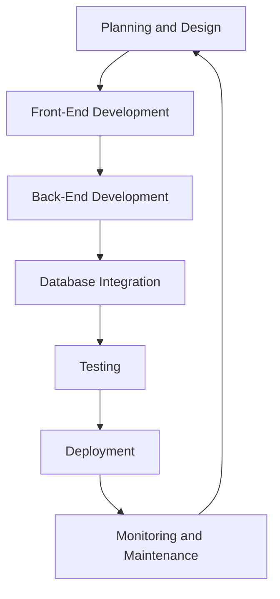
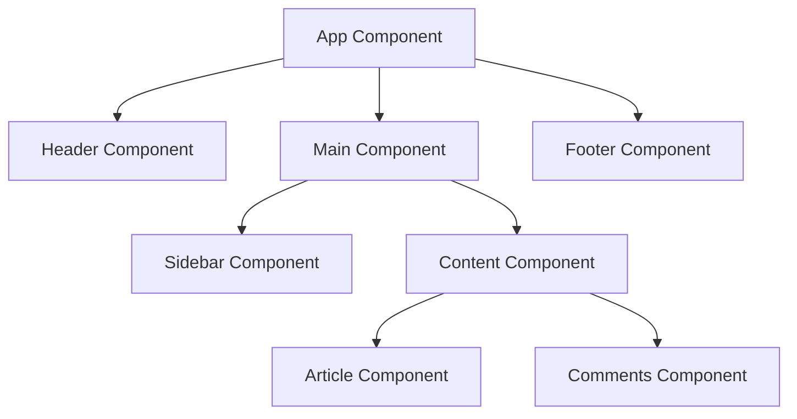
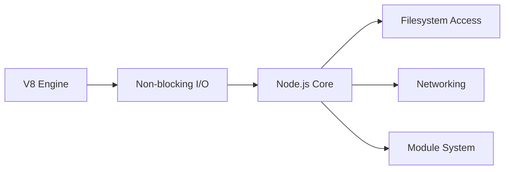
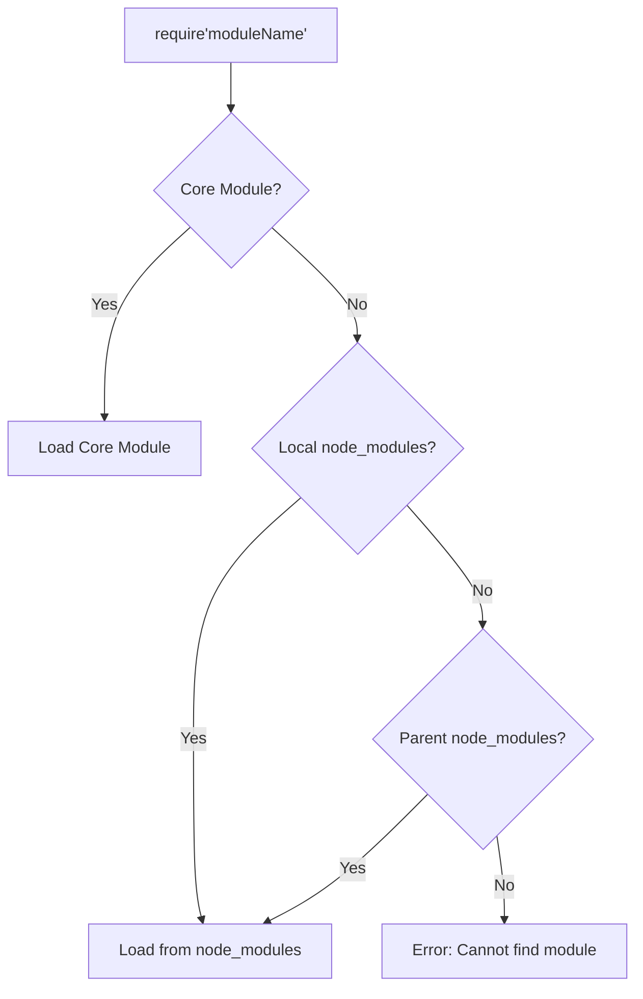
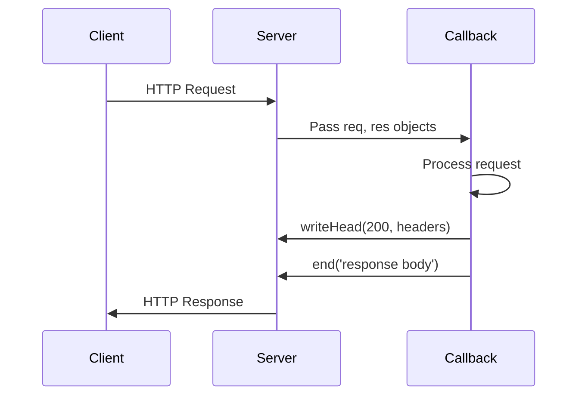
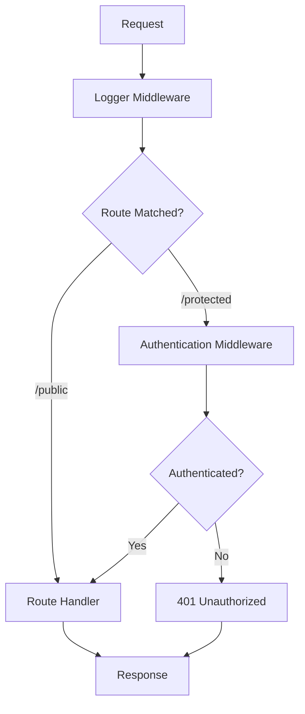
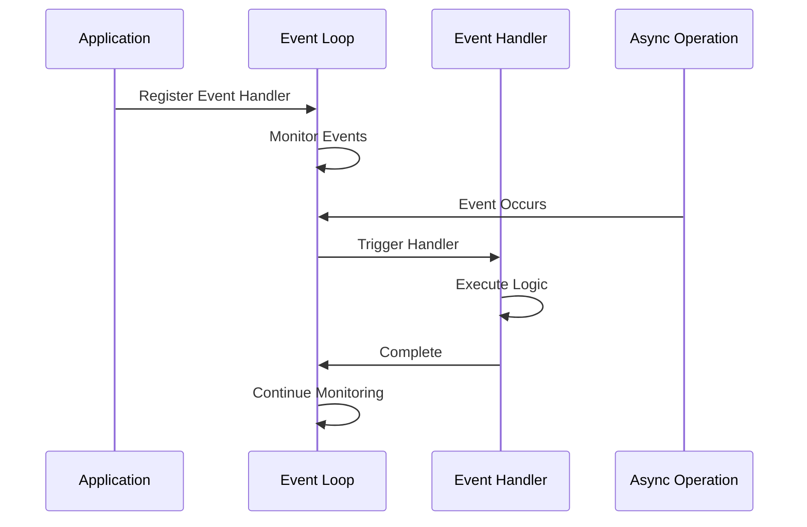
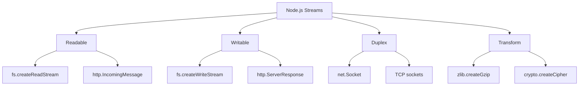
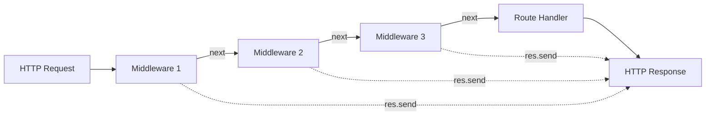

# Full Stack Development - Unit I: Detailed Notes

## Table of Contents

1. [Introduction to Full Stack Development](#introduction-to-full-stack-development)
2. [Understanding MVC Architecture in MERN](#understanding-mvc-architecture-in-mern)
3. [The MERN Stack](#the-mern-stack)
4. [Node.js Fundamentals](#nodejs-fundamentals)
5. [Express.js Web Application Development](#expressjs-web-application-development)
6. [Unit I Question Bank](#unit-i-question-bank)

---

## Introduction to Full Stack Development

### What is Full Stack Development?

Full stack development is a discipline that encompasses both the **front-end** (client-side) and **back-end** (server-side) development of a web application. A full stack developer has expertise across all layers of web development.

### Main Components of a Full Stack Application

|Component|Description|Technologies|
|---|---|---|
|**Front-End**|User interface and user experience layer|HTML, CSS, JavaScript, React|
|**Back-End**|Business logic, authentication, data processing|Node.js, Express.js|
|**Database**|Data storage and persistence layer|MongoDB, MySQL, PostgreSQL|
|**DevOps**|Deployment, scaling, monitoring|Docker, Kubernetes, CI/CD tools|

### Full Stack Application Development Cycle

mermaid



**Detailed Stages:**

1. **Planning and Design**
    - Define requirements
    - Create wireframes
    - Design user interface
    - Plan database schema
2. **Front-End Development**
    - Create interface using HTML, CSS, JavaScript
    - Implement React components
    - Handle user interactions
3. **Back-End Development**
    - Implement business logic
    - Create authentication mechanisms
    - Develop APIs
    - Handle data management
4. **Database Integration**
    - Connect to database
    - Create models
    - Implement CRUD operations
    - Handle data validation
5. **Testing and Deployment**
    - Unit testing
    - Integration testing
    - Deploy to production environment
    - Monitor performance

---

## Understanding MVC Architecture in MERN

### What is MVC Architecture?

**MVC (Model-View-Controller)** is a software design pattern that separates application logic into three interconnected components.

mermaid

````mermaid
graph LR
    A[User/Browser] --> B[Controller]
    B --> C[Model]
    C --> D[Database]
    D --> C
    C --> B
    B --> E[View]
    E --> A
```

### MVC Components

| Component | Responsibility | MERN Equivalent |
|-----------|----------------|-----------------|
| **Model** | Data structure, business logic, database interactions | MongoDB schemas/models |
| **View** | User interface, presentation layer | React components |
| **Controller** | Request handling, coordinates Model and View | Express route handlers |

### Benefits of MVC and Well-Organized Folder Structure

1. **Modularity and Separation of Concerns**
   - Each component has a single responsibility
   - Easier maintenance and updates
   - Clear code organization

2. **Code Reusability**
   - Common functionality can be identified and reused
   - DRY (Don't Repeat Yourself) principle
   - Shared utilities and helpers

3. **Scalability**
   - Easy to add new features
   - Update existing functionality without affecting other parts
   - Refactor code safely

4. **Collaboration and Codebase Understanding**
   - Team members can quickly grasp project structure
   - Easier onboarding for new developers
   - Improved productivity

**Typical MERN Folder Structure:**
```
project-root/
├── client/              # React front-end
│   ├── public/
│   ├── src/
│   │   ├── components/  # React components (View)
│   │   ├── services/    # API calls
│   │   └── App.js
├── server/              # Node.js + Express back-end
│   ├── controllers/     # Route handlers (Controller)
│   ├── models/          # Database models (Model)
│   ├── routes/          # API routes
│   ├── middleware/      # Custom middleware
│   └── server.js
└── package.json
````

---

## The MERN Stack

### What is MERN?

**MERN** is a technology stack combining four powerful technologies:

- **M**ongoDB - Database
- **E**xpress.js - Web framework
- **R**eact - Front-end library
- **N**ode.js - Runtime environment

Any web application is built using multiple technologies. The combination of these technologies is called a "**stack**".

### Single Page Application (SPA) Paradigm

**SPA** is a web application paradigm that avoids fetching the contents of an entire web page from the server to display new content.

**Key Characteristics:**

- Uses lightweight API calls to fetch data or snippets
- Changes web page dynamically without full reload
- Provides nifty, smooth user experience
- Led to rise in front-end frameworks (React, Angular, Vue)
- Most work done on front-end
- Coincided with rise of NoSQL databases

### MERN Components Overview

|Technology|Type|Key Features|
|---|---|---|
|**React**|Front-end Library|Declarative, Component-Based, Isomorphic|
|**Node.js**|Runtime Environment|Event-driven, Non-blocking I/O, JavaScript-based|
|**Express**|Web Framework|Routing, Middleware, Request/Response handling|
|**MongoDB**|Database|NoSQL, Document-oriented, Schema-less, JavaScript-based|

**Supporting Tools and Libraries:**

- React Router - Client-side routing
- React Bootstrap - UI components
- Webpack - Module bundler
- Papaparse - CSV processing
- SheetJS - Excel file processing
- Chart.js - Data visualization

---

## MERN Component: React

### What is React?

React is an **open-source JavaScript library** maintained by Facebook for creating views rendered in HTML.

**Key Points:**

- React is a **library, not a framework** (unlike AngularJS)
- Focuses on the **View** layer (V in MVC)
- Does not dictate framework patterns
- Developers decide how to tie the application together

**Companies Using React:**

- Facebook (creator)
- Airbnb
- Atlassian
- Bitbucket
- Disqus
- Walmart
- Netflix

**Popularity:** Over 120,000+ stars on GitHub repository

### React: Declarative

**Declarative Programming** means describing **what** you want, not **how** to achieve it.

**Benefits:**

- No need to manage DOM transitions manually
- Don't worry about mutations caused by state changes
- Views are consistent and predictable
- Easier to maintain and understand
- React handles the complexity of updating the DOM

**Example Comparison:**

javascript

```javascript
// Imperative (traditional)
const element = document.createElement('div');
element.className = 'container';
element.textContent = 'Hello World';
document.body.appendChild(element);

// Declarative (React)
const element = <div className="container">Hello World</div>;
ReactDOM.render(element, document.body);
```

### React: Component-Based

The fundamental building block of React is a **component** that maintains its own state and renders itself.

mermaid



**Component Characteristics:**

1. **Build components** - Create reusable UI pieces
2. **Compose components** - Combine to make complete views/pages
3. **Encapsulation** - Each component encapsulates state and view
4. **Minimal coupling** - Components interact through props and callbacks
5. **High cohesion** - Components are self-contained

**Component Communication:**

- **Parent to Child:** Via read-only properties (props)
- **Child to Parent:** Via callbacks

### React: No Templates

**Traditional Web Frameworks Problem:**

- Require learning special templating languages
- Repetitive tasks (loops, conditionals) in new syntax
- Developers must master another language
- Examples: Handlebars, EJS, Pug

**React Solution:**

- Uses **full-featured JavaScript** for rendering
- No new templating language to learn
- Leverage existing JavaScript knowledge

**Dynamic Element Creation Example:**

javascript

```javascript
// Traditional template approach (e.g., EJS)
// <% items.forEach(function(item) { %>
//   <li><%= item.name %></li>
// <% }); %>

// React approach using JavaScript map()
const items = ['Apple', 'Banana', 'Orange'];
const itemList = items.map(item => <li key={item}>{item}</li>);

// Rendering
return <ul>{itemList}</ul>;
```

**Common Array Methods in React:**

- `map()` - Transform and render arrays
- `filter()` - Conditional rendering
- `reduce()` - Aggregate data
- `find()` - Locate specific items

---

## Node.js Fundamentals

### Introduction to Node.js

**What is Node.js?**

Node.js is **JavaScript outside of a browser**. It uses Chrome's **V8 JavaScript engine** as an independent JavaScript runtime.

**Historical Context:**

**The Problem (mid-2000s):**

- Websites became dynamic with AJAX
- Two-way communication between browser and server was challenging
- Example: Flickr file upload couldn't provide real-time progress updates

**Ryan Dahl's Solution:**

1. Wanted platform to push data from server to browser efficiently
2. Traditional platforms used "expensive threads" that were often idle
3. Created non-blocking sockets solution using C
4. Combined with Google's V8 engine (2008)
5. First version of Node.js created

**Evolution:**

mermaid



### Node.js ES6 Support

Node.js V8 engine implements ES6 features in **three classifications:**

|Classification|Description|Activation|
|---|---|---|
|**Shipping**|Stable features, production-ready|Turned on by default|
|**Staged**|Almost stable, not recommended for production|`--es_staging` or `--harmony` flag|
|**In Progress**|Under development, unstable|Respective `--harmony` flags|

**Example:**

javascript

````javascript
// ES6 features in Node.js

// Arrow functions (Shipping)
const greet = (name) => `Hello ${name}`;

// Template literals (Shipping)
const message = `Welcome to ${process.env.APP_NAME}`;

// Destructuring (Shipping)
const { username, email } = user;

// Async/await (Shipping)
async function fetchData() {
  const result = await getData();
  return result;
}
```

### Node.js LTS (Long Term Support)

**LTS Release Schedule:**

- **Even-numbered versions** receive LTS (e.g., 10.x, 12.x, 14.x, 16.x)
- **Odd-numbered versions** are current/experimental
- LTS versions receive:
  - Security updates
  - Bug fixes
  - Performance improvements
  - 30 months of support

**Version Timeline:**
```
Current Release (6 months) → Active LTS (18 months) → Maintenance LTS (12 months)
````

---

## JavaScript Event-Driven Programming

### Concept and Importance

**Event-driven programming** is a paradigm where program flow is determined by events (user actions, sensor outputs, messages from other programs).

**Traditional Problem:**

- Web servers waste resources on blocking code
- Threads stay idle while waiting for I/O operations
- Multithreading has significant disadvantages:
    - Complex thread management
    - System resources wasted on idle threads
    - Difficult to scale

**Node.js Solution:**

Uses **single-threaded, event-driven, non-blocking I/O** model.

<<Javascript_Event_Loop_Architecture_Diagram>>

### Event-Driven Programming Example

html

```html
<!-- Browser Example -->
<span>What is your name?</span>
<input type="text" id="nameInput">
<input type="button" id="showNameButton" value="Show Name">

<script type="text/javascript">
  // Event listener registration
  const showNameButton = document.getElementById('showNameButton');
  
  // Event handler - executes when button is clicked
  showNameButton.addEventListener('click', (event) => {
    alert(document.getElementById('nameInput').value);
  });
  
  // Rest of your code continues executing
  console.log('Script continues without blocking');
</script>
```

**Key Points:**

- Code doesn't wait for button click
- Event handler registered and program continues
- When event occurs, callback executes
- Non-blocking execution model

### Apache vs NGINX Concurrency Model

**Traditional (Apache):**

- Thread-per-connection model
- Each connection gets dedicated thread
- High memory usage with many connections

**Event-Driven (NGINX/Node.js):**

- Single-threaded event loop
- Handles multiple connections concurrently
- Lower memory footprint
- Better scalability

<<Apache_vs_NGINX_Concurrency_Diagram>>

---

## JavaScript Closures

### Definition

A **closure** is a function that has access to variables from its parent (enclosing) environment, even after the parent function has finished executing.

**Why Important in Node.js?**

- Essential for asynchronous programming
- JavaScript functions are first-class objects
- Can be passed as arguments (callbacks)
- Helps utilize event-driven programming without explicit state passing

### Basic Closure Example

javascript

```javascript
// Parent function
function parent() {
  const message = 'Hello World';
  
  // Child function (closure)
  function child() {
    alert(message); // Accesses parent's variable
  }
  
  child(); // Executes immediately
}

parent(); // Output: Alert showing "Hello World"
```

### Advanced Closure Example

javascript

```javascript
// Closure with returned function
function parent() {
  const message = 'Hello World';
  
  // Return child function
  function child() {
    alert(message);
  }
  
  return child; // Return function reference
}

const childFN = parent(); // parent() executes and returns
childFN(); // Executes later, still has access to 'message'
```

**Key Point:** Even though `parent()` has finished executing, `child()` still has access to `message` variable.

### Practical Use Case in Node.js

javascript

```javascript
// Event handler with closure
function setupEventHandler(userId) {
  const userData = { id: userId, name: 'John Doe' };
  
  // Event handler closure
  return function handleEvent(event) {
    // Still has access to userData
    console.log(`Event for user: ${userData.name}`);
    console.log(`User ID: ${userData.id}`);
  };
}

// Register event handler
const handler = setupEventHandler(123);
eventEmitter.on('data', handler);

// When event fires, handler still has access to userData
```

### Closure in Callbacks

javascript

```javascript
// Async operation with closure
function fetchUserData(userId) {
  const timestamp = Date.now();
  
  // Callback closure
  setTimeout(() => {
    console.log(`Fetched user ${userId}`);
    console.log(`Request started at ${timestamp}`);
    // Closure remembers userId and timestamp
  }, 1000);
}

fetchUserData(42);
```

---

## Node.js Modules

### Module System Overview

In Node.js, there is no HTML page to load multiple JavaScript files. Node.js uses its own **module system** based on **CommonJS** to organize code into multiple files.

**Module Benefits:**

- Code organization
- Encapsulation
- Reusability
- Dependency management
- Namespace isolation

### CommonJS Module System

**History:**

- Developed in 2009 by Kevin Dangoor and other developers
- Specification for JavaScript modules in server-side environments
- Primary module system for Node.js

**Key Components:**

|Component|Purpose|
|---|---|
|`require()`|Load module into your code|
|`exports`|Object to expose code when module is loaded|
|`module.exports`|Pointer to exports object, used for metadata and single-function export|

### Creating and Using Modules

**Example 1: Basic Module (hello.js)**

javascript

```javascript
// hello.js
const message = 'Hello';

// Export function
exports.sayHello = function() {
  console.log(message);
};

// Export another function
exports.sayGoodbye = function() {
  console.log('Goodbye');
};
```

**Loading the Module (server.js)**

javascript

```javascript
// server.js
const hello = require('./hello'); // Relative path

hello.sayHello();    // Output: Hello
hello.sayGoodbye();  // Output: Goodbye
```

**Example 2: Single Function Export**

javascript

```javascript
// hello.js
module.exports = function() {
  const message = 'Hello';
  console.log(message);
};
```

**Loading Single Function**

javascript

```javascript
// server.js
const hello = require('./hello');
hello(); // Output: Hello
```

**Example 3: Logger Module**

javascript

```javascript
// logger.js
function logger(message) {
  console.log("Here is a message:", message);
}

module.exports = logger;
```

**Usage:**

javascript

```javascript
// test.js
const log = require('./logger');
log("my logger message");

// Command: node test.js
// Output: Here is a message: my logger message
```

### Types of Modules

Node.js supports three types of modules:

1. **Core Modules**
2. **Third-Party Modules**
3. **File/Folder Modules**

---

## Node.js Core Modules

### Definition

**Core modules** are modules compiled into the Node.js binary. They come pre-bundled with Node.js.

**Characteristics:**

- Compiled into Node binary
- Pre-bundled with Node.js installation
- Provide fundamental functionalities
- No installation required
- Well-documented in Node.js documentation

### Common Core Modules

|Module|Purpose|
|---|---|
|`fs`|File system operations|
|`http`|HTTP server and client|
|`https`|HTTPS server and client|
|`path`|File path manipulation|
|`os`|Operating system information|
|`events`|Event emitter|
|`stream`|Streaming data|
|`util`|Utility functions|
|`crypto`|Cryptographic operations|
|`buffer`|Binary data handling|

### Using Core Modules

**File System (fs) Example:**

javascript

```javascript
const fs = require('fs');

// Asynchronous file read
fs.readFile('/etc/hosts', 'utf8', (err, data) => {
  if (err) {
    return console.log(err);
  }
  console.log(data);
});
```

**HTTP Module Example:**

javascript

```javascript
const http = require('http');

const server = http.createServer((req, res) => {
  res.writeHead(200, { 'Content-Type': 'text/plain' });
  res.end('Hello World\n');
});

server.listen(3000);
console.log('Server running at http://localhost:3000/');
```

**Path Module Example:**

javascript

```javascript
const path = require('path');

// Join paths
const fullPath = path.join('/users', 'john', 'documents', 'file.txt');
console.log(fullPath); // /users/john/documents/file.txt

// Get file extension
const ext = path.extname('file.txt');
console.log(ext); // .txt

// Get basename
const base = path.basename('/users/john/file.txt');
console.log(base); // file.txt
```

---

## Node.js Third-Party Modules

### npm (Node Package Manager)

**npm** is the default package manager for Node.js, used to install third-party libraries and manage dependencies.

**Key Features:**

- Largest software registry in the world
- Public repository: [www.npmjs.com](http://www.npmjs.com)
- Installs packages in `node_modules` folder
- Manages dependencies automatically
- Version control

### Installing Third-Party Modules

**Installation Syntax:**

bash

```bash
# Install package locally (project-specific)
npm install package-name

# Install package globally (system-wide)
npm install -g package-name

# Install specific version
npm install package-name@1.2.3

# Install and save to dependencies
npm install --save package-name

# Install and save to devDependencies
npm install --save-dev package-name
```

**Example: Installing Express**

javascript

```javascript
// Installation
// Command: npm install express

// Usage
const express = require('express');
const app = express();

app.get('/', (req, res) => {
  res.send('Hello World');
});

app.listen(3000);
```

### Module Resolution

When you `require('moduleName')`, Node.js follows this search order:

mermaid



**Search Process:**

1. Check if it's a core module
2. Look in `./node_modules/`
3. Look in `../node_modules/`
4. Continue up directory tree
5. Check global modules
6. Throw error if not found

### Popular Third-Party Modules

javascript

```javascript
// Express - Web framework
const express = require('express');

// Lodash - Utility library
const _ = require('lodash');

// Mongoose - MongoDB ODM
const mongoose = require('mongoose');

// Axios - HTTP client
const axios = require('axios');

// Dotenv - Environment variables
require('dotenv').config();
```

---

## Node.js File and Folder Modules

### File Modules

Node.js can load modules from **relative or absolute paths**.

**Relative Path Example:**

javascript

```javascript
// Assuming structure:
// project/
//   ├── server.js
//   └── modules/
//       └── hello.js

// In server.js
const hello = require('./modules/hello');
```

**Absolute Path Example:**

javascript

````javascript
const hello = require('/home/projects/first-example/modules/hello');
```

**Key Points:**

- Use `./` for current directory
- Use `../` for parent directory
- `.js` extension is optional
- Node.js automatically appends `.js` if not provided

### Folder Modules

Node.js supports loading **folder modules** by looking for specific files.

**Folder Module Structure:**
```
myModule/
├── package.json      # Module metadata
├── index.js          # Default entry point
└── lib/
    └── helper.js
````

**Loading Folder Module:**

javascript

```javascript
const myModule = require('./myModule');
```

**Resolution Process:**

1. Look for `package.json` in folder
2. Read `main` property from `package.json`
3. Load file specified in `main`
4. If no `package.json`, look for `index.js`
5. If no `index.js`, throw error

**package.json Example:**

json

```json
{
  "name": "hello",
  "version": "1.0.0",
  "main": "./hello-module.js"
}
```

**Without package.json:**

javascript

```javascript
// If no package.json, Node looks for:
// - myModule/index.js
// - myModule/index.json
// - myModule/index.node
```

---

## Developing Node.js Web Applications

### Basic HTTP Server

Node.js is excellent for developing web applications. The most popular module for this is **Connect**, but first, let's understand the basics.

**Basic Server Example (server.js):**

javascript

```javascript
const http = require('http');

// Create server
http.createServer((req, res) => {
  // Set response header
  res.writeHead(200, { 'Content-Type': 'text/plain' });
  
  // Send response
  res.end('Hello World');
}).listen(3000);

console.log('Server running at http://localhost:3000/');
```

**Running the Server:**

bash

```bash
node server.js
```

### Understanding Request/Response Flow

mermaid



**Callback Function Workflow:**

1. **Receive request:** Server passes `req` and `res` objects
2. **Set headers:** Use `writeHead()` method
3. **Send body:** Use `write()` and/or `end()` methods

**Detailed Example:**

javascript

```javascript
const http = require('http');

http.createServer((req, res) => {
  // 1. Set response headers
  res.writeHead(200, {
    'Content-Type': 'text/html',
    'X-Custom-Header': 'CustomValue'
  });
  
  // 2. Write response body (optional)
  res.write('<h1>Hello World</h1>');
  res.write('<p>This is a paragraph</p>');
  
  // 3. End response (required)
  res.end();
}).listen(3000);
```

### Response Methods

**Method 1: Using write() and end()**

javascript

```javascript
res.writeHead(200, { 'Content-Type': 'text/plain' });
res.write('Hello ');
res.write('World');
res.end(); // Finalize response
```

**Method 2: Using end() with data**

javascript

```javascript
res.writeHead(200, { 'Content-Type': 'text/plain' });
res.end('Hello World'); // Write and finalize in one call
```

### Handling Different Content Types

javascript

```javascript
const http = require('http');

http.createServer((req, res) => {
  if (req.url === '/html') {
    res.writeHead(200, { 'Content-Type': 'text/html' });
    res.end('<h1>HTML Response</h1>');
  } else if (req.url === '/json') {
    res.writeHead(200, { 'Content-Type': 'application/json' });
    res.end(JSON.stringify({ message: 'JSON Response' }));
  } else {
    res.writeHead(404, { 'Content-Type': 'text/plain' });
    res.end('Not Found');
  }
}).listen(3000);
```

---

## Connect Module

### Introduction

**Connect** is a module built to support the interception of requests in a more modular approach using **middleware**.

**Key Concepts:**

- Middleware are callback functions
- Executed for specific HTTP request scenarios
- Allows modular request handling
- Chain multiple middleware functions
- Each middleware can:
    - Perform logic
    - Return response
    - Call next middleware

### Connect Architecture

mermaid


**Dispatcher Object:**

- Handles each HTTP request
- Decides order of middleware execution
- Executes middleware in cascading form

### Installing and Using Connect

**Installation:**

bash

```bash
npm install connect
```

**Basic Connect Server:**

javascript

```javascript
const connect = require('connect');
const app = connect();

app.listen(3000);
console.log('Server running at http://localhost:3000/');
```

### Connect Middleware

**Middleware Function Signature:**

javascript

```javascript
function middlewareName(req, res, next) {
  // req: HTTP request object
  // res: HTTP response object
  // next: Function to call next middleware
}
```

**Simple Middleware Example:**

javascript

```javascript
const connect = require('connect');
const app = connect();

// Define middleware
function helloWorld(req, res, next) {
  res.setHeader('Content-Type', 'text/plain');
  res.end('Hello World');
}

// Use middleware
app.use(helloWorld);

app.listen(3000);
console.log('Server running at http://localhost:3000/');
```

### Middleware Order

Middleware execution order is **determined by the order they are registered**.

javascript

````javascript
const connect = require('connect');
const app = connect();

// Logger middleware (executes first)
function logger(req, res, next) {
  console.log(req.method, req.url);
  next(); // Pass control to next middleware
}

// Response middleware (executes second)
function helloWorld(req, res, next) {
  res.setHeader('Content-Type', 'text/plain');
  res.end('Hello World');
}

// Register middleware in order
app.use(logger);      // First
app.use(helloWorld);  // Second

app.listen(3000);
console.log('Server running at http://localhost:3000/');
```

**Execution Flow:**
```
Request → logger() → next() → helloWorld() → Response
````

### Mounting Middleware

**Mounting** means attaching middleware to specific URL paths.

javascript

```javascript
const connect = require('connect');
const app = connect();

function logger(req, res, next) {
  console.log(req.method, req.url);
  next();
}

function helloWorld(req, res, next) {
  res.setHeader('Content-Type', 'text/plain');
  res.end('Hello World');
}

function goodbyeWorld(req, res, next) {
  res.setHeader('Content-Type', 'text/plain');
  res.end('Goodbye World');
}

// Logger runs for all requests
app.use(logger);

// Mounted middleware - only for specific paths
app.use('/hello', helloWorld);      // Only for /hello
app.use('/goodbye', goodbyeWorld);  // Only for /goodbye

app.listen(3000);
console.log('Server running at http://localhost:3000/');
```

**URL Mapping:**

- `http://localhost:3000/hello` → "Hello World"
- `http://localhost:3000/goodbye` → "Goodbye World"
- `http://localhost:3000/other` → (no response, hangs)

---

## Express.js Web Application Development

### Introduction to Express

**Express** is a minimal and flexible Node.js web application framework built on top of Connect.

**Key Features:**

- Minimal core (maintains Node.js style)
- Built on Connect middleware architecture
- Modular HTML template engine support
- Robust routing system
- Extended response object (JSON, file downloads, etc.)
- Request parsing
- Session management

**Express vs Connect:**

|Feature|Connect|Express|
|---|---|---|
|Base|HTTP server|Connect + routing|
|Routing|Manual|Built-in router|
|Views|None|Template engine support|
|Response|Basic|Extended (JSON, files, etc.)|
|Complexity|Simple|Feature-rich|

### Installing Express

**Method 1: Direct Installation**

bash

```bash
npm install express
```

**Method 2: Using package.json**

**package.json:**

json

```json
{
  "name": "MEAN",
  "version": "0.0.3",
  "dependencies": {
    "express": "4.14.0"
  }
}
```

**Install dependencies:**

bash

```bash
npm install
```

### First Express Application

**server.js:**

javascript

```javascript
const express = require('express');
const app = express();

// Define route
app.use('/', (req, res) => {
  res.status(200).send('Hello World');
});

// Start server
app.listen(3000);
console.log('Server running at http://localhost:3000/');

module.exports = app;
```

**Running the Application:**

bash

```bash
node server
```

**Visit:** [http://localhost:3000](http://localhost:3000)


## Express Application Object (continued)

### Key Methods and Properties

|Method/Property|Description|
|---|---|
|`app.set(name, value)`|Set environment variables/configuration|
|`app.get(name)`|Get environment variables|
|`app.engine(ext, callback)`|Define template engine for file extensions|
|`app.locals`|Send application-level variables to all rendered templates|
|`app.use([path], callback)`|Create middleware to handle HTTP requests|
|`app.VERB(path, [callback...], callback)`|Define route handlers for specific HTTP verbs (GET, POST, etc.)|
|`app.route(path).VERB([callback...], callback)`|Define multiple HTTP verb handlers for a unified path|
|`app.param([name], callback)`|Attach functionality to routing parameters|

### Detailed Examples

**Setting and Getting Configuration:**

javascript

```javascript
const express = require('express');
const app = express();

// Set configuration
app.set('title', 'My Application');
app.set('port', process.env.PORT || 3000);
app.set('view engine', 'ejs');

// Get configuration
const appTitle = app.get('title');
console.log(appTitle); // Output: My Application

const port = app.get('port');
app.listen(port);
```

**Template Engine Configuration:**

javascript

```javascript
// Use EJS template engine for HTML files
app.engine('html', require('ejs').renderFile);
app.set('view engine', 'html');
```

**Application-Level Variables:**

javascript

```javascript
// Set variables available to all templates
app.locals.appName = 'Issue Tracker';
app.locals.currentYear = new Date().getFullYear();

// In template (EJS):
// <footer><%= appName %> &copy; <%= currentYear %></footer>
```

**Using Middleware:**

javascript

```javascript
// Middleware for all routes
app.use((req, res, next) => {
  console.log('Request received:', req.method, req.url);
  next();
});

// Middleware for specific path
app.use('/api', (req, res, next) => {
  console.log('API request');
  next();
});
```

**HTTP Verb Routing:**

javascript

```javascript
// GET request
app.get('/users', (req, res) => {
  res.send('Get all users');
});

// POST request
app.post('/users', (req, res) => {
  res.send('Create new user');
});

// PUT request
app.put('/users/:id', (req, res) => {
  res.send(`Update user ${req.params.id}`);
});

// DELETE request
app.delete('/users/:id', (req, res) => {
  res.send(`Delete user ${req.params.id}`);
});
```

**Unified Route Definition:**

javascript

```javascript
// Multiple verbs for same path
app.route('/users/:id')
  .get((req, res) => {
    res.send(`Get user ${req.params.id}`);
  })
  .put((req, res) => {
    res.send(`Update user ${req.params.id}`);
  })
  .delete((req, res) => {
    res.send(`Delete user ${req.params.id}`);
  });
```

**Route Parameters:**

javascript

```javascript
// Attach functionality to userId parameter
app.param('userId', (req, res, next, userId) => {
  // Validate userId
  if (isNaN(userId)) {
    return res.status(400).send('Invalid user ID');
  }
  
  // Attach to request
  req.userId = parseInt(userId);
  next();
});

// Use in routes
app.get('/users/:userId', (req, res) => {
  res.send(`User ID: ${req.userId}`);
});
```

---

## Express Request Object

### Key Properties and Methods

The **request object** provides information about the current HTTP request.

|Property/Method|Description|
|---|---|
|`req.query`|Parsed query-string parameters|
|`req.params`|Parsed routing parameters|
|`req.body`|Parsed request body (requires middleware)|
|`req.path`|Request path|
|`req.hostname`|Hostname from Host header|
|`req.ip`|Remote IP address|
|`req.cookies`|Cookies sent by user agent (requires cookie-parser)|
|`req.method`|HTTP method (GET, POST, etc.)|
|`req.url`|Full request URL|
|`req.headers`|Request headers object|
|`req.get(header)`|Get specific header value|

### Request Object Examples

**Query Parameters:**

javascript

```javascript
// URL: http://localhost:3000/search?name=John&age=30

app.get('/search', (req, res) => {
  console.log(req.query);
  // Output: { name: 'John', age: '30' }
  
  const name = req.query.name;
  const age = req.query.age;
  
  res.send(`Searching for ${name}, age ${age}`);
});
```

**Route Parameters:**

javascript

```javascript
// URL: http://localhost:3000/users/123/posts/456

app.get('/users/:userId/posts/:postId', (req, res) => {
  console.log(req.params);
  // Output: { userId: '123', postId: '456' }
  
  const userId = req.params.userId;
  const postId = req.params.postId;
  
  res.send(`User ${userId}, Post ${postId}`);
});
```

**Request Body:**

javascript

```javascript
// Parse JSON body
app.use(express.json());

// Parse URL-encoded body
app.use(express.urlencoded({ extended: true }));

app.post('/users', (req, res) => {
  console.log(req.body);
  // Output: { name: 'John', email: 'john@example.com' }
  
  const { name, email } = req.body;
  res.send(`Created user: ${name}, ${email}`);
});
```

**Path, Hostname, IP:**

javascript

```javascript
app.get('/info', (req, res) => {
  console.log('Path:', req.path);         // /info
  console.log('Hostname:', req.hostname); // localhost
  console.log('IP:', req.ip);             // ::1 or client IP
  
  res.json({
    path: req.path,
    hostname: req.hostname,
    ip: req.ip
  });
});
```

**Request Headers:**

javascript

```javascript
app.get('/headers', (req, res) => {
  console.log('All headers:', req.headers);
  
  // Get specific header
  const userAgent = req.get('User-Agent');
  const contentType = req.get('Content-Type');
  
  res.json({
    userAgent,
    contentType
  });
});
```

---

## Express Response Object

### Key Methods

The **response object** is used to set response data and headers.

|Method|Description|
|---|---|
|`res.status(code)`|Set HTTP status code|
|`res.set(field, [value])`|Set response header|
|`res.cookie(name, value, [options])`|Set response cookie|
|`res.redirect([status], url)`|Redirect request to URL|
|`res.send([body])`|Send response (auto-detects type)|
|`res.json([body])`|Send JSON response|
|`res.render(view, [locals], callback)`|Render view template|
|`res.download(path, [filename])`|Prompt file download|
|`res.sendFile(path)`|Send file as response|
|`res.end()`|End response without data|

### Response Object Examples

**Status Codes:**

javascript

```javascript
// Success
app.get('/success', (req, res) => {
  res.status(200).send('OK');
});

// Created
app.post('/users', (req, res) => {
  res.status(201).json({ message: 'User created' });
});

// Bad Request
app.get('/error', (req, res) => {
  res.status(400).send('Bad Request');
});

// Not Found
app.get('/not-found', (req, res) => {
  res.status(404).send('Not Found');
});

// Internal Server Error
app.get('/server-error', (req, res) => {
  res.status(500).send('Internal Server Error');
});
```

**Setting Headers:**

javascript

```javascript
app.get('/custom-headers', (req, res) => {
  // Set single header
  res.set('X-Custom-Header', 'CustomValue');
  
  // Set multiple headers
  res.set({
    'Content-Type': 'text/html',
    'X-Powered-By': 'Express',
    'Cache-Control': 'no-cache'
  });
  
  res.send('<h1>Response with custom headers</h1>');
});
```

**Cookies:**

javascript

```javascript
app.get('/set-cookie', (req, res) => {
  // Simple cookie
  res.cookie('username', 'john');
  
  // Cookie with options
  res.cookie('sessionId', '12345', {
    maxAge: 900000,      // 15 minutes
    httpOnly: true,      // Not accessible via JavaScript
    secure: true,        // HTTPS only
    signed: true         // Signed cookie
  });
  
  res.send('Cookies set');
});
```

**Redirects:**

javascript

```javascript
// Default redirect (302 Found)
app.get('/old-page', (req, res) => {
  res.redirect('/new-page');
});

// Permanent redirect (301 Moved Permanently)
app.get('/old-url', (req, res) => {
  res.redirect(301, '/new-url');
});

// External redirect
app.get('/google', (req, res) => {
  res.redirect('https://www.google.com');
});
```

**Send vs JSON:**

javascript

```javascript
// res.send() - auto-detects content type
app.get('/send', (req, res) => {
  res.send('Plain text');                    // text/plain
  // res.send('<h1>HTML</h1>');              // text/html
  // res.send({ message: 'JSON' });          // application/json
  // res.send([1, 2, 3]);                    // application/json
});

// res.json() - forces JSON
app.get('/json', (req, res) => {
  res.json({ 
    message: 'JSON Response',
    data: [1, 2, 3]
  });
});

// Force JSON for non-objects
app.get('/null', (req, res) => {
  res.json(null);  // Sends: null (application/json)
});
```

**Render Views:**

javascript

```javascript
// Set view engine
app.set('view engine', 'ejs');
app.set('views', './views');

// Render template
app.get('/profile', (req, res) => {
  res.render('profile', {
    username: 'John Doe',
    email: 'john@example.com',
    age: 30
  });
});
```

**File Operations:**

javascript

```javascript
const path = require('path');

// Send file
app.get('/file', (req, res) => {
  const filePath = path.join(__dirname, 'public', 'document.pdf');
  res.sendFile(filePath);
});

// Prompt download
app.get('/download', (req, res) => {
  const filePath = path.join(__dirname, 'files', 'report.pdf');
  res.download(filePath, 'monthly-report.pdf');
});
```

---

## Express Middleware

### Built-in Middleware

Express has several built-in middleware functions:

**1. express.json()**

Parses incoming requests with JSON payloads.

javascript

```javascript
app.use(express.json());

app.post('/api/data', (req, res) => {
  console.log(req.body); // Parsed JSON object
  res.json({ received: req.body });
});
```

**2. express.urlencoded()**

Parses incoming requests with URL-encoded payloads (form data).

javascript

```javascript
app.use(express.urlencoded({ extended: true }));

app.post('/submit', (req, res) => {
  console.log(req.body); // Parsed form data
  res.send('Form submitted');
});
```

**3. express.static()**

Serves static files (HTML, CSS, JavaScript, images).

javascript

```javascript
// Serve files from 'public' directory
app.use(express.static('public'));

// Access: http://localhost:3000/styles.css
// Serves: public/styles.css

// Multiple static directories
app.use(express.static('public'));
app.use(express.static('files'));

// Mount on specific path
app.use('/static', express.static('public'));
// Access: http://localhost:3000/static/styles.css
```

### External Middleware

Popular third-party middleware:

**1. morgan - HTTP Request Logger**

javascript

```javascript
const morgan = require('morgan');

// Development logging
app.use(morgan('dev'));
// Output: GET /users 200 15.123 ms - 1234

// Combined logging (Apache-style)
app.use(morgan('combined'));
```

**2. cookie-parser - Parse Cookies**

javascript

```javascript
const cookieParser = require('cookie-parser');

app.use(cookieParser());

app.get('/read-cookie', (req, res) => {
  console.log(req.cookies);
  res.send(`Username: ${req.cookies.username}`);
});
```

**3. compression - Response Compression**

javascript

```javascript
const compression = require('compression');

// Compress all responses
app.use(compression());
```

**4. method-override - HTTP Verb Support**

javascript

```javascript
const methodOverride = require('method-override');

// Override with POST parameter
app.use(methodOverride('_method'));

// In HTML form:
// <form method="POST" action="/users/123?_method=DELETE">
```

### Custom Middleware

**Application-Level Middleware:**

javascript

```javascript
// Middleware function
const requestLogger = (req, res, next) => {
  console.log(`[${new Date().toISOString()}] ${req.method} ${req.url}`);
  next(); // Pass control to next middleware
};

// Use middleware
app.use(requestLogger);
```

**Router-Level Middleware:**

javascript

```javascript
const router = express.Router();

// Middleware for this router only
router.use((req, res, next) => {
  console.log('Router-level middleware');
  next();
});

router.get('/users', (req, res) => {
  res.send('Users list');
});

app.use('/api', router);
```

**Error-Handling Middleware:**

javascript

```javascript
// Error handler (4 parameters)
app.use((err, req, res, next) => {
  console.error(err.stack);
  res.status(500).json({
    error: 'Internal Server Error',
    message: err.message
  });
});
```

### Middleware Chain Example

javascript

```javascript
const express = require('express');
const app = express();

// 1. Logger middleware
app.use((req, res, next) => {
  console.log('Request:', req.method, req.url);
  next();
});

// 2. Authentication middleware
const authenticate = (req, res, next) => {
  const token = req.headers['authorization'];
  if (token === 'secret-token') {
    next(); // Authenticated, continue
  } else {
    res.status(401).send('Unauthorized');
  }
};

// 3. Route with middleware
app.get('/protected', authenticate, (req, res) => {
  res.send('Protected resource');
});

// 4. Public route (no authentication)
app.get('/public', (req, res) => {
  res.send('Public resource');
});

app.listen(3000);
```

**Middleware Flow:**

mermaid



### Complete Express Application Example

javascript

````javascript
const express = require('express');
const app = express();
const port = 3000;

// Built-in middleware
app.use(express.json());
app.use(express.urlencoded({ extended: true }));

// Custom middleware
app.use((req, res, next) => {
  console.log(`[${new Date().toISOString()}] ${req.method} ${req.url}`);
  next();
});

// GET request handler
app.get('/', (req, res) => {
  console.log('GET request received!');
  console.log('Request URL:', req.originalUrl);
  console.log('Request Headers:', req.headers);
  
  res.send('Hello, this is a GET request!');
});

// POST request handler
app.post('/submit', (req, res) => {
  console.log('POST request received!');
  console.log('Request Body:', req.body);
  
  res.status(201).json({
    message: 'Data received successfully!',
    data: req.body
  });
});

// PUT request handler
app.put('/update/:id', (req, res) => {
  console.log('PUT request received!');
  console.log('Route Parameters:', req.params);
  console.log('Request Body:', req.body);
  
  res.json({
    message: `Resource with ID ${req.params.id} updated successfully!`,
    data: req.body
  });
});

// DELETE request handler
app.delete('/delete/:id', (req, res) => {
  console.log('DELETE request received!');
  console.log('Route Parameters:', req.params);
  
  res.send(`Resource with ID ${req.params.id} deleted!`);
});

// Error handling middleware
app.use((err, req, res, next) => {
  console.error(err.stack);
  res.status(500).send('Something broke!');
});

// Start the server
app.listen(port, () => {
  console.log(`Express app listening at http://localhost:${port}`);
});
```

---

## Event-Driven Architecture in Node.js

### The Event Loop

Node.js uses a **single-threaded event loop** to handle concurrent operations.

<<Node.js_Event_Loop_Detailed_Architecture>>

**Key Components:**

1. **Call Stack** - Executes synchronous code
2. **Callback Queue** - Holds callback functions
3. **Event Loop** - Monitors Call Stack and Callback Queue
4. **libuv** - Handles async operations (I/O, timers, etc.)

**Event Loop Phases:**
```
   ┌───────────────────────────┐
┌─>│           timers          │  - setTimeout, setInterval
│  └─────────────┬─────────────┘
│  ┌─────────────┴─────────────┐
│  │     pending callbacks     │  - I/O callbacks
│  └─────────────┬─────────────┘
│  ┌─────────────┴─────────────┐
│  │       idle, prepare       │  - Internal use
│  └─────────────┬─────────────┘
│  ┌─────────────┴─────────────┐
│  │           poll            │  - Retrieve new I/O events
│  └─────────────┬─────────────┘
│  ┌─────────────┴─────────────┐
│  │           check           │  - setImmediate
│  └─────────────┬─────────────┘
│  ┌─────────────┴─────────────┐
└──┤      close callbacks      │  - socket.on('close', ...)
   └───────────────────────────┘
````

### Event Emitters

Node.js provides the **EventEmitter** class for custom event handling.

javascript

```javascript
const EventEmitter = require('events');

// Create event emitter
class MyEmitter extends EventEmitter {}
const myEmitter = new MyEmitter();

// Register event listener
myEmitter.on('event', (arg1, arg2) => {
  console.log('Event occurred!', arg1, arg2);
});

// Emit event
myEmitter.emit('event', 'Hello', 'World');
// Output: Event occurred! Hello World
```

**Common EventEmitter Methods:**

javascript

```javascript
const EventEmitter = require('events');
const emitter = new EventEmitter();

// on() - Register listener
emitter.on('data', (data) => {
  console.log('Received:', data);
});

// once() - One-time listener
emitter.once('connection', () => {
  console.log('Connected once');
});

// emit() - Trigger event
emitter.emit('data', 'Some data');

// removeListener() - Remove specific listener
const callback = (data) => console.log(data);
emitter.on('test', callback);
emitter.removeListener('test', callback);

// removeAllListeners() - Remove all listeners
emitter.removeAllListeners('data');

// listenerCount() - Get listener count
const count = emitter.listenerCount('data');
```

### Practical Event Example

javascript

```javascript
const EventEmitter = require('events');

class FileUploader extends EventEmitter {
  upload(file) {
    console.log(`Uploading ${file}...`);
    
    // Emit progress events
    this.emit('start', file);
    
    setTimeout(() => {
      this.emit('progress', 50);
    }, 1000);
    
    setTimeout(() => {
      this.emit('progress', 100);
      this.emit('complete', file);
    }, 2000);
  }
}

// Usage
const uploader = new FileUploader();

uploader.on('start', (file) => {
  console.log(`Started uploading ${file}`);
});

uploader.on('progress', (percent) => {
  console.log(`Progress: ${percent}%`);
});

uploader.on('complete', (file) => {
  console.log(`Completed uploading ${file}`);
});

uploader.upload('document.pdf');

// Output:
// Uploading document.pdf...
// Started uploading document.pdf
// Progress: 50%
// Progress: 100%
// Completed uploading document.pdf
```

---

## Node.js Streams

### Stream Types

Node.js provides four types of streams:

|Stream Type|Description|Examples|
|---|---|---|
|**Readable**|Read data from source|`fs.createReadStream()`, `http.IncomingMessage`|
|**Writable**|Write data to destination|`fs.createWriteStream()`, `http.ServerResponse`|
|**Duplex**|Both readable and writable|`net.Socket`, TCP sockets|
|**Transform**|Duplex stream that can modify data|`zlib.createGzip()`, compression|

### Readable Streams

javascript

```javascript
const fs = require('fs');

// Create readable stream
const readStream = fs.createReadStream('large-file.txt', 'utf8');

// Data event - fires when data is available
readStream.on('data', (chunk) => {
  console.log('Received chunk:', chunk.length, 'bytes');
});

// End event - fires when no more data
readStream.on('end', () => {
  console.log('Finished reading file');
});

// Error event
readStream.on('error', (err) => {
  console.error('Error:', err.message);
});
```

### Writable Streams

javascript

```javascript
const fs = require('fs');

// Create writable stream
const writeStream = fs.createWriteStream('output.txt');

// Write data
writeStream.write('First line\n');
writeStream.write('Second line\n');
writeStream.write('Third line\n');

// End stream
writeStream.end('Final line\n');

// Finish event
writeStream.on('finish', () => {
  console.log('Finished writing');
});

// Error event
writeStream.on('error', (err) => {
  console.error('Error:', err.message);
});
```

### Piping Streams

**Pipe** connects readable stream to writable stream.

javascript

```javascript
const fs = require('fs');

// Copy file using streams
const readStream = fs.createReadStream('source.txt');
const writeStream = fs.createWriteStream('destination.txt');

// Pipe - automatic flow control
readStream.pipe(writeStream);

writeStream.on('finish', () => {
  console.log('File copied successfully');
});
```

**Chaining Pipes:**

javascript

```javascript
const fs = require('fs');
const zlib = require('zlib');

// Compress file
fs.createReadStream('input.txt')
  .pipe(zlib.createGzip())
  .pipe(fs.createWriteStream('input.txt.gz'));

// Decompress file
fs.createReadStream('input.txt.gz')
  .pipe(zlib.createGunzip())
  .pipe(fs.createWriteStream('output.txt'));
```

---

## Why MERN Stack?

### Advantages of MERN

**1. JavaScript Everywhere**

- Single language for entire stack
- Shared code between client and server
- Easier context switching for developers
- Unified development experience

**2. JSON Everywhere**

- Native JSON support in all technologies
- MongoDB stores data as BSON (Binary JSON)
- Express/Node handle JSON natively
- React state management uses JavaScript objects
- No impedance mismatch between layers

**3. Node.js Performance**

- Event-driven, non-blocking I/O model
- Fast and scalable web server
- Handles many concurrent connections
- Low memory footprint
- Efficient for real-time applications

**4. npm Ecosystem**

- Largest package registry in the world
- Over 1.5+ million packages
- Easy dependency management
- Vibrant community
- Extensive library support

**5. Isomorphic JavaScript**

### Isomorphic/Universal JavaScript

**Definition:** Code that runs on both client and server.

**SPA vs SSR:**

|Approach|Description|Pros|Cons|
|---|---|---|---|
|**SPA**|Client-side rendering|Fast after load, rich UX|Slow initial load, SEO issues|
|**SSR**|Server-side rendering|Fast initial load, SEO-friendly|More server load, complex setup|

**Isomorphic Benefits:**

- Code reusability
- Better SEO with SSR
- Improved performance
- Shared validation logic
- Universal routing

**Example:**

javascript

```javascript
// Shared validation function (isomorphic)
function validateEmail(email) {
  const regex = /^[^\s@]+@[^\s@]+\.[^\s@]+$/;
  return regex.test(email);
}

// Use on client (React)
if (!validateEmail(userEmail)) {
  setError('Invalid email');
}

// Use on server (Express)
if (!validateEmail(req.body.email)) {
  res.status(400).send('Invalid email');
}
```

---

## Unit I Question Bank

### Question 1: Explain REPL in the context of Node.js with an example

**REPL** stands for **Read-Eval-Print-Loop**. It is an interactive shell environment that processes Node.js expressions.

**REPL Features:**

- **Read:** Reads user input
- **Eval:** Evaluates the input
- **Print:** Prints the result
- **Loop:** Loops to wait for next input

**Starting REPL:**

bash

```bash
$ node
>
```

**Example Session:**

javascript

```javascript
> 2 + 3
5

> const name = 'John'
undefined

> name
'John'

> function greet(name) { return `Hello ${name}`; }
undefined

> greet('Alice')
'Hello Alice'

> .help   // Show REPL commands
> .break  // Exit multi-line expression
> .clear  // Clear context
> .exit   // Exit REPL
```

**REPL Special Commands:**

- `.help` - Show all special commands
- `.save filename` - Save current session to file
- `.load filename` - Load and execute file
- `.editor` - Enter editor mode

---

### Question 2: Define event-driven programming with a neat diagram

**Event-Driven Programming** is a programming paradigm where program flow is determined by events such as user actions, sensor outputs, or messages from other programs.

**Key Concepts:**

1. **Event** - An action that occurs (click, HTTP request, file read)
2. **Event Handler** - Function that responds to event
3. **Event Loop** - Continuously monitors for events
4. **Non-blocking** - Operations don't block execution

**Event-Driven Flow:**

mermaid



**Example:**

javascript

```javascript
const EventEmitter = require('events');
const emitter = new EventEmitter();

// Register event handler
emitter.on('userLogin', (username) => {
  console.log(`User ${username} logged in`);
  // Send welcome email
  // Log to database
  // Update user status
});

// Trigger event
emitter.emit('userLogin', 'john_doe');
```

**Benefits:**

- Non-blocking operations
- Efficient resource utilization
- Scalable architecture
- Responsive applications

---

### Question 3: Discuss the challenges faced in Node.js

**1. Callback Hell**

Nested callbacks make code hard to read and maintain.

javascript

```javascript
// Callback hell example
getData((data1) => {
  getMoreData(data1, (data2) => {
    getEvenMoreData(data2, (data3) => {
      getEvenEvenMoreData(data3, (data4) => {
        // Deep nesting...
      });
    });
  });
});

// Solution: Promises or Async/Await
async function fetchData() {
  const data1 = await getData();
  const data2 = await getMoreData(data1);
  const data3 = await getEvenMoreData(data2);
  const data4 = await getEvenEvenMoreData(data3);
  return data4;
}
```

**2. Single-Threaded Limitations**

- CPU-intensive operations block event loop
- Long-running tasks affect performance
- Not ideal for heavy computations

**Solution:** Use Worker Threads or child processes

javascript

```javascript
const { Worker } = require('worker_threads');

const worker = new Worker('./heavy-task.js');
worker.on('message', (result) => {
  console.log('Result:', result);
});
```

**3. Error Handling**

Async errors can crash the application if not handled properly.

javascript

```javascript
// Uncaught exception handler
process.on('uncaughtException', (err) => {
  console.error('Uncaught Exception:', err);
  process.exit(1);
});

// Unhandled promise rejection
process.on('unhandledRejection', (reason, promise) => {
  console.error('Unhandled Rejection:', reason);
});
```

**4. Memory Leaks**

- Event listeners not removed
- Closures holding references
- Circular references

**Solution:**

javascript

```javascript
// Remove event listeners when done
emitter.removeListener('event', handler);

// Clear intervals/timeouts
clearInterval(intervalId);
clearTimeout(timeoutId);
```

**5. Immature Tools**

- Debugging can be challenging
- Some npm packages lack quality
- Breaking changes in dependencies

**6. Rapid API Changes**

- Frequent Node.js version updates
- Deprecated APIs
- Need to keep dependencies updated


### Question 4: List out the key features of Node.js (continued)

**1. Asynchronous and Event-Driven**

All APIs are asynchronous (non-blocking), server never waits for API to return data.

javascript

```javascript
// Non-blocking file read
const fs = require('fs');

fs.readFile('file.txt', 'utf8', (err, data) => {
  if (err) throw err;
  console.log(data);
});

console.log('This executes first!');
```

**2. Very Fast Execution**

- Built on Google Chrome's V8 JavaScript Engine
- V8 compiles JavaScript to native machine code
- Extremely fast code execution

**3. Single-Threaded but Highly Scalable**

- Uses single-threaded model with event looping
- Event mechanism helps server respond in non-blocking way
- More scalable than traditional multi-threaded servers
- Can handle many more concurrent requests

**4. No Buffering**

- Node.js applications never buffer data
- Output data in chunks
- Ideal for streaming applications

**5. Cross-Platform**

- Runs on Windows, Linux, macOS
- Consistent development experience across platforms

**6. NPM (Node Package Manager)**

- Largest open-source library ecosystem
- Over 1.5 million packages
- Easy dependency management

**7. JavaScript Everywhere**

- Same language for client and server
- Code reusability
- Shared validation and business logic

**8. Active Community**

- Large developer community
- Regular updates and improvements
- Extensive documentation and tutorials

---

### Question 5: Discuss JavaScript closures with an example

**Closure Definition:**

A closure is a function that has access to variables from its outer (enclosing) lexical scope, even after the outer function has finished executing.

**How Closures Work:**

When a function is created, it maintains a reference to its lexical environment. This reference allows the inner function to access variables from the outer function's scope.

**Basic Example:**

javascript

```javascript
function outerFunction() {
  const outerVariable = 'I am outside!';
  
  function innerFunction() {
    console.log(outerVariable); // Accesses outer variable
  }
  
  return innerFunction;
}

const myFunction = outerFunction();
myFunction(); // Output: I am outside!
```

**Practical Example - Counter:**

javascript

```javascript
function createCounter() {
  let count = 0; // Private variable
  
  return {
    increment: function() {
      count++;
      return count;
    },
    decrement: function() {
      count--;
      return count;
    },
    getCount: function() {
      return count;
    }
  };
}

const counter = createCounter();
console.log(counter.increment()); // 1
console.log(counter.increment()); // 2
console.log(counter.decrement()); // 1
console.log(counter.getCount());  // 1

// count is not directly accessible
console.log(counter.count); // undefined
```

**Closure in Async Operations:**

javascript

```javascript
function fetchUserData(userId) {
  const requestTime = new Date();
  
  setTimeout(() => {
    // Closure: Accesses userId and requestTime
    console.log(`User ${userId} data fetched`);
    console.log(`Request made at: ${requestTime}`);
  }, 1000);
}

fetchUserData(123);
// Output after 1 second:
// User 123 data fetched
// Request made at: [timestamp]
```

**Closure with Event Handlers:**

javascript

```javascript
function setupButtonHandlers() {
  const buttons = document.querySelectorAll('button');
  
  for (let i = 0; i < buttons.length; i++) {
    const buttonIndex = i; // Closure captures this value
    
    buttons[i].addEventListener('click', () => {
      console.log(`Button ${buttonIndex} clicked`);
    });
  }
}
```

**Benefits of Closures:**

1. **Data Privacy** - Create private variables
2. **Function Factories** - Generate customized functions
3. **Callbacks** - Maintain state in async operations
4. **Event Handlers** - Remember context when handler executes

**Common Pitfall:**

javascript

```javascript
// WRONG - Loop variable issue
for (var i = 0; i < 3; i++) {
  setTimeout(() => {
    console.log(i); // Prints 3, 3, 3
  }, 1000);
}

// CORRECT - Using closure with IIFE
for (var i = 0; i < 3; i++) {
  (function(index) {
    setTimeout(() => {
      console.log(index); // Prints 0, 1, 2
    }, 1000);
  })(i);
}

// BETTER - Using let (block scope)
for (let i = 0; i < 3; i++) {
  setTimeout(() => {
    console.log(i); // Prints 0, 1, 2
  }, 1000);
}
```

---

### Question 6: List out different modules used in Node.js

Node.js modules are categorized into three types:

**1. Core Modules (Built-in)**

|Module|Purpose|
|---|---|
|`fs`|File system operations|
|`http`|HTTP server and client|
|`https`|HTTPS server and client|
|`path`|File path utilities|
|`os`|Operating system information|
|`events`|Event emitter implementation|
|`stream`|Streaming data interface|
|`util`|Utility functions|
|`crypto`|Cryptographic functionality|
|`buffer`|Binary data handling|
|`net`|Network operations (TCP)|
|`dns`|DNS lookup operations|
|`child_process`|Spawn child processes|
|`cluster`|Multi-core scalability|
|`url`|URL parsing and formatting|
|`querystring`|Query string parsing|
|`zlib`|Compression (gzip, deflate)|
|`readline`|Read input line by line|
|`timers`|Scheduling functions|

**Example Usage:**

javascript

```javascript
// File System
const fs = require('fs');

// HTTP
const http = require('http');

// Path
const path = require('path');

// Events
const EventEmitter = require('events');

// Crypto
const crypto = require('crypto');
```

**2. Third-Party Modules (npm packages)**

|Module|Purpose|
|---|---|
|`express`|Web application framework|
|`mongoose`|MongoDB ODM|
|`lodash`|Utility library|
|`axios`|HTTP client|
|`dotenv`|Environment variable management|
|`bcrypt`|Password hashing|
|`jsonwebtoken`|JWT authentication|
|`cors`|Cross-origin resource sharing|
|`morgan`|HTTP request logger|
|`nodemon`|Auto-restart development server|
|`socket.io`|Real-time bidirectional communication|
|`multer`|File upload handling|
|`joi`|Data validation|
|`winston`|Logging library|

**3. Local/File Modules (Custom)**

User-defined modules in the application.

javascript

```javascript
// math.js (custom module)
exports.add = (a, b) => a + b;
exports.subtract = (a, b) => a - b;

// app.js (using custom module)
const math = require('./math');
console.log(math.add(5, 3)); // 8
```

---

### Question 7: Explain an event emitter in Node.js with example

**Event Emitter** is a core Node.js class that facilitates communication between objects. It provides an implementation of the Observer pattern.

**Key Concepts:**

- **Event** - Named occurrence in the system
- **Listener/Handler** - Function that responds to event
- **Emitter** - Object that triggers events

**EventEmitter Methods:**

|Method|Description|
|---|---|
|`on(event, listener)`|Register event listener|
|`once(event, listener)`|Register one-time listener|
|`emit(event, [args])`|Trigger event with optional arguments|
|`removeListener(event, listener)`|Remove specific listener|
|`removeAllListeners([event])`|Remove all listeners for event|
|`listenerCount(event)`|Get number of listeners|
|`listeners(event)`|Get array of listeners|
|`setMaxListeners(n)`|Set max listeners (default 10)|

**Basic Example:**

javascript

```javascript
const EventEmitter = require('events');

// Create event emitter
const emitter = new EventEmitter();

// Register listener
emitter.on('greet', (name) => {
  console.log(`Hello, ${name}!`);
});

// Emit event
emitter.emit('greet', 'John');
// Output: Hello, John!
```

**Class-based Event Emitter:**

javascript

```javascript
const EventEmitter = require('events');

class OrderProcessor extends EventEmitter {
  processOrder(order) {
    console.log(`Processing order ${order.id}`);
    
    // Emit events at different stages
    this.emit('orderReceived', order);
    
    // Simulate processing
    setTimeout(() => {
      this.emit('orderProcessed', order);
    }, 1000);
    
    setTimeout(() => {
      this.emit('orderShipped', order);
    }, 2000);
  }
}

// Usage
const processor = new OrderProcessor();

processor.on('orderReceived', (order) => {
  console.log(`Order ${order.id} received`);
});

processor.on('orderProcessed', (order) => {
  console.log(`Order ${order.id} processed`);
});

processor.on('orderShipped', (order) => {
  console.log(`Order ${order.id} shipped`);
});

processor.processOrder({ id: 123, item: 'Laptop' });

// Output:
// Processing order 123
// Order 123 received
// Order 123 processed (after 1 sec)
// Order 123 shipped (after 2 sec)
```

**Multiple Listeners:**

javascript

```javascript
const EventEmitter = require('events');
const emitter = new EventEmitter();

// Multiple listeners for same event
emitter.on('data', (value) => {
  console.log('Listener 1:', value);
});

emitter.on('data', (value) => {
  console.log('Listener 2:', value);
});

emitter.emit('data', 'Hello');
// Output:
// Listener 1: Hello
// Listener 2: Hello
```

**One-time Listener:**

javascript

```javascript
const emitter = new EventEmitter();

// Executes only once
emitter.once('connect', () => {
  console.log('Connected!');
});

emitter.emit('connect'); // Output: Connected!
emitter.emit('connect'); // No output (listener removed)
```

**Error Handling:**

javascript

```javascript
const emitter = new EventEmitter();

// Error event listener (special event)
emitter.on('error', (err) => {
  console.error('Error occurred:', err.message);
});

// Emit error
emitter.emit('error', new Error('Something went wrong'));
```

**Practical Example - File Uploader:**

javascript

````javascript
const EventEmitter = require('events');
const fs = require('fs');

class FileUploader extends EventEmitter {
  upload(filePath) {
    this.emit('uploadStart', filePath);
    
    const stream = fs.createReadStream(filePath);
    let uploaded = 0;
    
    stream.on('data', (chunk) => {
      uploaded += chunk.length;
      this.emit('uploadProgress', uploaded);
    });
    
    stream.on('end', () => {
      this.emit('uploadComplete', filePath);
    });
    
    stream.on('error', (err) => {
      this.emit('uploadError', err);
    });
  }
}

// Usage
const uploader = new FileUploader();

uploader.on('uploadStart', (file) => {
  console.log(`Starting upload: ${file}`);
});

uploader.on('uploadProgress', (bytes) => {
  console.log(`Uploaded: ${bytes} bytes`);
});

uploader.on('uploadComplete', (file) => {
  console.log(`Upload complete: ${file}`);
});

uploader.on('uploadError', (err) => {
  console.error(`Upload error: ${err.message}`);
});

uploader.upload('./large-file.txt');
```

---

### Question 8: Identify how Node.js handles child threads

**Node.js Threading Model:**

Node.js is **single-threaded** for JavaScript execution but uses **multiple threads** for I/O operations internally via **libuv**.

**Architecture:**
```
┌─────────────────────────────────────┐
│    JavaScript Code (Single Thread)  │
│         (Event Loop)                │
└──────────────┬──────────────────────┘
               │
               ▼
┌─────────────────────────────────────┐
│           libuv Thread Pool         │
│  (4 threads by default, configurable)│
│  - File I/O                         │
│  - DNS lookups                      │
│  - Compression                      │
│  - Crypto operations                │
└─────────────────────────────────────┘
````

**1. Child Processes**

Node.js can spawn child processes to handle CPU-intensive tasks.

javascript

```javascript
const { spawn, exec, fork } = require('child_process');

// spawn() - Stream-based communication
const ls = spawn('ls', ['-lh', '/usr']);

ls.stdout.on('data', (data) => {
  console.log(`stdout: ${data}`);
});

ls.stderr.on('data', (data) => {
  console.error(`stderr: ${data}`);
});

ls.on('close', (code) => {
  console.log(`Process exited with code ${code}`);
});

// exec() - Buffer-based communication
exec('ls -lh /usr', (error, stdout, stderr) => {
  if (error) {
    console.error(`Error: ${error}`);
    return;
  }
  console.log(`stdout: ${stdout}`);
});

// fork() - Special spawn for Node.js processes
const child = fork('./child.js');

child.on('message', (msg) => {
  console.log('Message from child:', msg);
});

child.send({ hello: 'world' });
```

**2. Worker Threads (Node.js 10.5+)**

True multi-threading for CPU-intensive JavaScript operations.

javascript

```javascript
const { Worker, isMainThread, parentPort, workerData } = require('worker_threads');

if (isMainThread) {
  // Main thread
  const worker = new Worker(__filename, {
    workerData: { num: 5 }
  });
  
  worker.on('message', (result) => {
    console.log('Result from worker:', result);
  });
  
  worker.on('error', (err) => {
    console.error('Worker error:', err);
  });
  
  worker.on('exit', (code) => {
    console.log(`Worker exited with code ${code}`);
  });
} else {
  // Worker thread
  const { num } = workerData;
  
  function fibonacci(n) {
    if (n <= 1) return n;
    return fibonacci(n - 1) + fibonacci(n - 2);
  }
  
  const result = fibonacci(num);
  parentPort.postMessage(result);
}
```

**3. Cluster Module**

Spawn multiple Node.js processes to utilize multi-core systems.

javascript

```javascript
const cluster = require('cluster');
const http = require('http');
const numCPUs = require('os').cpus().length;

if (cluster.isMaster) {
  console.log(`Master ${process.pid} is running`);
  
  // Fork workers (one per CPU core)
  for (let i = 0; i < numCPUs; i++) {
    cluster.fork();
  }
  
  cluster.on('exit', (worker, code, signal) => {
    console.log(`Worker ${worker.process.pid} died`);
    cluster.fork(); // Restart worker
  });
} else {
  // Workers share TCP connection
  http.createServer((req, res) => {
    res.writeHead(200);
    res.end('Hello World\n');
  }).listen(8000);
  
  console.log(`Worker ${process.pid} started`);
}
```

**When to Use Each:**

|Method|Use Case|
|---|---|
|**Child Process**|Execute system commands, run external programs|
|**Worker Threads**|CPU-intensive JavaScript computations|
|**Cluster**|Scale HTTP server across CPU cores|

**Comparison:**

javascript

```javascript
// CPU-intensive task blocking event loop
function fibonacci(n) {
  if (n <= 1) return n;
  return fibonacci(n - 1) + fibonacci(n - 2);
}

// BAD - Blocks event loop
app.get('/fib/:n', (req, res) => {
  const result = fibonacci(req.params.n);
  res.send(`Result: ${result}`);
});

// GOOD - Using Worker Thread
app.get('/fib/:n', (req, res) => {
  const worker = new Worker('./fibonacci-worker.js', {
    workerData: { n: req.params.n }
  });
  
  worker.on('message', (result) => {
    res.send(`Result: ${result}`);
  });
});
```

---

### Question 9: Illustrate different types of streams in Node.js

**Streams** are objects that let you read data from a source or write data to a destination in a continuous fashion.

**Types of Streams:**

mermaid



**1. Readable Streams**

Read data from a source.

javascript

```javascript
const fs = require('fs');

// Create readable stream
const readStream = fs.createReadStream('input.txt', {
  encoding: 'utf8',
  highWaterMark: 16 * 1024 // 16KB chunks
});

// Events
readStream.on('data', (chunk) => {
  console.log('Received chunk:', chunk.length, 'bytes');
});

readStream.on('end', () => {
  console.log('No more data');
});

readStream.on('error', (err) => {
  console.error('Error:', err.message);
});

// Pause and resume
readStream.pause();
setTimeout(() => {
  readStream.resume();
}, 1000);
```

**2. Writable Streams**

Write data to a destination.

javascript

```javascript
const fs = require('fs');

// Create writable stream
const writeStream = fs.createWriteStream('output.txt');

// Write data
writeStream.write('Line 1\n');
writeStream.write('Line 2\n');
writeStream.write('Line 3\n');

// End stream
writeStream.end('Final line\n');

// Events
writeStream.on('finish', () => {
  console.log('All writes completed');
});

writeStream.on('error', (err) => {
  console.error('Error:', err.message);
});

// Check if writable
if (writeStream.writable) {
  writeStream.write('More data\n');
}
```

**3. Duplex Streams**

Both readable and writable.

javascript

```javascript
const { Duplex } = require('stream');

// Custom duplex stream
const duplexStream = new Duplex({
  read(size) {
    this.push('Data chunk\n');
    this.push(null); // No more data
  },
  write(chunk, encoding, callback) {
    console.log('Writing:', chunk.toString());
    callback();
  }
});

// Read from stream
duplexStream.on('data', (chunk) => {
  console.log('Read:', chunk.toString());
});

// Write to stream
duplexStream.write('Hello World');
duplexStream.end();
```

**4. Transform Streams**

Duplex stream that can modify data as it's read/written.

javascript

```javascript
const { Transform } = require('stream');

// Custom transform stream (uppercase)
const upperCaseTransform = new Transform({
  transform(chunk, encoding, callback) {
    const upperChunk = chunk.toString().toUpperCase();
    this.push(upperChunk);
    callback();
  }
});

// Usage
process.stdin
  .pipe(upperCaseTransform)
  .pipe(process.stdout);

// Type input, see uppercase output
```

**Practical Examples:**

**File Copy with Progress:**

javascript

```javascript
const fs = require('fs');

function copyFile(source, destination) {
  const readStream = fs.createReadStream(source);
  const writeStream = fs.createWriteStream(destination);
  
  let totalBytes = 0;
  
  readStream.on('data', (chunk) => {
    totalBytes += chunk.length;
    console.log(`Copied: ${totalBytes} bytes`);
  });
  
  readStream.on('end', () => {
    console.log(`Total: ${totalBytes} bytes copied`);
  });
  
  readStream.pipe(writeStream);
}

copyFile('large-file.txt', 'copy.txt');
```

**HTTP Response Streaming:**

javascript

```javascript
const http = require('http');
const fs = require('fs');

http.createServer((req, res) => {
  // Stream file to response
  const stream = fs.createReadStream('large-video.mp4');
  
  res.writeHead(200, {
    'Content-Type': 'video/mp4'
  });
  
  stream.pipe(res);
  
  stream.on('error', (err) => {
    res.writeHead(500);
    res.end('Server Error');
  });
}).listen(3000);
```

**Compression with Transform Streams:**

javascript

```javascript
const fs = require('fs');
const zlib = require('zlib');

// Compress file
const readStream = fs.createReadStream('input.txt');
const writeStream = fs.createWriteStream('input.txt.gz');
const gzip = zlib.createGzip();

readStream
  .pipe(gzip)
  .pipe(writeStream)
  .on('finish', () => {
    console.log('Compression complete');
  });

// Decompress file
const readGz = fs.createReadStream('input.txt.gz');
const writeDecompressed = fs.createWriteStream('output.txt');
const gunzip = zlib.createGunzip();

readGz
  .pipe(gunzip)
  .pipe(writeDecompressed)
  .on('finish', () => {
    console.log('Decompression complete');
  });
```

**Stream Benefits:**

1. **Memory Efficient** - Process data in chunks, not all at once
2. **Time Efficient** - Start processing immediately
3. **Composability** - Chain operations with pipe()
4. **Backpressure Handling** - Automatic flow control

---

### Question 10: Interpret how Express.js handles middleware

**Middleware** are functions that have access to the request object (`req`), response object (`res`), and the next middleware function (`next`) in the application's request-response cycle.

**Middleware Function Signature:**

javascript

```javascript
function middlewareName(req, res, next) {
  // Execute middleware logic
  // Modify req or res objects
  // Call next() to pass control
  // Or send response to end cycle
}
```

**Middleware Flow:**

mermaid



**Types of Middleware:**

**1. Application-Level Middleware**

Bound to `app` object using `app.use()` or `app.METHOD()`.

javascript

```javascript
const express = require('express');
const app = express();

// Middleware for all routes
app.use((req, res, next) => {
  console.log('Time:', Date.now());
  next(); // Pass control to next middleware
});

// Middleware for specific path
app.use('/user', (req, res, next) => {
  console.log('User route accessed');
  next();
});

// Multiple handlers
app.use('/api', 
  (req, res, next) => {
    console.log('First middleware');
    next();
  },
  (req, res, next) => {
    console.log('Second middleware');
    next();
  }
);
```

**2. Router-Level Middleware**

Works same as application-level but bound to `express.Router()`.

javascript

```javascript
const express = require('express');
const router = express.Router();

// Router middleware
router.use((req, res, next) => {
  console.log('Router middleware');
  next();
});

router.get('/users', (req, res) => {
  res.send('Users list');
});

router.get('/users/:id', (req, res) => {
  res.send(`User ${req.params.id}`);
});

// Mount router
app.use('/api', router);
```

**3. Error-Handling Middleware**

Has **four parameters** (err, req, res, next).

javascript

```javascript
// Define AFTER all other middleware
app.use((err, req, res, next) => {
  console.error(err.stack);
  res.status(500).json({
    error: 'Something broke!',
    message: err.message
  });
});

// Trigger error
app.get('/error', (req, res, next) => {
  const err = new Error('Test error');
  next(err); // Pass error to error handler
});
```

**4. Built-in Middleware**

javascript

```javascript
// Parse JSON
app.use(express.json());

// Parse URL-encoded data
app.use(express.urlencoded({ extended: true }));

// Serve static files
app.use(express.static('public'));
```

**5. Third-Party Middleware**

javascript

```javascript
// Morgan - Logger
const morgan = require('morgan');
app.use(morgan('dev'));

// Cookie Parser
const cookieParser = require('cookie-parser');
app.use(cookieParser());

// Compression
const compression = require('compression');
app.use(compression());

// CORS
const cors = require('cors');
app.use(cors());
```

**Middleware Execution Order:**

javascript

```javascript
const express = require('express');
const app = express();

// 1. First middleware
app.use((req, res, next) => {
  console.log('1: First middleware');
  next();
});

// 2. Second middleware
app.use((req, res, next) => {
  console.log('2: Second middleware');
  next();
});

// 3. Route handler
app.get('/test', (req, res) => {
  console.log('3: Route handler');
  res.send('Response');
});

// 4. This won't execute (response already sent)
app.use((req, res, next) => {
  console.log('4: This won\'t run');
  next();
});

// Request to /test outputs:
// 1: First middleware
// 2: Second middleware
// 3: Route handler
```

**Conditional Middleware:**

javascript

```javascript
// Authentication middleware
function authenticate(req, res, next) {
  const token = req.headers['authorization'];
  
  if (token === 'secret-token') {
    req.user = { id: 1, name: 'John' };
    next(); // Authenticated
  } else {
    res.status(401).send('Unauthorized');
    // Don't call next() - end the cycle
  }
}

// Public route (no middleware)
app.get('/public', (req, res) => {
  res.send('Public content');
});

// Protected route (with middleware)
app.get('/protected', authenticate, (req, res) => {
  res.send(`Hello ${req.user.name}`);
});
```

**Middleware Best Practices:**

javascript

```javascript
// 1. Always call next() or send response
app.use((req, res, next) => {
  // Do something
  next(); // MUST call this or send response
});

// 2. Handle errors
app.use((req, res, next) => {
  try {
    // Risky operation
    next();
  } catch (err) {
    next(err); // Pass error to error handler
  }
});

// 3. Order matters
app.use(express.json()); // Parse body BEFORE routes
app.get('/api/data', handler); // Routes
app.use(errorHandler); // Error handler LAST
```

**Complete Example:**

javascript

```javascript
const express = require('express');
const app = express();

// 1. Logger middleware
app.use((req, res, next) => {
  console.log(`${req.method} ${req.url}`);
  next();
});

// 2. Body parser
app.use(express.json());

// 3. Authentication
function auth(req, res, next) {
  if (req.headers['api-key'] === 'secret') {
    next();
  } else {
    res.status(401).json({ error: 'Unauthorized' });
  }
}

// 4. Routes
app.get('/public', (req, res) => {
  res.send('Public route');
});

app.get('/private', auth, (req, res) => {
  res.send('Private route');
});

// 5. 404 handler
app.use((req, res) => {
  res.status(404).send('Not Found');
});

// 6. Error handler
app.use((err, req, res, next) => {
  console.error(err.stack);
  res.status(500).send('Server Error');
});

app.listen(3000);
```

---

### Question 11: Compare between Node.js and Express.js

|Aspect|Node.js|Express.js|
|---|---|---|
|**Type**|Runtime Environment|Web Framework|
|**Purpose**|Execute JavaScript outside browser|Build web applications and APIs|
|**Level**|Low-level|High-level|
|**Built On**|V8 JavaScript Engine|Node.js|
|**HTTP Server**|Requires manual setup using `http` module|Provides simplified server creation|
|**Routing**|Manual implementation required|Built-in routing system|
|**Middleware**|Not available (must use Connect)|Built-in middleware support|
|**Request/Response**|Basic objects, manual handling|Extended objects with helper methods|
|**Complexity**|More code for basic operations|Less code, more abstraction|
|**Learning Curve**|Steeper for web development|Easier for web applications|

**Node.js HTTP Server:**

javascript

```javascript
const http = require('http');

const server = http.createServer((req, res) => {
  // Manual routing
  if (req.url === '/') {
    res.writeHead(200, { 'Content-Type': 'text/plain' });
    res.end('Home Page');
  } else if (req.url === '/about') {
    res.writeHead(200, { 'Content-Type': 'text/plain' });
    res.end('About Page');
  } else {
    res.writeHead(404, { 'Content-Type': 'text/plain' });
    res.end('Not Found');
  }
});

server.listen(3000);
```

**Express.js Server (Same Functionality):**

javascript

```javascript
const express = require('express');
const app = express();

// Simpler routing
app.get('/', (req, res) => {
  res.send('Home Page
```