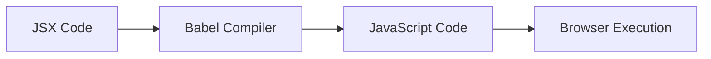
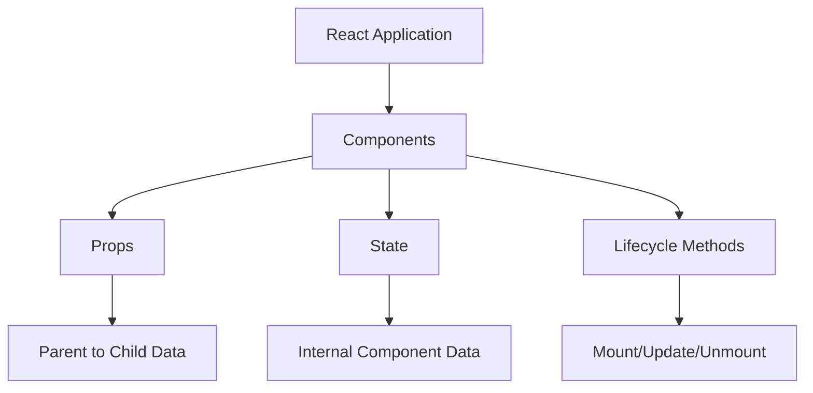
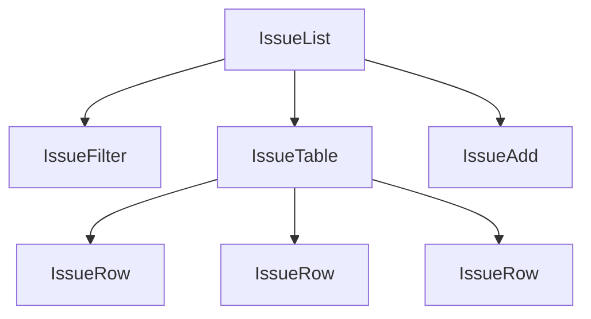
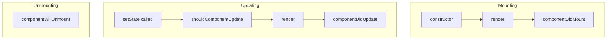
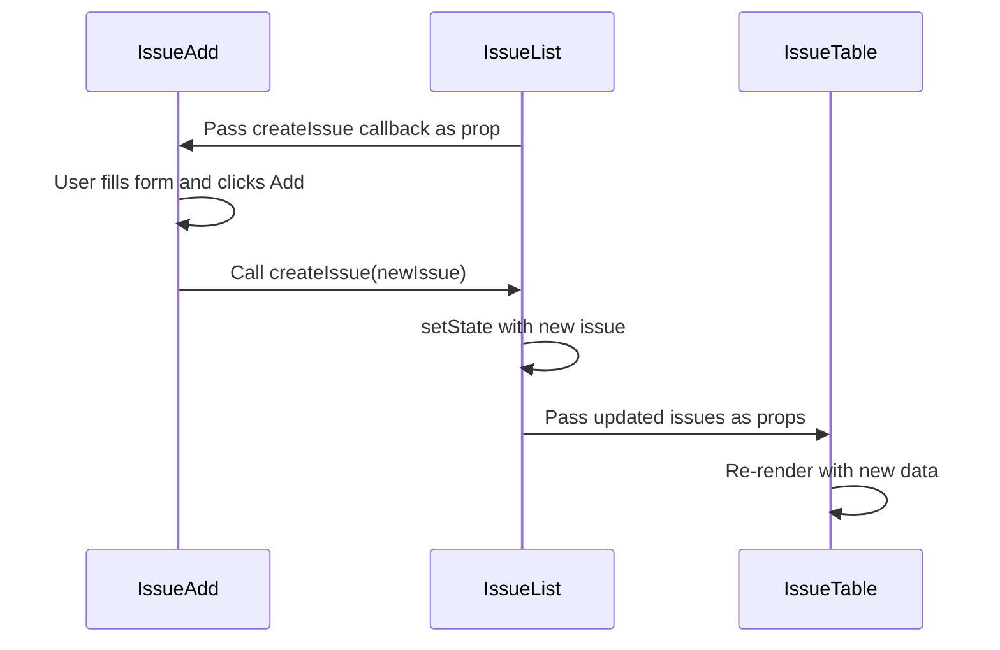
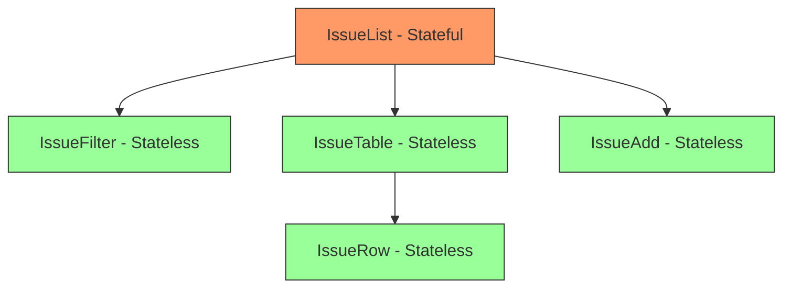
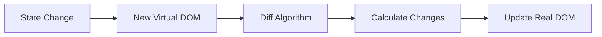
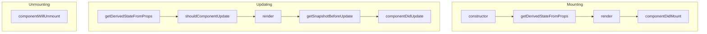
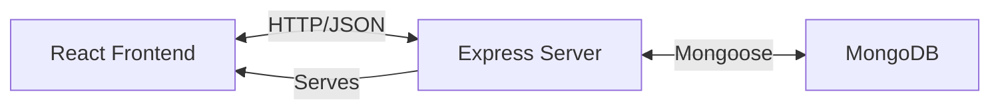
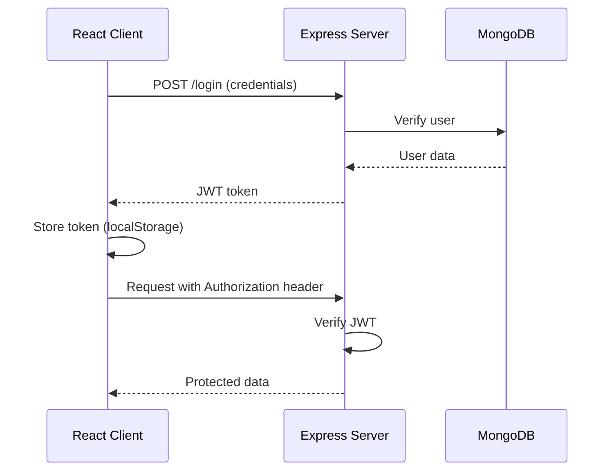

# Full Stack Application Development - Unit II

## Comprehensive Notes for Examination

---

## Table of Contents

1. [Understanding React and Web Server](#1-understanding-react-and-web-server)
2. [Server Setup](#2-server-setup)
3. [NVM and Node.js](#3-nvm-and-nodejs)
4. [NPM - Node Package Manager](#4-npm---node-package-manager)
5. [Express Integration](#5-express-integration)
6. [Build Time JSX Compilation](#6-build-time-jsx-compilation)
7. [React Library Fundamentals](#7-react-library-fundamentals)
8. [React Components](#8-react-components)
9. [React State Management](#9-react-state-management)
10. [Designing Components](#10-designing-components)
11. [Reference Questions with Answers](#11-reference-questions-with-answers)

---

## 1. Understanding React and Web Server

### 1.1 Overview

React is an open-source JavaScript library maintained by Facebook for building user interfaces, particularly single-page applications (SPAs). When combined with a web server like Express, it forms the foundation of modern full-stack development.

### 1.2 Key Characteristics of React

| Feature | Description |
|---------|-------------|
| Declarative | Describes what the UI should look like, not how to build it |
| Component-Based | UI is built from encapsulated, reusable components |
| Virtual DOM | Efficient updates through a lightweight copy of the actual DOM |
| Unidirectional Data Flow | Data flows from parent to child via props |
| JSX Syntax | JavaScript XML allows HTML-like syntax in JavaScript |

### 1.3 React vs Traditional Frameworks

```javascript
// Traditional DOM manipulation
document.getElementById('btn').addEventListener('click', function() {
    document.getElementById('output').innerHTML = 'Clicked!';
});

// React declarative approach
function App() {
    const [clicked, setClicked] = useState(false);
    return <div>{clicked ? 'Clicked!' : <button onClick={() => setClicked(true)}>Click</button>}</div>;
}
```

---

## 2. Server Setup

### 2.1 Serverless Hello World

The simplest way to start with React is without any server, using CDN links directly in an HTML file.

```html
<!DOCTYPE HTML>
<html>
<head>
    <meta charset="utf-8">
    <title>React Hello World</title>
    <!-- React Core Library -->
    <script src="https://unpkg.com/react@18/umd/react.development.js"></script>
    <!-- React DOM for rendering -->
    <script src="https://unpkg.com/react-dom@18/umd/react-dom.development.js"></script>
</head>
<body>
    <div id="contents"></div>
    <script>
        // Creating a React element using createElement
        const element = React.createElement('div', { title: 'Outer div' },
            React.createElement('h1', null, 'Hello World!')
        );
        // Rendering the element to the DOM
        ReactDOM.render(element, document.getElementById('contents'));
    </script>
</body>
</html>
```

### 2.2 React.createElement() Explained

The `createElement` function signature:

```javascript
React.createElement(type, [props], [...children])
```

| Parameter | Description |
|-----------|-------------|
| type | HTML tag name or React component |
| props | Object containing attributes and event handlers |
| children | Nested elements or text content |

### 2.3 ReactDOM.render()

This function transfers React elements to the actual DOM:

```javascript
// Syntax
ReactDOM.render(element, container);

// Example
ReactDOM.render(
    React.createElement('h1', null, 'Hello'),
    document.getElementById('root')
);
```

### 2.4 Transition to Local HTTP Server

**Why move from serverless to local server:**

| Aspect | Serverless (CDN) | Local Server |
|--------|------------------|--------------|
| Development Speed | Slow (network dependency) | Fast (local files) |
| Production Suitability | Poor | Good |
| MERN Integration | Not possible | Fully supported |
| Build Process | None | Webpack/Babel |

---

## 3. NVM and Node.js

### 3.1 What is NVM?

Node Version Manager (NVM) is a command-line tool that allows installation and management of multiple Node.js versions on a single machine.

### 3.2 Key NVM Commands

| Command | Description |
|---------|-------------|
| `nvm install <version>` | Install specific Node.js version |
| `nvm install --lts` | Install latest LTS version |
| `nvm use <version>` | Switch to specific version |
| `nvm ls` | List all installed versions |
| `nvm alias default <version>` | Set default version |
| `nvm current` | Show currently active version |

### 3.3 Installing Node.js with NVM

```bash
# Install LTS version
$ nvm install --lts

# Or install specific version
$ nvm install 18

# Set as default
$ nvm alias default 18

# Verify installation
$ node --version
$ npm --version
```

### 3.4 Why Use NVM?

```
<<nvm_version_management_diagram>>
```

**Benefits:**
- Multiple projects can use different Node versions
- Easy switching between versions
- No administrator privileges required
- Isolated environments prevent conflicts

---

## 4. NPM - Node Package Manager

### 4.1 Overview

NPM is the default package manager for Node.js, used for:
- Installing third-party libraries
- Managing project dependencies
- Running scripts and automating tasks
- Publishing packages to the npm registry

### 4.2 Project Initialization

```bash
# Initialize a new project
$ npm init

# Creates package.json with prompts
# Or use defaults
$ npm init -y
```

### 4.3 Package.json Structure

```json
{
    "name": "mern-project",
    "version": "1.0.0",
    "description": "Full Stack Application",
    "main": "server.js",
    "scripts": {
        "start": "node server.js",
        "dev": "nodemon server.js",
        "test": "jest",
        "build": "webpack --mode production"
    },
    "dependencies": {
        "express": "^4.18.0",
        "react": "^18.0.0"
    },
    "devDependencies": {
        "nodemon": "^2.0.0"
    }
}
```

### 4.4 NPM Commands

| Command | Description |
|---------|-------------|
| `npm install` | Install all dependencies from package.json |
| `npm install <package>` | Install package locally |
| `npm install -g <package>` | Install package globally |
| `npm install --save-dev <package>` | Install as dev dependency |
| `npm uninstall <package>` | Remove package |
| `npm update` | Update all packages |
| `npm run <script>` | Run custom script |
| `npm start` | Run start script (shorthand) |
| `npm test` | Run test script (shorthand) |

### 4.5 NPM Installation Characteristics

**Local Installation Benefits:**
- All installations are local to project directory
- Package dependencies are isolated within packages
- Two packages can depend on different versions of same library
- No administrator rights needed

```
project/
├── node_modules/       # All installed packages
│   ├── express/
│   └── react/
├── package.json        # Project configuration
└── package-lock.json   # Exact dependency versions
```

### 4.6 NPM Scripts for Automation

```json
{
    "scripts": {
        "start": "node server.js",
        "dev": "nodemon server.js",
        "build": "npm run clean && npm run compile",
        "clean": "rm -rf dist",
        "compile": "babel src -d dist",
        "full-build": "npm run clean && npm run build:css && npm run build:js"
    }
}
```

**Running scripts:**
```bash
$ npm start           # Runs start script
$ npm run dev         # Runs dev script
$ npm run build       # Runs build script
```

---

## 5. Express Integration

### 5.1 Basic Express Server for React

```javascript
// server.js
const express = require('express');
const app = express();

// Serve static files from 'public' directory
app.use(express.static('public'));

// Start server
app.listen(3000, function() {
    console.log('App started on port 3000');
});
```

### 5.2 Project Structure

```
project/
├── public/
│   ├── index.html      # Main HTML file
│   ├── App.jsx         # React components
│   └── styles.css      # Stylesheets
├── server.js           # Express server
├── package.json
└── node_modules/
```

### 5.3 HTML File Setup

```html
<!DOCTYPE HTML>
<html>
<head>
    <meta charset="utf-8">
    <title>MERN Application</title>
    <script src="https://unpkg.com/react@18/umd/react.development.js"></script>
    <script src="https://unpkg.com/react-dom@18/umd/react-dom.development.js"></script>
    <script src="https://unpkg.com/@babel/standalone@7/babel.min.js"></script>
</head>
<body>
    <div id="contents"></div>
    <!-- Load React component from separate file -->
    <script type="text/babel" src="/App.jsx"></script>
</body>
</html>
```

---

## 6. Build Time JSX Compilation

### 6.1 What is JSX?

JSX (JavaScript XML) is a syntax extension that allows writing HTML-like code in JavaScript. It gets compiled to regular JavaScript function calls.

```jsx
// JSX syntax
const element = <h1 className="greeting">Hello, World!</h1>;

// Compiles to
const element = React.createElement('h1', { className: 'greeting' }, 'Hello, World!');
```

### 6.2 Separate Script File

Moving JSX to a separate file improves organization:

**App.jsx:**
```jsx
const element = (
    <div title="Outer div">
        <h1>Hello World!</h1>
    </div>
);
ReactDOM.render(element, document.getElementById('contents'));
```

**index.html:**
```html
<script type="text/babel" src="/App.jsx"></script>
```

### 6.3 Transform Process



### 6.4 Runtime vs Build-time Compilation

| Aspect | Runtime Compilation | Build-time Compilation |
|--------|---------------------|------------------------|
| When | In browser | Before deployment |
| Speed | Slower | Faster |
| File Size | Larger (includes compiler) | Smaller |
| Production Ready | No | Yes |
| Tools | Babel standalone | Webpack + Babel |

### 6.5 Automation with Build Tools

**Webpack configuration example:**
```javascript
// webpack.config.js
module.exports = {
    entry: './src/App.jsx',
    output: {
        filename: 'bundle.js',
        path: __dirname + '/public'
    },
    module: {
        rules: [{
            test: /\.jsx?$/,
            exclude: /node_modules/,
            use: {
                loader: 'babel-loader',
                options: { presets: ['@babel/preset-react'] }
            }
        }]
    }
};
```

### 6.6 Create React App

The easiest way to set up a React project with build tooling:

```bash
# Create new React project
$ npx create-react-app my-app

# Navigate to project
$ cd my-app

# Start development server
$ npm start

# Open in VS Code
$ code .
```

---

## 7. React Library Fundamentals

### 7.1 Core Concepts



### 7.2 Virtual DOM

The Virtual DOM is a lightweight JavaScript representation of the actual DOM.

**How it works:**
1. When state changes, a new Virtual DOM tree is created
2. New tree is compared with previous tree (diffing)
3. Only changed elements are updated in real DOM (reconciliation)

```
<<virtual_dom_reconciliation_diagram>>
```

### 7.3 Declarative vs Imperative

**Imperative (How to do):**
```javascript
// Manual DOM manipulation
const list = document.createElement('ul');
const item = document.createElement('li');
item.textContent = 'Item 1';
list.appendChild(item);
document.body.appendChild(list);
```

**Declarative (What to do):**
```jsx
// React describes the desired output
function ItemList() {
    return (
        <ul>
            <li>Item 1</li>
        </ul>
    );
}
```

### 7.4 No Templates - JavaScript Power

React uses JavaScript for rendering instead of templating languages:

```jsx
// Using map() to render lists
function ItemList({ items }) {
    return (
        <ul>
            {items.map(item => <li key={item.id}>{item.name}</li>)}
        </ul>
    );
}

// Conditional rendering
function Greeting({ isLoggedIn }) {
    return isLoggedIn ? <h1>Welcome back!</h1> : <h1>Please log in</h1>;
}
```

---

## 8. React Components

### 8.1 Types of Components

| Type | Syntax | State | Lifecycle | Use Case |
|------|--------|-------|-----------|----------|
| Class Component | ES6 class | Yes | Yes | Complex logic |
| Functional Component | Function | With Hooks | With Hooks | Simple UI, modern apps |

### 8.2 Class Components

```jsx
class HelloWorld extends React.Component {
    render() {
        const continents = ['Africa', 'America', 'Asia', 'Australia', 'Europe'];
        const helloContinents = Array.from(continents, c => `Hello ${c}!`);
        const message = helloContinents.join(' --- ');
        
        return (
            <div title="Outer div">
                <h1>{message}</h1>
            </div>
        );
    }
}

// Usage
const element = <HelloWorld />;
ReactDOM.render(element, document.getElementById('contents'));
```

### 8.3 Functional Components

```jsx
// Simple functional component
function HelloWorld() {
    return <h1>Hello World!</h1>;
}

// Arrow function syntax
const HelloWorld = () => <h1>Hello World!</h1>;

// With props
const Greeting = (props) => <h1>Hello, {props.name}!</h1>;
```

### 8.4 Composing Components

Components can be composed to build complex UIs:



**Implementation:**
```jsx
class IssueFilter extends React.Component {
    render() {
        return <div>This is a placeholder for the issue filter.</div>;
    }
}

class IssueTable extends React.Component {
    render() {
        return <div>This is a placeholder for a table of issues.</div>;
    }
}

class IssueAdd extends React.Component {
    render() {
        return <div>This is a placeholder for a form to add an issue.</div>;
    }
}

class IssueList extends React.Component {
    render() {
        return (
            <React.Fragment>
                <h1>Issue Tracker</h1>
                <IssueFilter />
                <hr />
                <IssueTable />
                <hr />
                <IssueAdd />
            </React.Fragment>
        );
    }
}
```

### 8.5 Passing Data Using Props

Props (properties) are the mechanism for passing data from parent to child components.

```jsx
// Parent component passing props
<IssueRow issue_title="Title of the first issue" issue_id={1} />

// Child component receiving props
class IssueRow extends React.Component {
    render() {
        return (
            <tr>
                <td>{this.props.issue_id}</td>
                <td>{this.props.issue_title}</td>
            </tr>
        );
    }
}
```

### 8.6 Props Characteristics

| Characteristic | Description |
|----------------|-------------|
| Immutable | Cannot be modified by child component |
| Read-only | Used only for rendering |
| Passed down | Flow from parent to child |
| Any type | Can be strings, numbers, objects, functions |

### 8.7 Property Validation (PropTypes)

```jsx
import PropTypes from 'prop-types';

class IssueRow extends React.Component {
    render() {
        return <tr><td>{this.props.issue_id}</td></tr>;
    }
}

// Define expected prop types
IssueRow.propTypes = {
    issue_id: PropTypes.number.isRequired,
    issue_title: PropTypes.string.isRequired,
    issue: PropTypes.shape({
        id: PropTypes.number,
        status: PropTypes.string,
        owner: PropTypes.string
    })
};

// Default prop values
IssueRow.defaultProps = {
    issue_title: 'Untitled Issue'
};
```

### 8.8 Using Children

The `children` prop allows passing content between component tags:

```jsx
// Parent usage
<BorderWrap>
    <h1>This content is passed as children</h1>
</BorderWrap>

// BorderWrap component
class BorderWrap extends React.Component {
    render() {
        const borderedStyle = { border: '1px solid silver', padding: 6 };
        return (
            <div style={borderedStyle}>
                {this.props.children}
            </div>
        );
    }
}

// Another example with IssueRow
<IssueRow rowStyle={rowStyle} issue_id={1}>
    Error in console when clicking Add
</IssueRow>

// IssueRow using children
class IssueRow extends React.Component {
    render() {
        return (
            <tr>
                <td>{this.props.issue_id}</td>
                <td>{this.props.children}</td>
            </tr>
        );
    }
}
```

### 8.9 Dynamic Composition

Rendering lists dynamically using JavaScript array methods:

```jsx
// Data array
const issues = [
    { id: 1, status: 'New', owner: 'Ravan', effort: 5,
      created: new Date('2018-08-15'), title: 'Error in console' },
    { id: 2, status: 'Assigned', owner: 'Eddie', effort: 14,
      created: new Date('2018-08-16'), title: 'Missing border' }
];

// Dynamic rendering with map()
class IssueTable extends React.Component {
    render() {
        // Map each issue to an IssueRow component
        const issueRows = issues.map(issue =>
            <IssueRow key={issue.id} issue={issue} />
        );
        
        return (
            <table className="bordered-table">
                <thead>
                    <tr>
                        <th>ID</th>
                        <th>Status</th>
                        <th>Owner</th>
                        <th>Title</th>
                    </tr>
                </thead>
                <tbody>
                    {issueRows}
                </tbody>
            </table>
        );
    }
}

// IssueRow component
class IssueRow extends React.Component {
    render() {
        const issue = this.props.issue;
        return (
            <tr>
                <td>{issue.id}</td>
                <td>{issue.status}</td>
                <td>{issue.owner}</td>
                <td>{issue.title}</td>
            </tr>
        );
    }
}
```

**Important:** The `key` prop is essential for React to track list items efficiently during re-renders.

---

## 9. React State Management

### 9.1 What is State?

State is a built-in object that stores data that can change over time. It is the component's "memory."

| Aspect | Props | State |
|--------|-------|-------|
| Mutability | Immutable | Mutable |
| Ownership | Passed from parent | Owned by component |
| Updates | Cannot be changed | Changed via setState() |
| Triggers Re-render | When parent re-renders | When setState() called |

### 9.2 Setting Initial State

**In Class Components:**
```jsx
class IssueList extends React.Component {
    constructor() {
        super();
        // Initialize state in constructor
        this.state = { issues: [] };
    }
    
    render() {
        return <div>{this.state.issues.length} issues</div>;
    }
}
```

### 9.3 Updating State with setState()

**Important:** Never modify state directly. Always use `setState()`.

```jsx
// WRONG - Direct modification
this.state.issues.push(newIssue);

// CORRECT - Using setState()
this.setState({ issues: [...this.state.issues, newIssue] });
```

### 9.4 Async State Initialization

State should be initialized asynchronously in lifecycle methods, not in constructor:

```jsx
class IssueList extends React.Component {
    constructor() {
        super();
        this.state = { issues: [] };  // Empty initial state
    }
    
    componentDidMount() {
        // Called after component is mounted to DOM
        this.loadData();
    }
    
    loadData() {
        // Simulate API call with setTimeout
        setTimeout(() => {
            this.setState({ issues: initialIssues });
        }, 500);
    }
    
    render() {
        const issueRows = this.state.issues.map(issue =>
            <IssueRow key={issue.id} issue={issue} />
        );
        return <table><tbody>{issueRows}</tbody></table>;
    }
}
```

### 9.5 Lifecycle Methods



| Method | Phase | Description |
|--------|-------|-------------|
| constructor() | Mounting | Initialize state, bind methods |
| render() | Mounting/Updating | Return JSX to render |
| componentDidMount() | Mounting | Called after DOM insertion, safe for setState |
| componentDidUpdate() | Updating | Called after update, can compare prev props/state |
| componentWillUnmount() | Unmounting | Cleanup (timers, subscriptions) |
| shouldComponentUpdate() | Updating | Performance optimization |

### 9.6 Event Handling

```jsx
class IssueAdd extends React.Component {
    constructor() {
        super();
        // Bind event handler to component instance
        this.handleSubmit = this.handleSubmit.bind(this);
    }
    
    handleSubmit(e) {
        e.preventDefault();  // Prevent form submission
        const form = document.forms.issueAdd;
        const issue = {
            owner: form.owner.value,
            title: form.title.value,
            status: 'New'
        };
        this.props.createIssue(issue);  // Call parent method
        form.owner.value = '';
        form.title.value = '';
    }
    
    render() {
        return (
            <form name="issueAdd" onSubmit={this.handleSubmit}>
                <input type="text" name="owner" placeholder="Owner" />
                <input type="text" name="title" placeholder="Title" />
                <button>Add</button>
            </form>
        );
    }
}
```

### 9.7 Child to Parent Communication

Children communicate with parents via callbacks passed as props:

```jsx
// Parent component
class IssueList extends React.Component {
    constructor() {
        super();
        this.state = { issues: [] };
        this.createIssue = this.createIssue.bind(this);
    }
    
    createIssue(issue) {
        // Add new issue to state
        issue.id = this.state.issues.length + 1;
        issue.created = new Date();
        const newIssueList = this.state.issues.slice();
        newIssueList.push(issue);
        this.setState({ issues: newIssueList });
    }
    
    render() {
        return (
            <React.Fragment>
                <IssueTable issues={this.state.issues} />
                {/* Pass callback as prop */}
                <IssueAdd createIssue={this.createIssue} />
            </React.Fragment>
        );
    }
}
```



### 9.8 Stateless Components

Components without state can be written as simple functions:

```jsx
// Stateless functional component
function IssueRow(props) {
    const issue = props.issue;
    return (
        <tr>
            <td>{issue.id}</td>
            <td>{issue.status}</td>
            <td>{issue.owner}</td>
            <td>{issue.created.toDateString()}</td>
            <td>{issue.effort}</td>
            <td>{issue.due ? issue.due.toDateString() : ''}</td>
            <td>{issue.title}</td>
        </tr>
    );
}

// Stateless IssueTable
function IssueTable(props) {
    const issueRows = props.issues.map(issue =>
        <IssueRow key={issue.id} issue={issue} />
    );
    
    return (
        <table className="bordered-table">
            <thead>
                <tr>
                    <th>ID</th>
                    <th>Status</th>
                    <th>Owner</th>
                    <th>Created</th>
                    <th>Effort</th>
                    <th>Due Date</th>
                    <th>Title</th>
                </tr>
            </thead>
            <tbody>{issueRows}</tbody>
        </table>
    );
}
```

---

## 10. Designing Components

### 10.1 State vs Props Guidelines

| Use State When | Use Props When |
|----------------|----------------|
| Data changes due to user interaction | Data comes from parent |
| Data is owned by the component | Data is read-only |
| Data affects the rendered view | Passing callbacks to children |
| Component needs to track internal values | Initial values that don't change |

### 10.2 Design Principles

**What to keep in state:**
- Data that can change due to events
- Data that affects the rendered view
- Data owned by the component

**What NOT to keep in state:**
- Computed values (calculate in render instead)
- Props copied into state (exception: initial values)
- Data that doesn't affect rendering

### 10.3 Component Hierarchy



**Best Practice:** Keep state in the least common ancestor of components that need it.

### 10.4 Communication Patterns

| Direction | Method | Example |
|-----------|--------|---------|
| Parent to Child | Props | `<Child data={this.state.data} />` |
| Child to Parent | Callbacks | `<Child onUpdate={this.handleUpdate} />` |
| Sibling to Sibling | Lift state up | State in common parent |

### 10.5 Lifting State Up

When siblings need to share data:

```jsx
// State is "lifted" to the common parent
class Parent extends React.Component {
    constructor() {
        super();
        this.state = { sharedData: [] };
    }
    
    updateData = (newData) => {
        this.setState({ sharedData: newData });
    }
    
    render() {
        return (
            <div>
                {/* Both children access same data */}
                <ChildA data={this.state.sharedData} />
                <ChildB onUpdate={this.updateData} />
            </div>
        );
    }
}
```

### 10.6 Single Responsibility Principle

Each component should do one thing well:

```jsx
// BAD: Component doing too much
class EverythingComponent extends React.Component {
    // Handles data fetching, filtering, sorting, rendering, form submission...
}

// GOOD: Separated responsibilities
class DataFetcher extends React.Component { /* Only fetches data */ }
class DataFilter extends React.Component { /* Only filters data */ }
class DataList extends React.Component { /* Only displays data */ }
class DataForm extends React.Component { /* Only handles form */ }
```

---

## 11. Reference Questions with Answers

### Question 1: What are the advantages of using React?

**Answer:**

React offers several key advantages for building user interfaces:

1. **Virtual DOM Performance**: React uses a virtual DOM that minimizes actual DOM manipulation by calculating the most efficient way to update the browser DOM, resulting in faster rendering.

2. **Component-Based Architecture**: UI is broken into reusable, self-contained components that manage their own state, making code more maintainable and testable.

3. **Declarative Syntax**: Developers describe what the UI should look like, and React handles the how, making code more predictable and easier to debug.

4. **Unidirectional Data Flow**: Data flows in one direction (parent to child), making it easier to track data changes and debug applications.

5. **JSX Syntax**: Combines JavaScript and HTML-like syntax, making it intuitive to write UI components.

6. **Strong Ecosystem**: Large community support, extensive libraries (React Router, Redux), and tools (Create React App, React DevTools).

7. **Cross-Platform Development**: React Native enables mobile app development using the same concepts.

8. **Easy Integration**: Can be gradually adopted into existing projects.

---

### Question 2: What is useState() in React?

**Answer:**

`useState()` is a React Hook that allows functional components to manage state. It returns an array with two elements:

```jsx
const [state, setState] = useState(initialValue);
```

| Element | Description |
|---------|-------------|
| state | Current state value |
| setState | Function to update state |
| initialValue | Initial state value |

**Example:**
```jsx
import React, { useState } from 'react';

function Counter() {
    const [count, setCount] = useState(0);  // Initialize with 0
    
    return (
        <div>
            <p>Count: {count}</p>
            <button onClick={() => setCount(count + 1)}>Increment</button>
            <button onClick={() => setCount(count - 1)}>Decrement</button>
        </div>
    );
}
```

**Key Points:**
- Calling setState triggers a re-render
- State updates may be asynchronous
- Multiple useState hooks can be used in one component
- Replaces this.state and this.setState in class components

---

### Question 3: What are the differences between functional and class components?

**Answer:**

| Aspect | Functional Components | Class Components |
|--------|----------------------|------------------|
| Syntax | JavaScript function | ES6 class extending React.Component |
| State | useState Hook | this.state |
| Lifecycle | useEffect Hook | Lifecycle methods |
| this keyword | Not used | Required |
| Code Length | Shorter, cleaner | More verbose |
| Performance | Slightly better | Slightly slower |
| Readability | Easier to read | More complex |

**Functional Component:**
```jsx
function Welcome(props) {
    const [name, setName] = useState('Guest');
    
    useEffect(() => {
        document.title = `Welcome ${name}`;
    }, [name]);
    
    return <h1>Hello, {props.greeting} {name}!</h1>;
}
```

**Class Component:**
```jsx
class Welcome extends React.Component {
    constructor(props) {
        super(props);
        this.state = { name: 'Guest' };
    }
    
    componentDidUpdate() {
        document.title = `Welcome ${this.state.name}`;
    }
    
    render() {
        return <h1>Hello, {this.props.greeting} {this.state.name}!</h1>;
    }
}
```

---

### Question 4: What is the virtual DOM? How does React use the virtual DOM to render the UI?

**Answer:**

The Virtual DOM is a lightweight JavaScript representation of the actual DOM kept in memory. React uses it for efficient UI updates.

**How it works:**



**Process:**
1. **Initial Render**: React creates a virtual DOM tree representing the UI
2. **State Change**: When state changes, React creates a new virtual DOM tree
3. **Diffing**: React compares new virtual DOM with previous one
4. **Reconciliation**: Only the changed elements are identified
5. **Batch Update**: Changes are batched and applied to real DOM efficiently

**Benefits:**
- Minimizes expensive DOM operations
- Batches multiple updates together
- Provides predictable rendering
- Enables cross-platform rendering (React Native)

---

### Question 5: Explain about types of side effects in React component

**Answer:**

Side effects are operations that affect something outside the component's scope. They fall into two categories:

**1. Effects Not Requiring Cleanup:**
- API calls
- DOM manipulation
- Logging
- Updating document title

```jsx
useEffect(() => {
    document.title = `You clicked ${count} times`;
    console.log('Component rendered');
});
```

**2. Effects Requiring Cleanup:**
- Event listeners
- Subscriptions
- Timers
- WebSocket connections

```jsx
useEffect(() => {
    const subscription = dataSource.subscribe();
    
    // Cleanup function
    return () => {
        subscription.unsubscribe();
    };
}, []);
```

**In Class Components:**
- componentDidMount: Setup side effects
- componentWillUnmount: Cleanup side effects

---

### Question 6: What is the use of useEffect React Hook?

**Answer:**

`useEffect` is a Hook that lets you perform side effects in functional components. It combines componentDidMount, componentDidUpdate, and componentWillUnmount lifecycle methods.

**Syntax:**
```jsx
useEffect(() => {
    // Side effect code
    return () => {
        // Cleanup code (optional)
    };
}, [dependencies]);
```

**Dependency Array Behavior:**

| Dependency Array | Behavior |
|-----------------|----------|
| Not provided | Runs after every render |
| Empty [] | Runs only on mount |
| [dep1, dep2] | Runs when dependencies change |

**Examples:**
```jsx
// Runs on every render
useEffect(() => {
    console.log('Component rendered');
});

// Runs only on mount (like componentDidMount)
useEffect(() => {
    fetchData();
}, []);

// Runs when count changes
useEffect(() => {
    document.title = `Count: ${count}`;
}, [count]);

// With cleanup (like componentWillUnmount)
useEffect(() => {
    const timer = setInterval(() => tick(), 1000);
    return () => clearInterval(timer);
}, []);
```

---

### Question 7: How to pass data between sibling components using React router?

**Answer:**

Siblings cannot communicate directly. Data must flow through a common parent or use React Router's features:

**Method 1: Lifting State Up**
```jsx
function Parent() {
    const [sharedData, setSharedData] = useState(null);
    
    return (
        <BrowserRouter>
            <Routes>
                <Route path="/sibling1" element={
                    <Sibling1 onDataChange={setSharedData} />
                } />
                <Route path="/sibling2" element={
                    <Sibling2 data={sharedData} />
                } />
            </Routes>
        </BrowserRouter>
    );
}
```

**Method 2: Using URL Parameters**
```jsx
// Sibling1 navigates with data
navigate(`/sibling2/${dataId}`);

// Sibling2 receives data
const { dataId } = useParams();
```

**Method 3: Using Location State**
```jsx
// Sibling1 passes state
navigate('/sibling2', { state: { data: myData } });

// Sibling2 receives state
const location = useLocation();
const data = location.state?.data;
```

---

### Question 8: Can React Hook replace Redux?

**Answer:**

React Hooks can replace Redux in many cases, but not all:

| Scenario | Hooks Sufficient | Redux Better |
|----------|-----------------|--------------|
| Small to medium apps | Yes | No |
| Local component state | Yes | No |
| Complex global state | Partially | Yes |
| Time-travel debugging | No | Yes |
| Middleware (async) | Partially | Yes |
| DevTools | Limited | Excellent |

**Using Hooks for State Management:**
```jsx
// Context + useReducer as Redux alternative
const StateContext = createContext();

function reducer(state, action) {
    switch(action.type) {
        case 'INCREMENT': return { count: state.count + 1 };
        default: return state;
    }
}

function StateProvider({ children }) {
    const [state, dispatch] = useReducer(reducer, { count: 0 });
    return (
        <StateContext.Provider value={{ state, dispatch }}>
            {children}
        </StateContext.Provider>
    );
}
```

**Conclusion:** For simple state management, useContext + useReducer is sufficient. For large-scale applications with complex state logic, Redux remains valuable.

---

### Question 9: What are the lifecycle methods of React?

**Answer:**

Lifecycle methods are special methods in class components called at different stages:



| Method | Phase | Purpose |
|--------|-------|---------|
| constructor() | Mounting | Initialize state, bind methods |
| getDerivedStateFromProps() | Mounting/Updating | Sync state with props |
| render() | Mounting/Updating | Return JSX |
| componentDidMount() | Mounting | API calls, subscriptions |
| shouldComponentUpdate() | Updating | Performance optimization |
| getSnapshotBeforeUpdate() | Updating | Capture DOM info |
| componentDidUpdate() | Updating | React to prop/state changes |
| componentWillUnmount() | Unmounting | Cleanup |

---

### Question 10: How to prevent re-renders in React?

**Answer:**

Several strategies prevent unnecessary re-renders:

**1. React.memo for Functional Components:**
```jsx
const MemoizedComponent = React.memo(function MyComponent(props) {
    return <div>{props.value}</div>;
});
```

**2. PureComponent for Class Components:**
```jsx
class MyComponent extends React.PureComponent {
    render() {
        return <div>{this.props.value}</div>;
    }
}
```

**3. shouldComponentUpdate:**
```jsx
shouldComponentUpdate(nextProps, nextState) {
    return nextProps.value !== this.props.value;
}
```

**4. useMemo for Expensive Calculations:**
```jsx
const expensiveValue = useMemo(() => {
    return computeExpensiveValue(a, b);
}, [a, b]);
```

**5. useCallback for Function References:**
```jsx
const handleClick = useCallback(() => {
    doSomething(a, b);
}, [a, b]);
```

---

### Question 11: What is the difference between ES6 and ES5 standards?

**Answer:**

| Feature | ES5 | ES6 |
|---------|-----|-----|
| Variables | var | let, const |
| Functions | function keyword | Arrow functions |
| Classes | Prototype-based | class keyword |
| Modules | No native support | import/export |
| Template Strings | Concatenation | Template literals |
| Default Parameters | Manual check | Built-in support |
| Destructuring | Not available | Available |
| Spread Operator | Not available | Available |

**ES5 Example:**
```javascript
var name = 'John';
function greet(name) {
    return 'Hello ' + name;
}
var Person = function(name) {
    this.name = name;
};
```

**ES6 Example:**
```javascript
const name = 'John';
const greet = (name) => `Hello ${name}`;
class Person {
    constructor(name) {
        this.name = name;
    }
}
```

---

### Question 12: What are forms in React?

**Answer:**

Forms in React can be controlled or uncontrolled:

**Controlled Components:**
Form data is handled by React state.

```jsx
function ControlledForm() {
    const [value, setValue] = useState('');
    
    const handleSubmit = (e) => {
        e.preventDefault();
        console.log('Submitted:', value);
    };
    
    return (
        <form onSubmit={handleSubmit}>
            <input 
                type="text"
                value={value}
                onChange={(e) => setValue(e.target.value)}
            />
            <button type="submit">Submit</button>
        </form>
    );
}
```

**Uncontrolled Components:**
Form data is handled by the DOM using refs.

```jsx
function UncontrolledForm() {
    const inputRef = useRef(null);
    
    const handleSubmit = (e) => {
        e.preventDefault();
        console.log('Submitted:', inputRef.current.value);
    };
    
    return (
        <form onSubmit={handleSubmit}>
            <input type="text" ref={inputRef} />
            <button type="submit">Submit</button>
        </form>
    );
}
```

---

### Question 13: What is an arrow function and how is it used in React?

**Answer:**

Arrow functions are concise ES6 function syntax with lexical `this` binding.

**Syntax:**
```javascript
// Traditional function
function add(a, b) {
    return a + b;
}

// Arrow function
const add = (a, b) => a + b;
```

**Usage in React:**

**1. Event Handlers:**
```jsx
// Arrow function auto-binds this
<button onClick={() => this.handleClick()}>Click</button>

// Or as class property
handleClick = () => {
    console.log(this.state.value);
};
```

**2. Functional Components:**
```jsx
const Greeting = ({ name }) => <h1>Hello, {name}!</h1>;
```

**3. Array Operations:**
```jsx
const items = data.map(item => <li key={item.id}>{item.name}</li>);
```

**4. Callbacks:**
```jsx
useEffect(() => {
    fetchData();
}, []);
```

**Benefits in React:**
- No need to bind `this` in constructor
- Shorter syntax
- Implicit return for single expressions

---

### Question 14: What is the difference between componentDidMount() and useEffect()?

**Answer:**

| Aspect | componentDidMount() | useEffect() |
|--------|--------------------| ------------|
| Component Type | Class only | Functional only |
| Execution | Once after mount | Configurable |
| Cleanup | Separate method | Return function |
| Multiple Effects | Complex | Simple |

**componentDidMount:**
```jsx
class MyComponent extends React.Component {
    componentDidMount() {
        // Runs once after initial render
        this.fetchData();
        this.subscription = subscribe();
    }
    
    componentWillUnmount() {
        // Cleanup in separate method
        this.subscription.unsubscribe();
    }
}
```

**useEffect equivalent:**
```jsx
function MyComponent() {
    useEffect(() => {
        // Runs once after initial render
        fetchData();
        const subscription = subscribe();
        
        // Cleanup in same function
        return () => subscription.unsubscribe();
    }, []);  // Empty array = componentDidMount behavior
}
```

---

### Question 15: What is the MERN stack, and how do its components work together?

**Answer:**

MERN is a full-stack JavaScript framework consisting of:

| Component | Role | Description |
|-----------|------|-------------|
| MongoDB | Database | NoSQL document database |
| Express.js | Backend Framework | Web server framework for Node.js |
| React | Frontend Library | UI component library |
| Node.js | Runtime | JavaScript runtime environment |

**Architecture Flow:**


**How They Work Together:**
1. **React** renders the user interface in the browser
2. **React** makes API calls to the backend
3. **Express** handles HTTP requests and routes
4. **Express** processes business logic
5. **MongoDB** stores and retrieves data
6. **Node.js** runs the Express server

---

### Question 16: What is the role of Express.js in a MERN application?

**Answer:**

Express.js serves as the backend framework handling:

**1. Routing:**
```javascript
app.get('/api/issues', (req, res) => {
    // Handle GET request
});

app.post('/api/issues', (req, res) => {
    // Handle POST request
});
```

**2. Middleware:**
```javascript
app.use(express.json());  // Parse JSON bodies
app.use(cors());          // Enable CORS
app.use(authMiddleware);  // Authentication
```

**3. Static File Serving:**
```javascript
app.use(express.static('public'));
```

**4. API Endpoints:**
```javascript
app.get('/api/users/:id', async (req, res) => {
    const user = await User.findById(req.params.id);
    res.json(user);
});
```

**5. Error Handling:**
```javascript
app.use((err, req, res, next) => {
    res.status(500).json({ error: err.message });
});
```

---

### Question 17: How do you connect a MongoDB database to a Node.js application?

**Answer:**

Using Mongoose ODM (Object Document Mapper):

```javascript
// Install mongoose
// npm install mongoose

const mongoose = require('mongoose');

// Connection string
const mongoURI = 'mongodb://localhost:27017/myapp';

// Connect to MongoDB
mongoose.connect(mongoURI, {
    useNewUrlParser: true,
    useUnifiedTopology: true
})
.then(() => console.log('MongoDB connected'))
.catch(err => console.error('Connection error:', err));

// Define a Schema
const userSchema = new mongoose.Schema({
    name: { type: String, required: true },
    email: { type: String, unique: true },
    createdAt: { type: Date, default: Date.now }
});

// Create a Model
const User = mongoose.model('User', userSchema);

// CRUD Operations
// Create
const newUser = new User({ name: 'John', email: 'john@example.com' });
await newUser.save();

// Read
const users = await User.find();
const user = await User.findById(id);

// Update
await User.findByIdAndUpdate(id, { name: 'Jane' });

// Delete
await User.findByIdAndDelete(id);
```

---

### Question 18: What is JSX in React, and why is it used?

**Answer:**

JSX (JavaScript XML) is a syntax extension that allows writing HTML-like code in JavaScript.

**Why JSX:**
- Combines UI structure with logic
- More readable than createElement calls
- Enables component composition
- Catches errors at compile time

**JSX vs createElement:**
```jsx
// JSX syntax
const element = (
    <div className="container">
        <h1>Hello</h1>
        <p>Welcome to React</p>
    </div>
);

// Equivalent createElement calls
const element = React.createElement('div', { className: 'container' },
    React.createElement('h1', null, 'Hello'),
    React.createElement('p', null, 'Welcome to React')
);
```

**JSX Rules:**
- Must return single root element
- Use className instead of class
- Use camelCase for attributes
- Close all tags
- JavaScript expressions in curly braces

```jsx
const name = 'John';
const element = (
    <div>
        <h1>{name.toUpperCase()}</h1>
        
        {isLoggedIn && <LogoutButton />}
    </div>
);
```

---

### Question 19: Explain the difference between state and props in React.

**Answer:**

| Aspect | State | Props |
|--------|-------|-------|
| Definition | Internal component data | External data passed in |
| Mutability | Mutable via setState | Immutable |
| Ownership | Owned by component | Owned by parent |
| Initialization | In constructor/useState | When component is used |
| Updates | Triggers re-render | Triggers re-render |
| Access | this.state or useState | this.props or function parameter |

**State Example:**
```jsx
class Counter extends React.Component {
    constructor() {
        super();
        this.state = { count: 0 };  // Internal state
    }
    
    increment = () => {
        this.setState({ count: this.state.count + 1 });
    }
    
    render() {
        return <button onClick={this.increment}>{this.state.count}</button>;
    }
}
```

**Props Example:**
```jsx
// Parent passes props
<Greeting name="John" age={25} />

// Child receives props
function Greeting(props) {
    return <h1>Hello, {props.name}! Age: {props.age}</h1>;
}
```

**Key Difference:**
- State is managed within the component
- Props are passed from parent to child
- State can be changed; props cannot

---

### Question 20: What is the purpose of useEffect in React?

**Answer:**

useEffect performs side effects in functional components, replacing lifecycle methods.

**Purposes:**
1. Data fetching
2. DOM manipulation
3. Subscriptions
4. Timers
5. Logging

**Syntax and Variations:**
```jsx
// Runs after every render
useEffect(() => {
    console.log('Rendered');
});

// Runs only on mount
useEffect(() => {
    fetchInitialData();
}, []);

// Runs when dependency changes
useEffect(() => {
    fetchUserData(userId);
}, [userId]);

// With cleanup
useEffect(() => {
    const socket = new WebSocket(url);
    
    return () => {
        socket.close();  // Cleanup on unmount
    };
}, [url]);
```

**Lifecycle Equivalent:**
```jsx
// componentDidMount + componentDidUpdate + componentWillUnmount
useEffect(() => {
    // componentDidMount and componentDidUpdate logic
    
    return () => {
        // componentWillUnmount logic
    };
}, [dependencies]);
```

---

## Additional Practice Questions

### Question 21: How do you structure a large-scale MERN application for better maintainability?

**Answer:**

**Recommended Folder Structure:**
```
project/
├── client/                 # React frontend
│   ├── public/
│   ├── src/
│   │   ├── components/     # Reusable components
│   │   ├── pages/          # Page components
│   │   ├── hooks/          # Custom hooks
│   │   ├── context/        # Context providers
│   │   ├── services/       # API calls
│   │   ├── utils/          # Helper functions
│   │   └── App.js
│   └── package.json
├── server/                 # Express backend
│   ├── config/             # Configuration files
│   ├── controllers/        # Route handlers
│   ├── models/             # Mongoose models
│   ├── routes/             # Route definitions
│   ├── middleware/         # Custom middleware
│   ├── utils/              # Helper functions
│   └── server.js
└── package.json
```

**Best Practices:**
- Separate concerns (MVC pattern)
- Use environment variables
- Implement error handling middleware
- Create reusable components
- Use TypeScript for type safety

---

### Question 22: How do you handle authentication in a MERN stack project?

**Answer:**

**JWT-Based Authentication Flow:**



**Backend Implementation:**
```javascript
// Auth middleware
const authMiddleware = (req, res, next) => {
    const token = req.header('Authorization')?.replace('Bearer ', '');
    
    if (!token) {
        return res.status(401).json({ error: 'Access denied' });
    }
    
    try {
        const decoded = jwt.verify(token, process.env.JWT_SECRET);
        req.user = decoded;
        next();
    } catch (error) {
        res.status(400).json({ error: 'Invalid token' });
    }
};

// Login route
app.post('/api/login', async (req, res) => {
    const { email, password } = req.body;
    const user = await User.findOne({ email });
    
    if (user && await bcrypt.compare(password, user.password)) {
        const token = jwt.sign({ id: user._id }, process.env.JWT_SECRET);
        res.json({ token });
    } else {
        res.status(401).json({ error: 'Invalid credentials' });
    }
});
```

---

### Question 23: Explain how to implement server-side rendering with React in a MERN project.

**Answer:**

Server-Side Rendering (SSR) renders React components on the server before sending to the client.

**Benefits:**
- Better SEO
- Faster initial page load
- Improved performance on slow devices

**Basic Implementation:**
```javascript
// server.js
import express from 'express';
import React from 'react';
import ReactDOMServer from 'react-dom/server';
import App from './client/App';

const app = express();

app.get('*', (req, res) => {
    // Render React component to HTML string
    const html = ReactDOMServer.renderToString(<App />);
    
    res.send(`
        <!DOCTYPE html>
        <html>
        <head><title>SSR App</title></head>
        <body>
            <div id="root">${html}</div>
            <script src="/bundle.js"></script>
        </body>
        </html>
    `);
});
```

**Hydration on Client:**
```jsx
// client/index.js
import ReactDOM from 'react-dom';
import App from './App';

// Hydrate attaches event listeners to existing HTML
ReactDOM.hydrate(<App />, document.getElementById('root'));
```

---

### Question 24: What steps do you take to improve performance in a production-level MERN app?

**Answer:**

**Frontend Optimizations:**
| Technique | Implementation |
|-----------|---------------|
| Code Splitting | React.lazy() and Suspense |
| Memoization | React.memo, useMemo, useCallback |
| Image Optimization | Lazy loading, WebP format |
| Bundle Analysis | webpack-bundle-analyzer |
| Minification | Production build |

**Backend Optimizations:**
| Technique | Implementation |
|-----------|---------------|
| Database Indexing | Create indexes on frequently queried fields |
| Caching | Redis for session/data caching |
| Compression | gzip middleware |
| Connection Pooling | Mongoose connection options |
| Rate Limiting | express-rate-limit |

**Code Example:**
```jsx
// Code splitting with lazy loading
const Dashboard = React.lazy(() => import('./Dashboard'));

function App() {
    return (
        <Suspense fallback={<Loading />}>
            <Dashboard />
        </Suspense>
    );
}
```

---

### Question 25: How do you implement real-time features (like chat) in a MERN stack app?

**Answer:**

Using Socket.IO for real-time bidirectional communication:

**Server Setup:**
```javascript
const express = require('express');
const http = require('http');
const { Server } = require('socket.io');

const app = express();
const server = http.createServer(app);
const io = new Server(server);

io.on('connection', (socket) => {
    console.log('User connected:', socket.id);
    
    // Listen for chat messages
    socket.on('chat message', (msg) => {
        // Broadcast to all clients
        io.emit('chat message', msg);
    });
    
    socket.on('disconnect', () => {
        console.log('User disconnected');
    });
});

server.listen(3000);
```

**Client Setup:**
```jsx
import { useEffect, useState } from 'react';
import io from 'socket.io-client';

const socket = io('http://localhost:3000');

function Chat() {
    const [messages, setMessages] = useState([]);
    const [input, setInput] = useState('');
    
    useEffect(() => {
        socket.on('chat message', (msg) => {
            setMessages(prev => [...prev, msg]);
        });
        
        return () => socket.off('chat message');
    }, []);
    
    const sendMessage = () => {
        socket.emit('chat message', input);
        setInput('');
    };
    
    return (
        <div>
            <ul>{messages.map((msg, i) => <li key={i}>{msg}</li>)}</ul>
            <input value={input} onChange={e => setInput(e.target.value)} />
            <button onClick={sendMessage}>Send</button>
        </div>
    );
}
```

---

## Summary Table: Key Concepts

| Concept | Definition | Key Points |
|---------|------------|------------|
| React | UI library | Component-based, Virtual DOM, Declarative |
| JSX | Syntax extension | HTML-like syntax in JavaScript |
| Props | Component inputs | Immutable, passed from parent |
| State | Component memory | Mutable, triggers re-render |
| useState | State hook | Returns [value, setter] |
| useEffect | Side effect hook | Replaces lifecycle methods |
| Virtual DOM | JS representation | Efficient DOM updates |
| Component | UI building block | Reusable, encapsulated |
| Lifecycle | Component stages | Mount, Update, Unmount |

---

## Quick Reference: React Patterns

```jsx
// Functional Component with Hooks
function MyComponent({ prop1, prop2 }) {
    const [state, setState] = useState(initialValue);
    
    useEffect(() => {
        // Side effect
        return () => { /* cleanup */ };
    }, [dependencies]);
    
    const handleEvent = () => setState(newValue);
    
    return <div onClick={handleEvent}>{state}</div>;
}

// Class Component
class MyComponent extends React.Component {
    constructor(props) {
        super(props);
        this.state = { value: 0 };
        this.handleEvent = this.handleEvent.bind(this);
    }
    
    componentDidMount() { /* side effect */ }
    componentWillUnmount() { /* cleanup */ }
    
    handleEvent() { this.setState({ value: 1 }); }
    
    render() {
        return <div onClick={this.handleEvent}>{this.state.value}</div>;
    }
}
```

---

